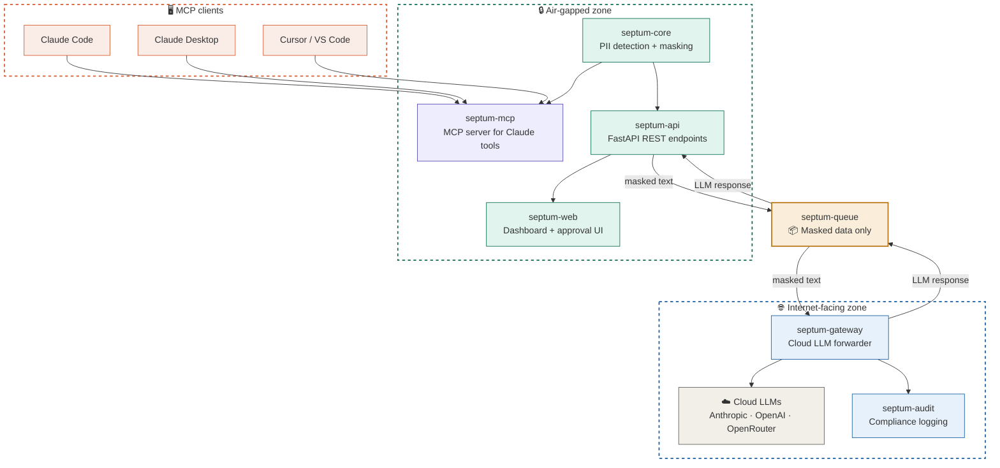

# Septum Modular Refactoring — Project Specification

> **Branch:** `refactor/modular-architecture`
> **Base:** `main`
> **Goal:** Monolitik Septum'u 7 bağımsız modüle ayırarak enterprise-grade deployment esnekliği sağlamak.

---

## 1. Vizyon

Septum'un mevcut monolitik yapısını, bağımsız olarak deploy edilebilen modüllere ayırmak:

- **Air-gapped deployment:** PII hiçbir zaman ağ dışına çıkmaz
- **MCP-native:** Claude Code / Claude Desktop ile doğrudan entegrasyon
- **Seçici deploy:** Şirketler sadece ihtiyaç duydukları modülleri çalıştırır
- **Queue-based bridge:** Zone'lar arası iletişimde sadece maskelenmiş veri akar

---

## 2. Modül Haritası

| Modül | Paket Adı | Tip | Zone | Açıklama |
|---|---|---|---|---|
| **septum-core** | `septum-core` | Python lib (pip) | Air-gapped | PII detection, masking, unmasking, regulation engine |
| **septum-mcp** | `septum-mcp` | MCP Server (stdio/SSE) | Air-gapped | Claude Code/Desktop tool endpoint'leri |
| **septum-api** | — | FastAPI app | Air-gapped | REST API katmanı, webhook, batch |
| **septum-web** | — | Next.js app | Air-gapped | Dashboard, approval gate UI, settings |
| **septum-queue** | `septum-queue` | Python lib | Bridge | Zone'lar arası mesaj kuyruğu (Redis Streams / RabbitMQ / file-based) |
| **septum-gateway** | — | FastAPI app | Internet-facing | Maskelenmiş veriyi cloud LLM'lere iletir |
| **septum-audit** | — | FastAPI app | Internet-facing | Compliance logging, SIEM export, retention |

---

## 3. Repo Yapısı (Hedef)

```
septum/
├── packages/
│   ├── core/
│   │   ├── septum_core/
│   │   │   ├── __init__.py
│   │   │   ├── detector.py          # PII detection pipeline (Presidio + NER + regex)
│   │   │   ├── masker.py            # Anonymization — replace PII with placeholders
│   │   │   ├── unmasker.py          # De-anonymization — restore real values
│   │   │   ├── anonymization_map.py # Placeholder ↔ real value mapping (in-memory)
│   │   │   ├── regulations/
│   │   │   │   ├── __init__.py
│   │   │   │   ├── base.py          # Abstract regulation interface
│   │   │   │   ├── gdpr.py
│   │   │   │   ├── kvkk.py
│   │   │   │   ├── hipaa.py
│   │   │   │   ├── ccpa.py
│   │   │   │   └── lgpd.py
│   │   │   ├── recognizers/
│   │   │   │   ├── __init__.py
│   │   │   │   ├── presidio_recognizer.py
│   │   │   │   ├── ner_recognizer.py
│   │   │   │   └── regex_recognizer.py
│   │   │   ├── national_ids/
│   │   │   │   ├── __init__.py
│   │   │   │   ├── tckn.py
│   │   │   │   ├── ssn.py
│   │   │   │   └── iban.py
│   │   │   └── config.py            # Pydantic settings for core
│   │   ├── tests/
│   │   │   ├── test_detector.py
│   │   │   ├── test_masker.py
│   │   │   ├── test_unmasker.py
│   │   │   └── test_regulations.py
│   │   ├── pyproject.toml
│   │   └── README.md
│   │
│   ├── mcp/
│   │   ├── septum_mcp/
│   │   │   ├── __init__.py
│   │   │   ├── server.py            # MCP server (stdio + SSE transport)
│   │   │   ├── tools.py             # Tool definitions: mask_text, unmask_response, etc.
│   │   │   └── config.py
│   │   ├── tests/
│   │   │   └── test_tools.py
│   │   ├── pyproject.toml
│   │   └── README.md
│   │
│   ├── api/
│   │   ├── septum_api/
│   │   │   ├── __init__.py
│   │   │   ├── main.py              # FastAPI app
│   │   │   ├── routers/
│   │   │   │   ├── __init__.py
│   │   │   │   ├── mask.py          # POST /mask, POST /unmask
│   │   │   │   ├── detect.py        # POST /detect
│   │   │   │   ├── documents.py     # Document upload & processing
│   │   │   │   ├── chat.py          # Chat endpoint (SSE streaming)
│   │   │   │   ├── regulations.py   # Regulation management
│   │   │   │   ├── settings.py      # Settings CRUD
│   │   │   │   └── health.py        # Health check
│   │   │   ├── middleware/
│   │   │   │   ├── auth.py          # JWT / API key auth (YENİ!)
│   │   │   │   └── rate_limit.py
│   │   │   ├── database.py
│   │   │   ├── models/
│   │   │   └── config.py
│   │   ├── tests/
│   │   ├── pyproject.toml
│   │   └── README.md
│   │
│   ├── web/
│   │   ├── src/
│   │   │   ├── app/                 # Mevcut Next.js yapı (taşınacak)
│   │   │   ├── components/
│   │   │   └── store/
│   │   ├── package.json
│   │   └── README.md
│   │
│   ├── queue/
│   │   ├── septum_queue/
│   │   │   ├── __init__.py
│   │   │   ├── base.py              # Abstract queue interface
│   │   │   ├── redis_backend.py     # Redis Streams implementation
│   │   │   ├── rabbitmq_backend.py  # RabbitMQ implementation
│   │   │   └── file_backend.py      # File-based (air-gap friendly, no infra dep)
│   │   ├── tests/
│   │   ├── pyproject.toml
│   │   └── README.md
│   │
│   ├── gateway/
│   │   ├── septum_gateway/
│   │   │   ├── __init__.py
│   │   │   ├── main.py              # FastAPI app
│   │   │   ├── forwarder.py         # LLM API client (Anthropic, OpenAI, OpenRouter)
│   │   │   ├── response_handler.py  # Stream/batch response processing
│   │   │   └── config.py
│   │   ├── tests/
│   │   ├── pyproject.toml
│   │   └── README.md
│   │
│   └── audit/
│       ├── septum_audit/
│       │   ├── __init__.py
│       │   ├── main.py              # FastAPI app
│       │   ├── logger.py            # Structured audit log writer
│       │   ├── exporters/
│       │   │   ├── __init__.py
│       │   │   ├── json_exporter.py
│       │   │   ├── csv_exporter.py
│       │   │   └── siem_exporter.py # Splunk/ELK format
│       │   └── retention.py         # Auto-purge by policy
│       ├── tests/
│       ├── pyproject.toml
│       └── README.md
│
├── docker/
│   ├── core.Dockerfile
│   ├── api.Dockerfile
│   ├── web.Dockerfile
│   ├── gateway.Dockerfile
│   ├── mcp.Dockerfile
│   └── audit.Dockerfile
│
├── docker-compose.yml              # Full stack (dev)
├── docker-compose.airgap.yml       # Air-gapped zone only
├── docker-compose.gateway.yml      # Internet-facing zone only
├── docker-compose.standalone.yml   # All-in-one single server
│
├── CLAUDE.md
├── README.md
├── CONTRIBUTING.md
└── LICENSE
```

---

## 4. MCP Server Tool Tanımları

`septum-mcp` aşağıdaki tool'ları expose eder:

### `mask_text`
```json
{
  "name": "mask_text",
  "description": "Detect and mask PII in the given text using active regulations. Returns masked text with placeholders like [PERSON_1], [EMAIL_2].",
  "inputSchema": {
    "type": "object",
    "properties": {
      "text": { "type": "string", "description": "Raw text containing potential PII" },
      "regulations": {
        "type": "array",
        "items": { "type": "string" },
        "description": "Regulation codes to apply. Default: all active. Options: gdpr, kvkk, hipaa, ccpa, lgpd"
      },
      "language": { "type": "string", "default": "auto", "description": "Text language for NER. auto = detect automatically" }
    },
    "required": ["text"]
  }
}
```

### `unmask_response`
```json
{
  "name": "unmask_response",
  "description": "Restore real values in an LLM response by replacing placeholders with original PII from the session anonymization map.",
  "inputSchema": {
    "type": "object",
    "properties": {
      "text": { "type": "string", "description": "LLM response containing placeholders" },
      "session_id": { "type": "string", "description": "Session ID from the mask_text call" }
    },
    "required": ["text", "session_id"]
  }
}
```

### `detect_pii`
```json
{
  "name": "detect_pii",
  "description": "Scan text for PII entities without masking. Returns entity list with types, positions, and confidence scores.",
  "inputSchema": {
    "type": "object",
    "properties": {
      "text": { "type": "string" },
      "regulations": { "type": "array", "items": { "type": "string" } }
    },
    "required": ["text"]
  }
}
```

### `scan_file`
```json
{
  "name": "scan_file",
  "description": "Scan a file (PDF, DOCX, XLSX, TXT) for PII. Extracts text first, then runs detection pipeline.",
  "inputSchema": {
    "type": "object",
    "properties": {
      "file_path": { "type": "string", "description": "Absolute path to the file to scan" },
      "mask": { "type": "boolean", "default": false, "description": "If true, return masked text. If false, return PII report only." }
    },
    "required": ["file_path"]
  }
}
```

### `list_regulations`
```json
{
  "name": "list_regulations",
  "description": "List available and active regulation packs with their entity types and rules.",
  "inputSchema": {
    "type": "object",
    "properties": {}
  }
}
```

### `get_session_map`
```json
{
  "name": "get_session_map",
  "description": "Get the anonymization map for a session. Shows which placeholders map to which real values. Useful for debugging.",
  "inputSchema": {
    "type": "object",
    "properties": {
      "session_id": { "type": "string" }
    },
    "required": ["session_id"]
  }
}
```

---

## 5. Claude Code MCP Konfigürasyonu

### Yöntem A: uvx ile (PyPI'dan, önerilen)
```json
{
  "mcpServers": {
    "septum": {
      "command": "uvx",
      "args": ["septum-mcp"],
      "env": {
        "SEPTUM_REGULATIONS": "kvkk,gdpr",
        "SEPTUM_OLLAMA_URL": "http://localhost:11434",
        "SEPTUM_NER_MODEL": "dbmdz/bert-large-cased-finetuned-conll03-english"
      }
    }
  }
}
```

### Yöntem B: Local dev (repo'dan)
```json
{
  "mcpServers": {
    "septum": {
      "command": "python",
      "args": ["-m", "septum_mcp.server"],
      "cwd": "/Users/barisyerlikaya/Projects/Septum/packages/mcp",
      "env": {
        "PYTHONPATH": "/Users/barisyerlikaya/Projects/Septum/packages/core",
        "SEPTUM_REGULATIONS": "kvkk,gdpr"
      }
    }
  }
}
```

### Yöntem C: Docker (production)
```json
{
  "mcpServers": {
    "septum": {
      "command": "docker",
      "args": ["exec", "-i", "septum-mcp", "python", "-m", "septum_mcp.server"]
    }
  }
}
```

---

## 6. Kullanım Senaryoları

### Senaryo A: Bireysel Geliştirici (Claude Code + MCP)
```
Developer → Claude Code → septum-mcp → septum-core (local masking)
                ↓
         Claude API (masked text) → response → unmask locally
```
Tek makine. Docker bile gerekmez. `pip install septum-mcp` yeterli.

### Senaryo B: Startup (Single Server)
```
docker-compose.standalone.yml → all modules on one machine
```
Tüm modüller tek sunucuda. Basit, hızlı kurulum.

### Senaryo C: Enterprise (Air-gapped + DMZ)
```
Air-gapped Server:
  docker-compose.airgap.yml → core, api, web, mcp, queue (producer)

DMZ Server:
  docker-compose.gateway.yml → queue (consumer), gateway, audit
```
İki farklı sunucu. Queue üzerinden sadece maskelenmiş veri akar.

### Senaryo D: Hybrid (On-prem masking + Cloud gateway)
```
On-prem: septum-core + septum-api
Cloud VM: septum-gateway + septum-audit
Bridge: septum-queue (Redis Streams over VPN / private link)
```

---

## 7. Refactoring Fazları

> **⚠️ ZORUNLU KURALLAR — her faz için geçerli:**
> 1. Her faza başlamadan önce `/simplify` ve `/compact` çalıştır — context'i temizle
> 2. Asla kendi başına commit atma — kullanıcı "commit et" demeden `git add` / `git commit` / `git push` yapma
> 3. Commit atacaksan önce mesajı göster, onay al, sonra çalıştır

### Faz 1: septum-core extraction (3-4 gün) — ✓ TAMAMLANDI
> `/simplify` ve `/compact` çalıştır, sonra başla.

**Öncelik: EN YÜKSEK — diğer tüm modüller buna bağımlı**

1. ✓ `packages/core/` klasörü oluştur
2. ✓ Mevcut dosyaları taşı:
   - `backend/app/services/sanitizer.py` → `septum_core/detector.py`
   - `backend/app/services/anonymization_map.py` → `septum_core/anonymization_map.py`
   - `backend/app/services/deanonymizer.py` → `septum_core/unmasker.py`
   - `backend/app/services/policy_composer.py` → `septum_core/regulations/`
   - `backend/app/services/recognizers/` → `septum_core/recognizers/` (17 regulation pack)
   - `backend/app/services/national_ids/` → `septum_core/national_ids/` (tckn, ssn, iban, aadhaar, cpf)
3. ✓ Yeni public API tasarla:
   ```python
   from septum_core import SeptumEngine

   engine = SeptumEngine(regulations=["kvkk", "gdpr"])
   result = engine.mask("Ahmet Yılmaz'ın TC'si 12345678901")
   # result.masked_text → "[PERSON_1]'ın TC'si [TCKN_1]"
   # result.session_id → "sess_abc123"
   # result.entities → [{"type": "PERSON", "original": "Ahmet Yılmaz", ...}]

   restored = engine.unmask(llm_response_text, session_id="sess_abc123")
   ```
4. ✓ `pyproject.toml` oluştur (zero network dependency, `[transformers]` extra)
5. ✓ Mevcut testleri taşı ve çalıştır (24/24 pass)
6. ✓ `backend/app/services/` → `septum-core` import'larına güncelle (backward compat shim)

### Faz 2: septum-mcp server (2-3 gün) — ✓ TAMAMLANDI
> `/simplify` ve `/compact` çalıştır, sonra başla.

1. ✓ `packages/mcp/` klasörü oluştur
2. ✓ MCP SDK kullanarak server yaz (`mcp` Python package)
3. ✓ Tool tanımlarını implemente et (Bölüm 4'teki 6 tool: mask_text, unmask_response, detect_pii, scan_file, list_regulations, get_session_map)
4. ✓ stdio transport desteği (SSE ileriye bırakıldı — Claude Code/Desktop stdio üzerinden çalışıyor)
5. ✓ Claude Code ile test et (39/39 test dahil stdio smoke test)
6. ✓ README yaz (kurulum, konfigürasyon, kullanım örnekleri)

### Faz 3: septum-api refactor (2-3 gün) — ✓ TAMAMLANDI
> `/simplify` ve `/compact` çalıştır, sonra başla.

1. ✓ `packages/api/` klasörü oluştur
2. ✓ Mevcut `backend/` yapısını taşı (Faz 3a–3b: bootstrap, config, database, models, seeds, utils, services, routers, main; backend/app/ shim'leri korundu)
3. ✓ `septum-core` import'larına geçiş
4. ✓ Auth middleware ekle (JWT + API key — `AuthMiddleware`, `packages/api/septum_api/middleware/auth.py`)
5. ✓ Rate limiting (Faz 3c: `middleware/rate_limit.py` + per-route `@limiter.limit`)
6. ✓ OpenAPI schema güncelle (X-API-Key security scheme eklendi)
7. ⏭️ Docker compose güncelle — Faz 7'ye ertelendi (modüler compose varyantları orada planlanmış)

### Faz 4: septum-web separation (1-2 gün) — ✓ TAMAMLANDI
> `/simplify` ve `/compact` çalıştır, sonra başla.

1. ✓ `packages/web/` klasörü oluştur
2. ✓ Mevcut `frontend/` taşı (`git mv` ile, history korundu)
3. ✓ API base URL'i environment variable'dan oku (`NEXT_PUBLIC_API_BASE_URL`)
4. ✓ CORS konfigürasyonu (`FRONTEND_ORIGIN` → `_resolve_cors_origins`)
5. ✓ Standalone build & deploy testi (Jest 17/17, build başarılı, backend 283/283)

### Faz 5: septum-queue + septum-gateway (3-4 gün) — ✓ TAMAMLANDI
> `/simplify` ve `/compact` çalıştır, sonra başla.

1. ✓ `packages/queue/` — Abstract `QueueBackend` Protocol + envelope dataclasses (`Message`, `RequestEnvelope`, `ResponseEnvelope`); `FileQueueBackend` (atomic POSIX rename, air-gap default) + `RedisStreamsQueueBackend` (consumer groups + XACK, `[redis]` extra). RabbitMQ ileriye bırakıldı (Septum deployment profilinde nadir).
2. ✓ `packages/gateway/` — `AnthropicForwarder` / `OpenAIForwarder` / `OpenRouterForwarder` + `ForwarderRegistry` + `GatewayConsumer` (queue → forwarder → response queue); FastAPI `/health` `[server]` extra arkasında. **`septum-core`'u asla import etmez** (kod-review invariant).
3. ✓ septum-api'ye queue producer entegrasyonu — `services/gateway_client.py` (`GatewayClient.complete()` publish + correlation_id ile reply bekleme), `AppSettings.use_gateway: bool = False` (sqlite migration dahil), `LLMRouter._dispatch_cloud_call` branch (process-wide `set_gateway_client_factory` ile bağlı).
4. ✓ gateway'e queue consumer entegrasyonu — `GatewayConsumer.run_once()` / `run_forever()` döngüsü; forwarder hatası, bilinmeyen provider, malformed payload, beklenmeyen exception → hepsi error envelope'a dönüşür ve döngüyü kırmaz.
5. ✓ End-to-end test: 47 yeni queue+gateway test (file-queue + consumer + mock forwarder roundtrip dahil) + 6 producer-tarafı GatewayClient test = **53 yeni test, 289/289 backend test geçiyor**. Tam mask → queue → gateway → LLM → queue → response zinciri test edilmiş; `use_gateway=False` default'u sayesinde mevcut chat/sanitization testleri rewire gerektirmedi. Ollama `septum-api` içinde local kaldı (air-gap-safe direct call).

### Faz 6: septum-audit (2 gün)
> `/simplify` ve `/compact` çalıştır, sonra başla.

1. `packages/audit/` klasörü oluştur
2. Structured logging (JSON)
3. Exporters: JSON, CSV, SIEM (Splunk HEC format)
4. Retention policy (auto-purge by age)
5. gateway event hook'ları

### Faz 7: Docker & Deploy (2-3 gün)
> `/simplify` ve `/compact` çalıştır, sonra başla.

1. Her modül için ayrı Dockerfile
2. 4 compose variant:
   - `docker-compose.yml` (full dev stack)
   - `docker-compose.airgap.yml`
   - `docker-compose.gateway.yml`
   - `docker-compose.standalone.yml`
3. Health check endpoint'leri
4. README güncelle (deployment guides)

**Toplam tahmini süre: 15-21 gün**

---

## 8. Dependency Grafiği

```
septum-core ← (bağımlılık yok, tamamen standalone)
    ↑
septum-mcp ← septum-core
    ↑
septum-api ← septum-core, septum-queue (optional)
    ↑
septum-web ← septum-api (HTTP, runtime dependency only)

septum-queue ← (bağımlılık yok, abstract interface)

septum-gateway ← septum-queue
septum-audit ← septum-queue (optional, event consumer)
```

**Kural:** Hiçbir internet-facing modül, septum-core'a doğrudan bağımlı değildir. Gateway asla raw PII görmez.

---

## 9. README'ye Eklenecek Mimari Diyagram

Aşağıdaki Mermaid diyagramını `README.md`'nin Architecture bölümüne ekle:

````markdown

````

---

## 10. Branch Stratejisi

```
main (stable, dokunma)
 └── refactor/modular-architecture (ana çalışma branch'i)
      ├── refactor/extract-core       → Faz 1 tamamlanınca → merge to modular-architecture
      ├── feature/mcp-server          → Faz 2 tamamlanınca → merge to modular-architecture
      ├── refactor/api-separation     → Faz 3 tamamlanınca → merge to modular-architecture
      ├── refactor/web-separation     → Faz 4 tamamlanınca → merge to modular-architecture
      ├── feature/queue-gateway       → Faz 5 tamamlanınca → merge to modular-architecture
      ├── feature/audit               → Faz 6 tamamlanınca → merge to modular-architecture
      └── chore/docker-deploy         → Faz 7 tamamlanınca → merge to modular-architecture

Her faz tamamlandığında:
1. Sub-branch → refactor/modular-architecture (PR + review)
2. Tüm fazlar tamamlandığında → refactor/modular-architecture → main (final PR)
```

---

## 11. CLAUDE.md Güncellemesi

Bu branch'te `CLAUDE.md`'ye eklenmesi gerekenler:

```markdown
## Modüler Mimari Kuralları

- Her modül `packages/<modül>/` altında yaşar
- `septum-core` sıfır network bağımlılığına sahiptir — asla requests/httpx/urllib import etme
- Internet-facing modüller (gateway, audit) asla septum-core'u doğrudan import edemez
- Zone'lar arası iletişim yalnızca septum-queue üzerinden olur
- Tüm PII işlemleri septum-core'da yapılır, başka hiçbir modülde PII manipülasyonu yapılmaz
- MCP tool'ları septum-mcp/tools.py'de tanımlanır, iş mantığı septum-core'dadır
- Her modülün kendi pyproject.toml'u vardır
- Test'ler modül içinde `tests/` klasöründe tutulur

## Import Kuralları

```python
# ✅ Doğru — gateway sadece queue kullanır
from septum_queue import QueueConsumer

# ❌ Yanlış — gateway asla core'u import etmemeli
from septum_core import SeptumEngine

# ✅ Doğru — mcp, core'u kullanır
from septum_core import SeptumEngine

# ✅ Doğru — api, core + queue kullanır
from septum_core import SeptumEngine
from septum_queue import QueueProducer
```
```

---

## 12. Kabul Kriterleri

Her faz için Definition of Done:

- [ ] Modül bağımsız olarak `pip install -e .` ile kurulabilir
- [ ] Modül testleri `pytest` ile geçer
- [ ] Import kuralları ihlal edilmemiş (`septum-core` network bağımlılığı yok, gateway core import etmiyor)
- [ ] Docker build başarılı
- [ ] README güncel
- [ ] Mevcut özellikler çalışmaya devam ediyor (regression test)
- [ ] `septum-core` tek başına kullanılabilir (CLI veya Python script)
- [ ] `septum-mcp` Claude Code ile test edilmiş
