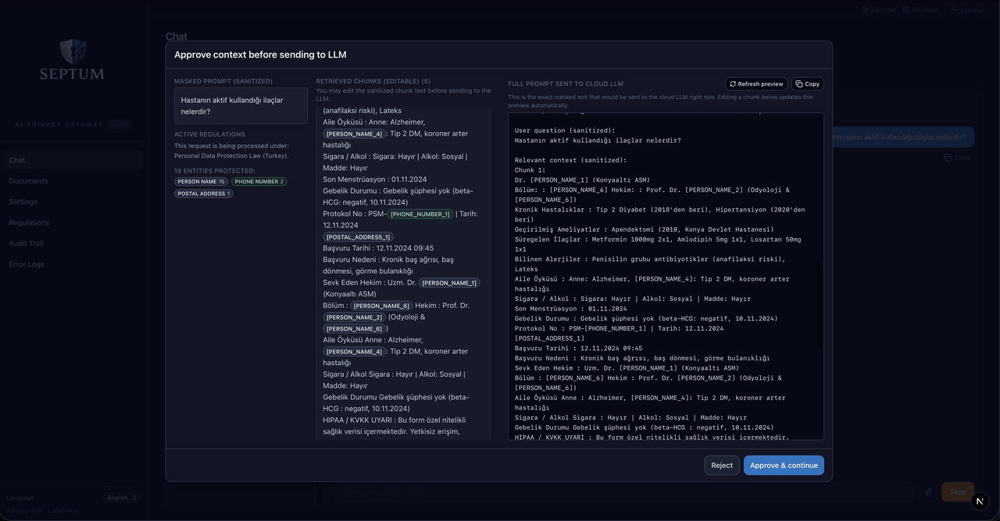
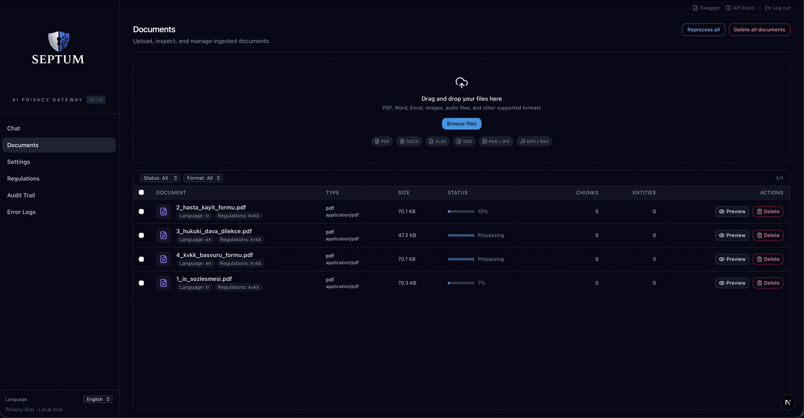
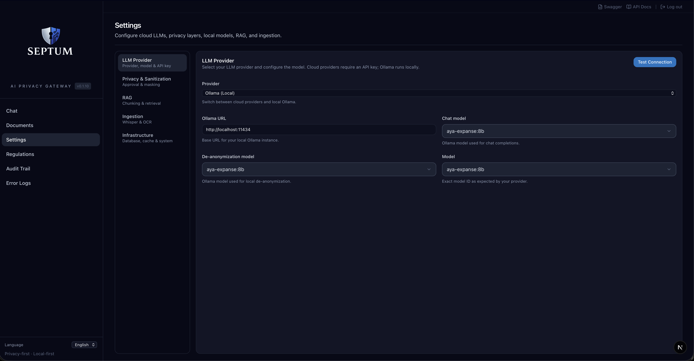
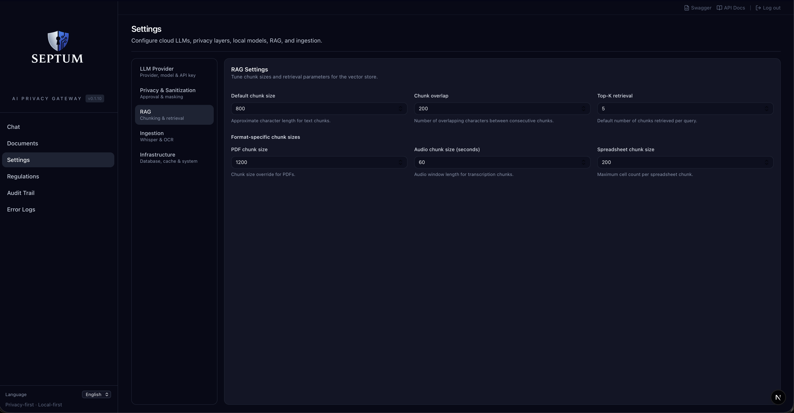
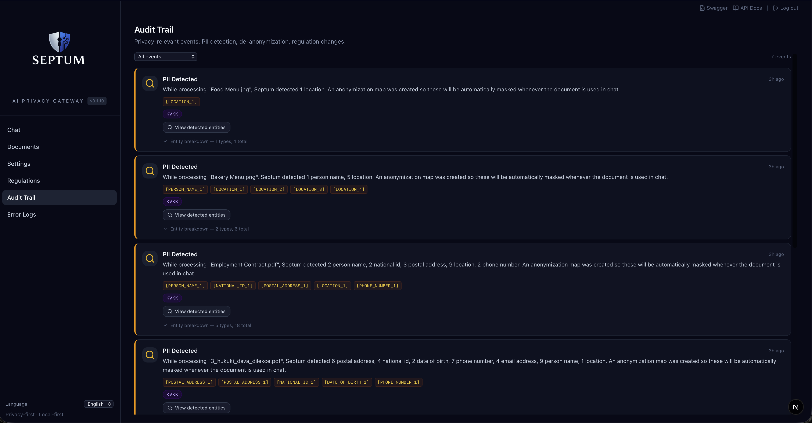

<p align="center">
  
</p>

<h3 align="center">Your data never leaves. Your AI still works.</h3>

<p align="center">
  <a href="https://github.com/byerlikaya/Septum/actions/workflows/tests.yml">
    
  </a>
  <a href="https://hub.docker.com/r/byerlikaya/septum">
    
  </a>
  <a href="https://hub.docker.com/r/byerlikaya/septum">
    
  </a>
  <a href="https://github.com/byerlikaya/Septum/stargazers">
    
  </a>
  <a href="LICENSE">
    
  </a>
  <a href="README.tr.md">
    
  </a>
</p>

<p align="center">
  <a href="https://github.com/byerlikaya/Septum/stargazers"><b>⭐ Star the repo if Septum helps you keep PII out of the cloud — it's the single biggest signal that this project is worth building.</b></a>
</p>

<p align="center">
  <a href="#who-is-this-for"><strong>Who Is This For?</strong></a>
  &middot;
  <a href="#see-it-in-action"><strong>Screenshots</strong></a>
  &middot;
  <a href="#quick-start"><strong>Quick Start</strong></a>
  &middot;
  <a href="ARCHITECTURE.md"><strong>Architecture</strong></a>
  &middot;
  <a href="CHANGELOG.md"><strong>Changelog</strong></a>
  &middot;
  <a href="LICENSE"><strong>License</strong></a>
</p>

---

## What is Septum?

Septum is a **privacy-first AI middleware** that sits between you and cloud LLMs. It lets you query sensitive company data — and chat freely — with ChatGPT, Claude, or any LLM, while **automatically detecting and masking personal data before anything leaves your machine**.

1. You upload documents (PDF, Word, Excel, images, audio, etc.) **and** type questions in chat.
2. Septum **detects and masks** all personal data locally — in both your documents *and* your chat messages.
3. Only anonymised text is sent to the LLM (the question, the retrieved context, everything).
4. The answer comes back with real names and values restored — **locally**.

> **In one sentence:** Septum is a safety layer for teams who want LLM power without leaking personal data — whether it's in a document or in something you just typed.

**Before and after — what the LLM actually sees:**

Both your documents and your chat messages go through the same masking pipeline.

```
Document chunk: "Ahmet Yılmaz lives in Berlin, email ahmet.yilmaz@corp.de, ID 12345678901"
Masked:         "[PERSON_1] lives in [LOCATION_1], email [EMAIL_1], ID [NATIONAL_ID_1]"

User question:  "Write a welcome email using these details: customer name Ahmet Yılmaz,
                 email ahmet.yilmaz@corp.de, member ID 12345678901."
Masked:         "Write a welcome email using these details: customer name [PERSON_1],
                 email [EMAIL_1], member ID [NATIONAL_ID_1]."
```

The LLM answers using placeholders. Septum restores real values locally before showing you the response.

---

## Who Is This For?

- **Developers** building AI-powered apps that handle real customer data
- **Teams** subject to GDPR, KVKK, HIPAA, or other privacy regulations
- **Companies** running LLMs against internal documents (contracts, HR files, health records)
- **Self-hosting advocates** who want full control — no data leaves your infrastructure

---

## What Problems Does It Solve?

**Safe enterprise document Q&A** — Query contracts, customer files, health records, or HR documents with an LLM. The LLM only sees placeholders like `[PERSON_1]` and `[EMAIL_2]`, never real identities.

**Regulation compliance** — Helps reduce GDPR, KVKK, HIPAA, CCPA, and other regulation risks by anonymising data **before** anything touches the cloud. 17 built-in regulation packs, with the most restrictive rule always winning.

**Internal knowledge assistant** — Indexes your documents into a vector store (RAG) so you can build powerful search and Q&A over company knowledge.

---

## How It Works

1. **Upload your documents**
   Use the Documents page or the chat sidebar to add PDFs, Office files, images or audio files. Septum automatically detects file type, language and personal data, masks all PII, and prepares anonymised content for search.

2. **Ask questions in chat**
   *"What are the termination conditions in this contract?"*
   *"Write a welcome email for new customer Ahmet Yılmaz (ahmet.yilmaz@corp.de, member ID 12345678901)."*
   *"Summarise the last 6 months of case files."*

3. **Septum anonymises your question too**
   Your chat message is run through the **same** PII detection pipeline as your documents. Names, phone numbers, emails, IDs and any other personal data you typed are replaced with placeholders before retrieval and before the LLM call. PII never leaves the machine — not from documents, not from what you type.

4. **Approve before sending**
   See exactly what anonymised content (your masked question **and** the masked document chunks) will be sent to the LLM. Approve or reject.

5. **Get answers with real values**
   Septum locally restores placeholders to original values, giving you a natural, human-readable answer.

---

## Key Features

- **Local PII Protection** — Detects and masks personal data before anything is sent to the cloud — both inside uploaded documents **and** inside the chat messages you type. Documents stored encrypted (AES-256-GCM). The **Approval Gate** lets you verify the masked output before each LLM call — nothing is sent without your review.
- **Multi-Regulation Support** — 17 built-in packs (GDPR, KVKK, CCPA, HIPAA, LGPD, PIPEDA, PDPA, APPI, PIPL, POPIA, DPDP, UK GDPR, and more). Each regulation ships its own recognizer pack with region-specific national ID detectors (TCKN checksum, Aadhaar Verhoeff, NRIC/FIN, Resident ID, NINO, CNPJ, My Number, and more). Multiple active simultaneously; most restrictive wins.
- **Approval Gate** — Review exactly what will be sent to the LLM before it leaves your environment.
- **Custom Rules** — Define your own patterns: regex, keyword lists, or LLM-prompt based detection.
- **Rich Format Support** — PDFs, Office files, spreadsheets, images (OCR), audio (Whisper transcription), emails.
- **Hybrid Retrieval** — BM25 keyword matching + FAISS semantic search with Reciprocal Rank Fusion.
- **Structured Data Extraction** — Automatically detects tables and key-value pairs from PDFs.
- **Audit Trail** — Append-only compliance log with entity detection metrics. No raw PII in audit events.
- **Multi-Provider** — Works with Anthropic, OpenAI, OpenRouter, and local Ollama. Switch from the UI.
- **JWT Auth & RBAC** — Admin-only user management UI to create accounts, assign roles (admin/editor/viewer), reset passwords, and deactivate users; self-service password change; first user auto-promoted to admin via the setup wizard.

<details>
<summary><b>All 17 built-in regulation packs</b> — jurisdictions, region-specific identifiers</summary>

| Region | Code | Regulation |
|:---|:---|:---|
| 🇪🇺 EU / EEA | `gdpr` | General Data Protection Regulation |
| 🇺🇸 USA (Healthcare) | `hipaa` | Health Insurance Portability and Accountability Act |
| 🇹🇷 Turkey | `kvkk` | Personal Data Protection Law (6698) |
| 🇧🇷 Brazil | `lgpd` | Lei Geral de Proteção de Dados |
| 🇺🇸 USA (California) | `ccpa` | California Consumer Privacy Act |
| 🇺🇸 USA (California) | `cpra` | California Privacy Rights Act |
| 🇬🇧 United Kingdom | `uk_gdpr` | UK GDPR |
| 🇨🇦 Canada | `pipeda` | Personal Information Protection and Electronic Documents Act |
| 🇹🇭 Thailand | `pdpa_th` | Personal Data Protection Act |
| 🇸🇬 Singapore | `pdpa_sg` | Personal Data Protection Act |
| 🇯🇵 Japan | `appi` | Act on the Protection of Personal Information |
| 🇨🇳 China | `pipl` | Personal Information Protection Law |
| 🇿🇦 South Africa | `popia` | Protection of Personal Information Act |
| 🇮🇳 India | `dpdp` | Digital Personal Data Protection Act |
| 🇸🇦 Saudi Arabia | `pdpl_sa` | Personal Data Protection Law |
| 🇳🇿 New Zealand | `nzpa` | Privacy Act 2020 |
| 🇦🇺 Australia | `australia_pa` | Privacy Act 1988 |

Every row is a loadable pack under [`backend/app/services/recognizers/`](backend/app/services/recognizers/). Multiple can be active simultaneously — the sanitizer applies the union and the most restrictive rule wins. Legal sources for each entity type live in [`backend/docs/REGULATION_ENTITY_SOURCES.md`](backend/docs/REGULATION_ENTITY_SOURCES.md).

</details>

---

## Why Septum?

| Capability | Septum | Plain ChatGPT / Claude | Azure Presidio | LangChain Pipeline |
|:---|:---:|:---:|:---:|:---:|
| **PII masked before cloud** | **Yes** | No | Detection only | Build yourself |
| **Multi-regulation (17 packs)** | **Yes** | No | No | Build yourself |
| **Approval gate before LLM** | **Yes** | No | No | Build yourself |
| **De-anonymisation (real values)** | **Yes** | N/A | No | Build yourself |
| **Document RAG with hybrid retrieval** | **Yes** | No | No | Partial |
| **Custom detection rules** | **Yes** | No | Limited | Build yourself |
| **Ready-to-use web UI** | **Yes** | N/A | No | No |
| **Audit trail & compliance** | **Yes** | No | No | Build yourself |
| **Works with any LLM provider** | **Yes** | Single provider | Azure only | Configurable |
| **Fully self-hosted** | **Yes** | No | Cloud service | Depends |

**The key difference:** Other tools offer pieces of the puzzle — detection here, a vector store there. Septum is the **complete end-to-end pipeline**: detection → anonymisation → mapping → retrieval → approval → LLM call → de-anonymisation → audit. Out of the box, with a UI, for any regulation.

---

## Detection & Privacy

Septum uses a **multi-layer PII detection pipeline** to minimise both false negatives (missed PII) and false positives (over-masking). Each layer adds detection capability; all run **locally**.

### What Each Layer Detects

| Layer | Technology | Entity Types Detected |
|:---:|:---|:---|
| 1 | **Presidio** — regex patterns + algorithmic validators (Luhn, IBAN MOD-97, TCKN, CPF, SSN checksums). Context-aware recognizers with multilingual keywords. | EMAIL_ADDRESS, PHONE_NUMBER, IP_ADDRESS, CREDIT_CARD_NUMBER, IBAN, NATIONAL_ID, MEDICAL_RECORD_NUMBER, HEALTH_INSURANCE_ID, POSTAL_ADDRESS, DATE_OF_BIRTH, MAC_ADDRESS, URL, COORDINATES, COOKIE_ID, DEVICE_ID, SOCIAL_SECURITY_NUMBER, CPF, PASSPORT_NUMBER, DRIVERS_LICENSE, TAX_ID, LICENSE_PLATE |
| 2 | **NER** — HuggingFace XLM-RoBERTa with per-language model selection (20+ languages). ALL CAPS input auto-normalised to title case. | PERSON_NAME, LOCATION, ORGANIZATION_NAME |
| 3 | **Ollama** — local LLM for context-aware validation, alias detection, and semantic entity detection | PERSON_NAME aliases/nicknames; DIAGNOSIS, MEDICATION, RELIGION, POLITICAL_OPINION, SEXUAL_ORIENTATION, ETHNICITY, CLINICAL_NOTE, BIOMETRIC_ID, DNA_PROFILE |

Layers are additive: L1 catches structured identifiers and context-tagged values (dates of birth, passport numbers, device IDs, etc.), L2 adds names, locations, and organisations via transformer NER (including ALL CAPS text), and L3 uses a local LLM for semantic types (medical diagnoses, medications, religious/political/ethnic references) plus alias detection. Results are merged with coreference resolution so "John", "J. Doe", and "Mr. Doe" all map to the same `[PERSON_1]` placeholder.

> **Benchmark models:** NER uses `akdeniz27/xlm-roberta-base-turkish-ner` (TR) and `Davlan/xlm-roberta-base-wikiann-ner` (all other languages). Ollama layer uses `aya-expanse:8b`. Results will vary with different Ollama models — larger models generally improve semantic detection accuracy.

### Benchmark Results

All 17 built-in regulations active. **3,268 algorithmically generated PII values** across 23 entity types (valid Luhn, IBAN MOD-97, TCKN checksums). 150 samples per Presidio type, 160 person names (mixed case + ALL CAPS, EN/TR), 100 locations (EN/TR), 30 organisation names (EN/TR), plus alias detection. Fixed seed for full reproducibility.

<p align="center">
  
</p>

<p align="center">
  
</p>

| Layer | Entities | Types | Precision | Recall | F1 |
|:---|:---:|:---:|:---:|:---:|:---:|
| **Presidio (L1)** — patterns + validators | 1,710 | 20 | 100% | 94.4% | 97.1% |
| **NER (L2)** — XLM-RoBERTa + ALL CAPS normalisation | 770 | 3 | 97.5% | 92.7% | 95.1% |
| **Ollama (L3)** — aya-expanse:8b | 788 | 3 | 99.7% | 91.6% | 95.5% |
| **Combined** | **3,268** | **23** | **99.3%** | **93.3%** | **96.2%** |

> NER (L2) detects ALL CAPS names (common in medical/legal documents) via automatic titlecase normalisation, and recognises organisation names. Ollama (L3) validates candidates and catches aliases. Benchmark includes adversarial edge cases (spaced IBANs, dotted phone numbers, etc.) that lower Presidio recall to real-world levels. Reproducible: `pytest tests/benchmark_detection.py -v -s`

### Detection Coverage & Limitations

**No PII detection system is 100% accurate.** Septum's benchmark is transparent about this:

- **All 37 regulation entity types are now detectable** — 21 via Presidio pattern recognizers, 3 via NER, 9 via Ollama semantic detection, and 7 via parent-type coverage (e.g. CITY covered by LOCATION, FIRST_NAME by PERSON_NAME).
- **23 entity types are actively benchmarked** across 3,268 test values in 14 languages with adversarial edge cases.
- **Semantic types** (DIAGNOSIS, MEDICATION, RELIGION, POLITICAL_OPINION, etc.) are detected by the Ollama layer and require a local LLM to be running. Detection accuracy depends on the model used (benchmark uses `aya-expanse:8b`).
- **Context-dependent recognizers** (DATE_OF_BIRTH, PASSPORT_NUMBER, SSN, TAX_ID, etc.) require contextual keywords near the value to reduce false positives. Multilingual keywords in 8+ languages are supported.
- **Adversarial formats** (spaced TCKNs, dotted phone numbers) show lower detection rates than controlled-format tests. This is reported honestly in the benchmark.

**The Approval Gate is your safety net.** Before any text is sent to the LLM, you see exactly what will be transmitted and can reject it. This is by design — automated detection reduces risk, human review eliminates it.

For full pipeline details, see [Architecture — PII Detection & Anonymisation Pipeline](ARCHITECTURE.md#pii-detection--anonymisation-pipeline).

---

## See It in Action

### Setup wizard — from `docker run` to a working stack in under 2 minutes

<p align="center">
  
</p>

Pick your database (SQLite or PostgreSQL), cache (in-memory or Redis), LLM provider (Anthropic, OpenAI, OpenRouter, or local Ollama), privacy regulations, and audio transcription model — all from a guided wizard. No `.env` files, no manual configuration.

### The approval gate — see exactly what leaves your machine

<p align="center">
  
</p>

Before every LLM call, Septum shows you three side-by-side panes: the **masked prompt** you typed, the **retrieved document chunks** (editable), and the **full assembled prompt** that will actually be sent to the cloud. Approve it and the answer comes back with real values restored — locally, never in the cloud.

### Document preview with entity highlights

<p align="center">
  
</p>

Every detected entity — names, addresses, dates of birth, phone numbers, medical diagnoses, IDs — is highlighted inline on the original document with a colour coded by entity type. Click any entity to jump to its location; the side panel lists every match with its score and placeholder.

<details>
<summary><b>More screenshots</b> — Settings, custom regulation rules, audit trail</summary>

<br />

<table>
  <tr>
    <td width="50%" align="center">
      <b>LLM Provider</b><br />
      
    </td>
    <td width="50%" align="center">
      <b>Privacy & Sanitization (3-layer pipeline)</b><br />
      
    </td>
  </tr>
  <tr>
    <td align="center">
      <b>RAG & Hybrid Retrieval</b><br />
      
    </td>
    <td align="center">
      <b>Document Ingestion</b><br />
      
    </td>
  </tr>
  <tr>
    <td align="center">
      <b>Infrastructure</b><br />
      
    </td>
    <td align="center">
      <b>Custom Regulation Rules</b><br />
      
    </td>
  </tr>
  <tr>
    <td colspan="2" align="center">
      <b>Audit Trail</b> — append-only compliance log with entity detection metrics, no raw PII<br />
      
    </td>
  </tr>
</table>

</details>

---

## Quick Start

### Docker (recommended)

```bash
docker pull byerlikaya/septum
docker run --name septum \
  --add-host=host.docker.internal:host-gateway \
  -p 3000:3000 \
  -v septum-data:/app/data \
  -v septum-uploads:/app/uploads \
  -v septum-anon-maps:/app/anon_maps \
  -v septum-vector-indexes:/app/vector_indexes \
  -v septum-bm25-indexes:/app/bm25_indexes \
  -v septum-models:/app/models \
  byerlikaya/septum
```

Open **http://localhost:3000** — the setup wizard walks you through everything:

1. **Database** — SQLite (default, zero config) or PostgreSQL
2. **Cache** — In-memory (default) or Redis
3. **LLM Provider** — Anthropic, OpenAI, OpenRouter, or Ollama (local)
4. **Audio model** — Whisper model for speech-to-text (optional)

No `.env` file, no manual configuration. Data persists automatically via Docker volumes.

### Updating

```bash
docker stop septum && docker rm septum
docker pull byerlikaya/septum
docker run --name septum \
  --add-host=host.docker.internal:host-gateway \
  -p 3000:3000 \
  -v septum-data:/app/data \
  -v septum-uploads:/app/uploads \
  -v septum-anon-maps:/app/anon_maps \
  -v septum-vector-indexes:/app/vector_indexes \
  -v septum-bm25-indexes:/app/bm25_indexes \
  -v septum-models:/app/models \
  byerlikaya/septum
```

The `docker pull` step is required — `docker run` alone reuses the cached image. Your data is preserved in the named volumes.

### Docker Compose (PostgreSQL + Redis)

```bash
docker compose up
```

Starts PostgreSQL, Redis, and Septum in a single command. Add `--profile ollama` for a local Ollama instance. The setup wizard configures the LLM provider on first visit.

### Local Development

```bash
./dev.sh --setup   # First-time: install dependencies
./dev.sh           # Start dev servers (port 3000)
```

The setup wizard opens on first visit.

### Docker vs Local

All features work identically in both deployment modes — no functionality is lost in Docker:

| Feature | Docker | Local |
|:---|:---:|:---:|
| **NER / PII detection** | CPU | GPU-accelerated |
| **OCR (PaddleOCR)** | CPU | GPU-accelerated |
| **Audio transcription (Whisper)** | CPU | GPU-accelerated |
| **Semantic search (FAISS)** | CPU | CPU |
| **Chat & de-anonymization** | Full | Full |
| **Setup complexity** | Single command | Python + Node.js |

**Docker is recommended for most users.** CPU inference handles typical workloads (single documents, interactive chat) with no issues. GPU acceleration (requires local install with NVIDIA CUDA) only makes a noticeable difference when batch-processing large volumes of documents with OCR or audio transcription.

**Apple Silicon:** The Docker image includes native `linux/arm64` builds. M1/M2/M3/M4 Macs run without x86 emulation — no performance penalty.

For architecture details, see **[ARCHITECTURE.md](ARCHITECTURE.md)**.

---

## For Developers

### Quick API Example

```bash
# Upload a document
curl -X POST http://localhost:3000/api/documents/upload \
  -H "Authorization: Bearer $TOKEN" \
  -F "file=@contract.pdf"

# Ask a question (streamed response via SSE)
curl -N -X POST http://localhost:3000/api/chat/ask \
  -H "Authorization: Bearer $TOKEN" \
  -H "Content-Type: application/json" \
  -d '{"message": "What are the termination clauses?", "document_id": 1}'
```

The chat endpoint returns Server-Sent Events: `meta` (session info) → `approval_required` (masked chunks for review) → `answer_chunk` (streamed response) → `end`.

Septum handles everything in between: PII detection, anonymisation, retrieval, LLM call, and de-anonymisation. Your app just sends questions and receives clean answers.

For full API reference, pipeline details, code structure, and deployment options, see **[ARCHITECTURE.md](ARCHITECTURE.md)**.

---

## Support the Project

Septum is open source (MIT) and maintained in the open. If it saves you from a privacy incident, helps your team ship faster, or just makes your LLM workflow safer, please consider:

- ⭐ **Star the repo on [GitHub](https://github.com/byerlikaya/Septum)** — the single biggest signal that this project is worth continued investment.
- **Open issues and discussions** for bugs or features you need — every report shapes the roadmap.
- **Tell your team** — privacy-first AI tooling is still rare, and word of mouth matters more than any ad.

### Star History

<p align="center">
  <a href="https://star-history.com/#byerlikaya/Septum&Date">
    
  </a>
</p>

---

## License

See [LICENSE](LICENSE) for details.
