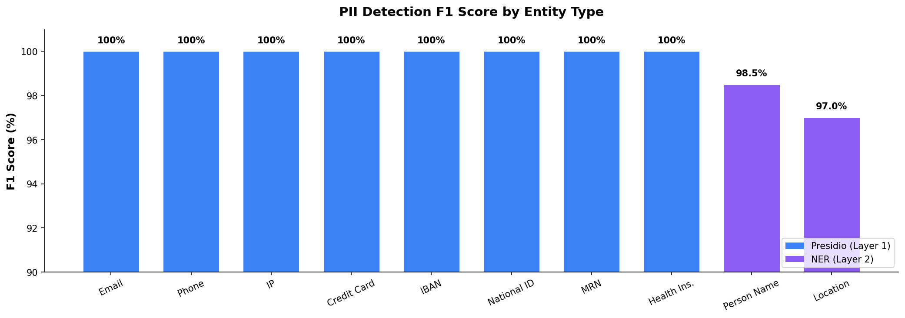
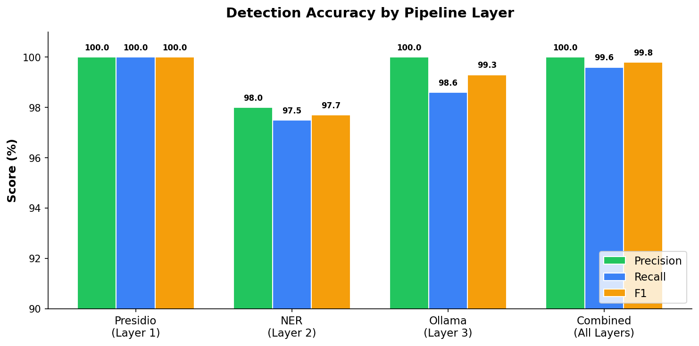

<p align="center">
  
</p>

<h3 align="center">Use AI on your company data without leaking personal information.</h3>

<p align="center">
  
  
  
  
  <a href="README.tr.md">
    
  </a>
  <br />
  
  
</p>

<p align="center">
  <a href="#screenshots"><strong>Screenshots</strong></a>
  &middot;
  <a href="#quick-start"><strong>Quick Start</strong></a>
  &middot;
  <a href="ARCHITECTURE.md"><strong>Architecture</strong></a>
  &middot;
  <a href="CHANGELOG.md"><strong>Changelog</strong></a>
  &middot;
  <a href="LICENSE"><strong>License</strong></a>
</p>

---

## What is Septum?

Septum is a **privacy-first AI middleware** that sits between your documents and cloud LLMs. It lets you query sensitive company data with ChatGPT, Claude, or any LLM — while ensuring **no raw personal data ever leaves your machine**.

1. You upload documents (PDF, Word, Excel, images, audio, etc.).
2. Septum **detects and masks** all personal data locally.
3. Only anonymised text is sent to the LLM.
4. The answer comes back with real names and values restored — **locally**.

> **In one sentence:** Septum is a safety layer for teams who want LLM power without leaking personal data.

---

## What Problems Does It Solve?

**Safe enterprise document Q&A** — Query contracts, customer files, health records, or HR documents with an LLM. The LLM only sees placeholders like `[PERSON_1]` and `[EMAIL_2]`, never real identities.

**Regulation compliance** — Helps reduce GDPR, KVKK, HIPAA, CCPA, and other regulation risks by anonymising data **before** anything touches the cloud. 17 built-in regulation packs, with the most restrictive rule always winning.

**Internal knowledge assistant** — Indexes your documents into a vector store (RAG) so you can build powerful search and Q&A over company knowledge.

---

## How It Works

1. **Upload your documents**
   Use the Documents page or the chat sidebar to add PDFs, Office files, images or audio files.

2. **Septum anonymises locally**
   Automatically detects file type, language and personal data. Masks all PII and prepares anonymised content for search.

3. **Ask questions**
   *"What are the termination conditions in this contract?"*
   *"Which products does this customer have?"*
   *"Summarise the last 6 months of case files."*

4. **Approve before sending**
   See exactly what anonymised content will be sent to the LLM. Approve or reject.

5. **Get answers with real values**
   Septum locally restores placeholders to original values, giving you a natural, human-readable answer.

---

## Key Features

- **Local PII Protection** — Raw personal data never leaves your machine. Documents stored encrypted (AES-256-GCM).
- **Multi-Regulation Support** — 17 built-in packs (GDPR, KVKK, CCPA, HIPAA, LGPD, PIPEDA, PDPA, APPI, PIPL, POPIA, DPDP, UK GDPR, and more). Multiple active simultaneously; most restrictive wins.
- **Approval Gate** — Review exactly what will be sent to the LLM before it leaves your environment.
- **Custom Rules** — Define your own patterns: regex, keyword lists, or LLM-prompt based detection.
- **Rich Format Support** — PDFs, Office files, spreadsheets, images (OCR), audio (Whisper transcription), emails.
- **Hybrid Retrieval** — BM25 keyword matching + FAISS semantic search with Reciprocal Rank Fusion.
- **Structured Data Extraction** — Automatically detects tables and key-value pairs from PDFs.
- **Audit Trail** — Append-only compliance log with entity detection metrics. No raw PII in audit events.
- **Multi-Provider** — Works with Anthropic, OpenAI, OpenRouter, and local Ollama. Switch from the UI.
- **JWT Auth & RBAC** — User roles (admin/editor/viewer) with document and session scoping.

---

## Why Septum?

| Capability | Septum | Plain ChatGPT / Claude | Azure Presidio (standalone) | Custom LangChain pipeline |
|---|:---:|:---:|:---:|:---:|
| PII masked before cloud | **Yes** | No | Detection only | Build yourself |
| Multi-regulation (17 packs) | **Yes** | No | No | Build yourself |
| Approval gate before LLM | **Yes** | No | No | Build yourself |
| De-anonymisation (real values in answers) | **Yes** | N/A | No | Build yourself |
| Document RAG with hybrid retrieval | **Yes** | No | No | Partial |
| Custom detection rules (regex, keywords, LLM) | **Yes** | No | Limited | Build yourself |
| Ready-to-use web UI | **Yes** | N/A | No | No |
| Audit trail & compliance reporting | **Yes** | No | No | Build yourself |
| Works with any LLM provider | **Yes** | Single provider | Azure only | Configurable |
| Fully self-hosted, no data leaves | **Yes** | No | Cloud service | Depends |

**The key difference:** Other tools offer pieces of the puzzle — detection here, a vector store there. Septum is the **complete end-to-end pipeline**: detection → anonymisation → mapping → retrieval → approval → LLM call → de-anonymisation → audit. Out of the box, with a UI, for any regulation.

---

## Detection & Privacy

Septum uses a **multi-layer PII detection pipeline** to minimise both false negatives (missed PII) and false positives (over-masking). Each layer adds detection capability; all run **locally**.

### What Each Layer Detects

| Layer | Technology | Entity Types Detected |
|:---:|-----------|-------------|
| 1 | **Presidio** — regex patterns + algorithmic validators (Luhn, IBAN MOD-97, TCKN checksum) | EMAIL_ADDRESS, PHONE_NUMBER, IP_ADDRESS, CREDIT_CARD_NUMBER, IBAN, NATIONAL_ID, MEDICAL_RECORD_NUMBER, HEALTH_INSURANCE_ID, POSTAL_ADDRESS |
| 2 | **NER** — HuggingFace XLM-RoBERTa with per-language model selection (20+ languages) | PERSON_NAME, LOCATION |
| 3 | **Ollama** — local LLM for context-aware validation and alias detection | PERSON_NAME aliases/nicknames; filters false positives from L1/L2 |

Layers are additive: L1 catches structured identifiers, L2 adds names and locations that patterns can't match, and L3 catches informal references like nicknames and validates ambiguous detections. Results are merged with coreference resolution so "John", "J. Doe", and "Mr. Doe" all map to the same `[PERSON_1]` placeholder.

> **Semantic entity types** (DIAGNOSIS, MEDICATION, RELIGION, POLITICAL_OPINION, etc.) are declared by regulations but require custom detection rules or the Ollama layer for detection — they cannot be caught by regex alone.

### Benchmark Results

All 17 built-in regulations active. **1 618 algorithmically generated PII values** across 10 entity types (valid Luhn, IBAN MOD-97, TCKN checksums). 150 samples per Presidio type, 100 person names (EN/TR/multilingual), 100 locations (EN/TR), plus alias detection. Fixed seed for full reproducibility.

<p align="center">
  
</p>

<p align="center">
  
</p>

| Layer | Entities | Types | Precision | Recall | F1 |
|---|:---:|:---:|:---:|:---:|:---:|
| Presidio (L1) — patterns + validators | 1 200 | 8 | 100% | 100% | 100% |
| NER (L2) — XLM-RoBERTa | 200 | 2 | 98.0% | 97.5% | 97.7% |
| Ollama (L3) — aya-expanse:8b | 218 | 2 | 100% | 98.6% | 99.3% |
| **Combined** | **1 618** | **10** | **100%** | **99.6%** | **99.8%** |

> Ollama (L3) improves PERSON_NAME recall from 97% to 100% by catching aliases, and eliminates false positives via context-aware validation. Reproducible: `pytest tests/benchmark_detection.py -v -s`

For full pipeline details, see [Architecture — PII Detection & Anonymisation Pipeline](ARCHITECTURE.md#pii-detection--anonymisation-pipeline).

---

## Screenshots

**1. Chat — ask questions, approve before sending**

<p align="center">
  
</p>

**2. Documents — upload and manage**

<p align="center">
  
</p>

**3. Regulations — 17 built-in packs, custom rules**

<p align="center">
  
</p>

**4. Settings — LLM, privacy, RAG configuration**

<p align="center">
  
</p>

<details>
<summary><strong>More screenshots</strong></summary>

**Privacy & sanitisation layers**
<p align="center">
  
</p>

**Local model configuration**
<p align="center">
  
</p>

**RAG configuration**
<p align="center">
  
</p>

**Ingestion pipeline settings**
<p align="center">
  
</p>

**Text normalisation rules**
<p align="center">
  
</p>

**NER model mappings**
<p align="center">
  
</p>

</details>

---

## Quick Start

### Docker Compose (recommended)

```bash
cp .env.example .env
# Edit .env — set at least one LLM API key (ANTHROPIC_API_KEY or OPENAI_API_KEY)
docker compose up
```

Open `http://localhost:3000`. A setup wizard guides you through the first-time configuration.

To include a local Ollama instance:

```bash
docker compose --profile ollama up
```

### Local Development

```bash
# Backend
cd backend && python -m venv .venv && source .venv/bin/activate
pip install -r requirements.txt
cp .env.example .env  # Fill in your API key(s)
uvicorn app.main:app --reload

# Frontend (in another terminal)
cd frontend && npm install && npm run dev
```

For full setup options (Docker, local dev, environment variables), see [Architecture — Setup](ARCHITECTURE.md#setup).

---

## For Developers

Septum's internals — PII pipeline details, code structure, API reference, technology stack, and deployment options — are documented in **[ARCHITECTURE.md](ARCHITECTURE.md)**.

---

## License

See [LICENSE](LICENSE) for details.
