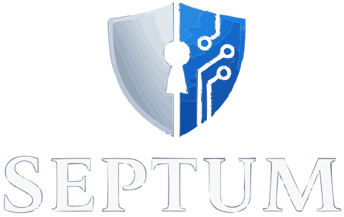
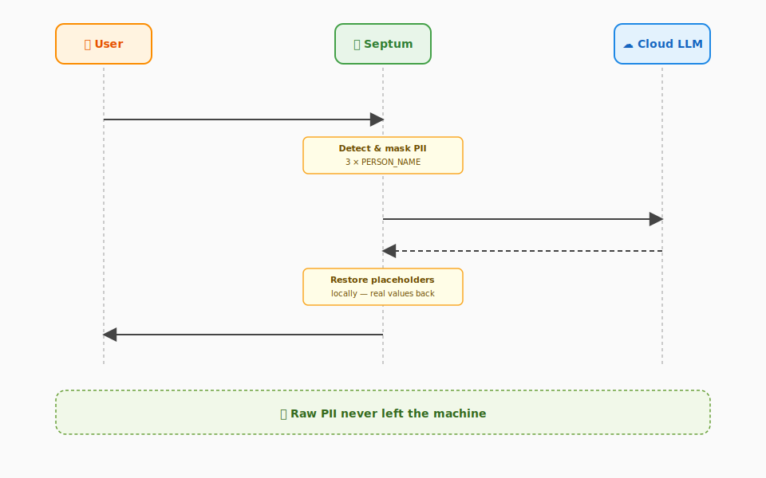

<p align="center" class="home-logo">
  
</p>

<h3 align="center">Your data never leaves. Your AI still works.</h3>

<p align="center">
  <a href="https://github.com/byerlikaya/Septum/actions/workflows/tests.yml">
    
  </a>
  <a href="https://hub.docker.com/r/byerlikaya/septum">
    
  </a>
  <a href="https://hub.docker.com/r/byerlikaya/septum">
    
  </a>
  <a href="https://github.com/byerlikaya/Septum/stargazers">
    
  </a>
  <a href="LICENSE">
    
  </a>
  <a href="README.tr.md">
    
  </a>
</p>

<p align="center">
  <strong>🏠 Home</strong>
  &nbsp;·&nbsp;
  <a href="docs/installation.md"><strong>🚀 Installation</strong></a>
  &nbsp;·&nbsp;
  <a href="docs/benchmark.md"><strong>📈 Benchmark</strong></a>
  &nbsp;·&nbsp;
  <a href="docs/features.md"><strong>✨ Features</strong></a>
  &nbsp;·&nbsp;
  <a href="docs/architecture.md"><strong>🏗️ Architecture</strong></a>
  &nbsp;·&nbsp;
  <a href="docs/document-ingestion.md"><strong>📊 Document Ingestion</strong></a>
  &nbsp;·&nbsp;
  <a href="docs/screenshots.md"><strong>📸 Screenshots</strong></a>
</p>

---

## What is Septum?

Septum is a **privacy-first AI middleware** that sits between you and cloud LLMs. You can ask questions with sensitive company data — and chat freely — with ChatGPT, Claude, Gemini, or any other LLM; Septum detects and masks personal information locally **before it reaches the cloud**.


> **In one sentence:** Septum is a safety layer for teams who want LLM power without leaking personal data — whether it is in a document or in something you typed.

**Before and after — what the LLM actually sees:**

```
Document chunk: "Ahmet Yılmaz was born in Istanbul in 1985. His mother is Ayşe and his father is Ali."
Masked:         "[PERSON_1] was born in [LOCATION_1] in 1985. His mother is [PERSON_2] and his father is [PERSON_3]."

User question:  "Where was Ahmet Yılmaz (mother Ayşe, father Ali) born?"
Masked:         "Where was [PERSON_3] (mother [PERSON_1], father [PERSON_2]) born?"
```

The LLM answers using placeholders. Septum restores real values locally before showing you the response.

---

## How It Works?

<p align="center">
  <a href="#how-it-works"></a>
</p>

1. **Upload your documents** — PDFs, Office files, images, audio. Septum detects file type, language, and personal data; masks all PII; prepares anonymised content for search. *([📊 Pipeline diagram](docs/document-ingestion.md))*
2. **Ask questions in chat** — select specific documents, or leave the selection empty and let Septum decide. With no selection, a local Ollama classifier routes the question to either Auto-RAG (search all indexed documents) or a plain chatbot reply.
3. **Your question is masked too** — the same three-layer pipeline runs on the message you typed, not just the documents. Names, phones, emails, IDs in your prompt all turn into placeholders before retrieval.
4. **Approve before sending** — see the masked question, the retrieved chunks, and the assembled cloud prompt side by side. Approve or reject.
5. **Answer with real values** — placeholders are restored locally so you see a natural, human-readable answer.

---

## Architecture

Septum is composed of 7 independent modules split across three security zones. Air-gapped modules handle raw PII with zero internet access. The bridge transports only masked placeholders. Internet-facing modules never see raw PII.

<p align="center">
  <a href="#architecture"></a>
</p>

| Package | Zone | Purpose |
|:---|:---|:---|
| [`septum-core`](packages/core/) | Air-gapped | PII detection, masking, unmasking, regulation engine |
| [`septum-mcp`](packages/mcp/) | Air-gapped | MCP server for Claude Desktop, ChatGPT, Cursor |
| [`septum-api`](packages/api/) | Air-gapped | FastAPI REST layer + models, services, auth |
| [`septum-web`](packages/web/) | Air-gapped | Next.js 16 dashboard |
| [`septum-queue`](packages/queue/) | Gateway | Cross-zone broker (file / Redis Streams) |
| [`septum-gateway`](packages/gateway/) | Internet-facing | Cloud LLM forwarder — never imports `septum-core` |
| [`septum-audit`](packages/audit/) | Internet-facing | Compliance log + SIEM export — never imports `septum-core` |

Module contracts and zone semantics live in the [Architecture](docs/architecture.md) doc.

---

## Key Features

- **Local PII Protection** — three-layer detection (Presidio + NER + optional Ollama) on both uploaded documents **and** typed chat messages. Documents stored encrypted (AES-256-GCM).
- **Approval Gate** — review the masked prompt, retrieved chunks, and assembled cloud request before any LLM call. Nothing is sent without your review.
- **17 Regulation Packs** — GDPR, KVKK, CCPA, HIPAA, LGPD, PIPEDA, PDPA, APPI, PIPL, POPIA, DPDP, UK GDPR, and more. Multiple active simultaneously; most restrictive wins. Region-specific national ID validators (TCKN checksum, Aadhaar Verhoeff, NRIC/FIN, CPF, NINO, CNPJ, My Number, and more).
- **Auto-RAG Routing** — when no documents are selected, a local Ollama classifier routes between Auto-RAG (search all indexed documents) and a plain chatbot reply. No manual selection required.
- **Custom Rules** — define your own detectors: regex, keyword lists, or LLM-prompt based.
- **Rich Format Support** — PDFs, Office files, spreadsheets, images (OCR), audio (Whisper), emails.
- **Hybrid Retrieval** — BM25 keyword matching + FAISS semantic search with Reciprocal Rank Fusion.
- **Multi-Provider** — Anthropic, OpenAI, OpenRouter, or local Ollama. Switch from the UI.
- **JWT Auth + RBAC + API Keys** — first user auto-promoted via setup wizard; admin UI manages roles (admin / editor / viewer). Programmatic API keys with SHA-256 hashed storage and per-prefix rate limits.
- **MCP Server** — standalone `septum-mcp` exposes the same local masking pipeline to any MCP-aware client over stdio (Claude Desktop, Cursor, Windsurf) or streamable-http / sse (remote, browser, containerised clients) with bearer-token auth.
- **Audit Trail** — append-only compliance log with entity detection metrics. No raw PII in audit events.

See the [Features](docs/features.md) doc for the full detection benchmark, regulation pack table, MCP integration walkthrough, REST API + authentication reference, and the "why Septum" comparison. For every Septum screen — setup wizard, approval gate, document preview, settings tabs, custom regulation rules, audit trail — see the [Screenshots](docs/screenshots.md) tour.

---

## Quick Start

The recommended installation brings up PostgreSQL, Redis, Ollama, and Septum together with one command:

```bash
git clone https://github.com/byerlikaya/Septum.git && cd Septum
cp .env.example .env && $EDITOR .env    # set POSTGRES_PASSWORD + REDIS_PASSWORD
docker compose up
```

Open **http://localhost:3000** — the setup wizard walks you through database, cache, LLM provider, regulations, and the first admin account.

Looking for a simpler single-container demo, an air-gapped two-host split, a cloud-provider-only setup without Ollama, or the native source install for contributors? The **[Installation Guide](docs/installation.md)** covers all five supported topologies, system requirements, first-launch walkthrough, upgrades, and troubleshooting.

---

## Support the Project

Septum is open source (MIT) and maintained in the open. If it saves you from a privacy incident, helps your team ship faster, or just makes your LLM workflow safer:

- ⭐ **Star the repo on [GitHub](https://github.com/byerlikaya/Septum)** — the biggest signal that this project is worth continued investment.
- **Open an issue** for bugs or features you need — every report shapes the roadmap.
- **Tell your team** — privacy-first AI tooling is still rare, and word of mouth matters more than any ad.


---

## License

See [LICENSE](LICENSE) for details.

---

<p align="center">
  <strong>🏠 Home</strong>
  &nbsp;·&nbsp;
  <a href="docs/installation.md"><strong>🚀 Installation</strong></a>
  &nbsp;·&nbsp;
  <a href="docs/benchmark.md"><strong>📈 Benchmark</strong></a>
  &nbsp;·&nbsp;
  <a href="docs/features.md"><strong>✨ Features</strong></a>
  &nbsp;·&nbsp;
  <a href="docs/architecture.md"><strong>🏗️ Architecture</strong></a>
  &nbsp;·&nbsp;
  <a href="docs/document-ingestion.md"><strong>📊 Document Ingestion</strong></a>
  &nbsp;·&nbsp;
  <a href="docs/screenshots.md"><strong>📸 Screenshots</strong></a>
</p>
