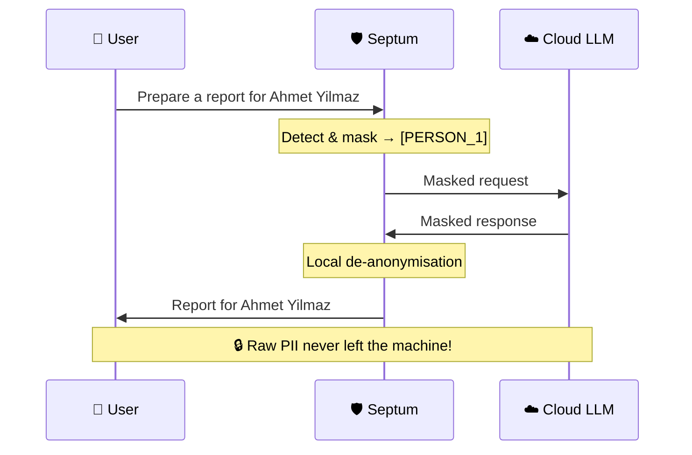
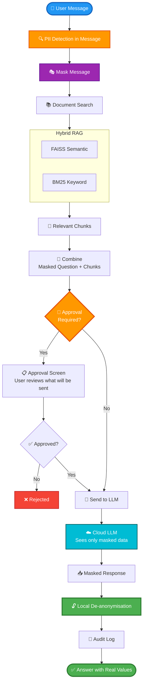
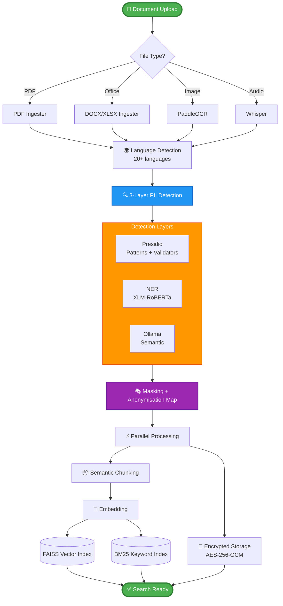
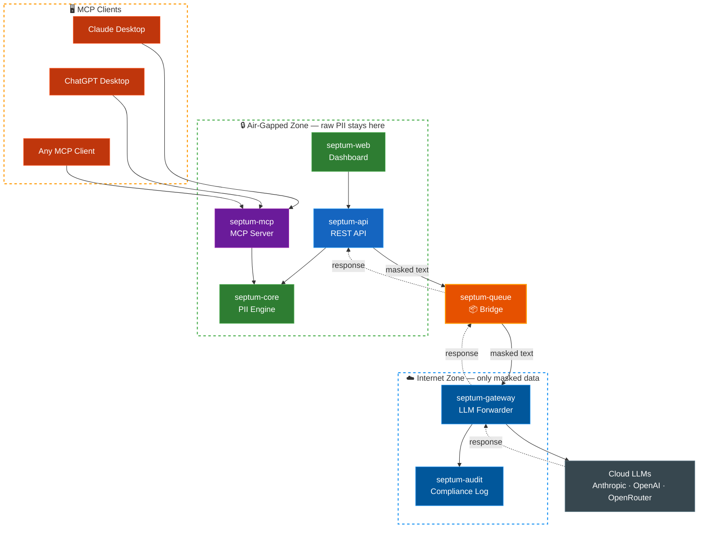

<p align="center">
  
</p>

<h3 align="center">Veriniz dışarı çıkmaz. Yapay zekanız çalışmaya devam eder.</h3>

<p align="center">
  <a href="https://github.com/byerlikaya/Septum/actions/workflows/tests.yml">
    
  </a>
  <a href="https://hub.docker.com/r/byerlikaya/septum">
    
  </a>
  <a href="https://hub.docker.com/r/byerlikaya/septum">
    
  </a>
  <a href="https://github.com/byerlikaya/Septum/stargazers">
    
  </a>
  <a href="LICENSE">
    
  </a>
  <a href="README.md">
    
  </a>
</p>

<p align="center">
  <a href="https://github.com/byerlikaya/Septum/stargazers"><b>⭐ Septum PII'yi bulutun dışında tutmanıza yardımcı oluyorsa, GitHub'da bir yıldız bu projenin devam etmesi için en büyük sinyaldir.</b></a>
</p>

<p align="center">
  <a href="#bu-kimin-için"><strong>Bu Kimin İçin?</strong></a>
  &middot;
  <a href="#ekran-görüntüleri"><strong>Ekran Görüntüleri</strong></a>
  &middot;
  <a href="#hızlı-başlangıç"><strong>Hızlı Başlangıç</strong></a>
  &middot;
  <a href="ARCHITECTURE.tr.md"><strong>Mimari</strong></a>
  &middot;
  <a href="CHANGELOG.md"><strong>Değişiklik Günlüğü</strong></a>
  &middot;
  <a href="LICENSE"><strong>Lisans</strong></a>
</p>

---

## Septum Nedir?

Septum, sizinle bulut LLM'ler arasında duran bir **gizlilik odaklı AI ara katmanıdır**. ChatGPT, Claude veya herhangi bir LLM ile hassas şirket verilerinizi sorgulamanızı — ve özgürce sohbet etmenizi — sağlar; **kişisel verileri otomatik tespit edip maskeleyerek buluta hiçbir şey göndermeden önce korur**.

1. Dokümanlarınızı (PDF, Word, Excel, görsel, ses vb.) yüklersiniz **ve** sohbette sorularınızı yazarsınız.
2. Septum tüm kişisel verileri **yerelde tespit edip maskeler** — hem dokümanlarınızda *hem de* sohbet mesajlarınızda.
3. LLM'e yalnızca anonimleştirilmiş metin gönderilir (soru, getirilen bağlam, hepsi).
4. Cevap, gerçek isim ve değerlerle **yerelde** geri birleştirilir.

> **Tek cümleyle:** Septum, LLM gücünü kullanırken kişisel veri sızdırmak istemeyen ekipler için bir güvenlik katmanıdır — bu veri ister bir dokümanda, ister az önce yazdığınız bir cümlede olsun.

**Önce ve sonra — LLM'in gerçekte gördüğü:**

Hem dokümanlarınız hem de sohbet mesajlarınız aynı maskeleme pipeline'ından geçer.

```
Doküman parçası:  "Ahmet Yılmaz Berlin'de yaşıyor, e-posta ahmet.yilmaz@corp.de, TC 12345678901"
Maskeli:          "[PERSON_1] [LOCATION_1]'de yaşıyor, e-posta [EMAIL_1], TC [NATIONAL_ID_1]"

Kullanıcı sorusu: "Şu bilgilerle bir karşılama maili yaz: müşteri adı Ahmet Yılmaz,
                   e-posta ahmet.yilmaz@corp.de, üyelik no 12345678901."
Maskeli:          "Şu bilgilerle bir karşılama maili yaz: müşteri adı [PERSON_1],
                   e-posta [EMAIL_1], üyelik no [NATIONAL_ID_1]."
```

LLM placeholder'larla cevap verir. Septum, cevabı size göstermeden önce gerçek değerleri yerelde geri yükler.

---

## Bu Kimin İçin?

- **Geliştiriciler** — gerçek müşteri verisiyle çalışan yapay zeka uygulamaları geliştiren
- **Ekipler** — GDPR, KVKK, HIPAA veya diğer gizlilik regülasyonlarına tabi olan
- **Şirketler** — iç dokümanlarla (sözleşmeler, İK dosyaları, sağlık kayıtları) LLM kullanan
- **Self-hosting savunucuları** — tam kontrol isteyen, verilerin altyapısından çıkmasını istemeyen

---

## Hangi Sorunları Çözer?

**Güvenli kurumsal doküman sorgulama** — Sözleşmeleri, müşteri dosyalarını, sağlık kayıtlarını veya İK dokümanlarını LLM ile sorgulayın. LLM yalnızca `[PERSON_1]`, `[EMAIL_2]` gibi maskeler görür, gerçek kimlikleri asla görmez.

**Regülasyon uyumluluğu** — GDPR, KVKK, HIPAA, CCPA ve diğer regülasyon risklerini, verileri buluta göndermeden **önce** anonimleştirerek azaltır. 17 hazır regülasyon paketi, en kısıtlayıcı kural her zaman kazanır.

**İç bilgi asistanı** — Dokümanlarınızı vektör veritabanına (RAG) gömerek şirket bilgisi üzerinde güçlü arama ve soru-cevap deneyimi oluşturur.

---

## Nasıl Çalışır?



1. **Dokümanlarınızı yükleyin**
   Dokümanlar sayfasından veya sohbet kenar çubuğundan PDF, Office, görsel veya ses dosyalarını ekleyin. Septum dosya tipini, dili ve kişisel verileri otomatik tespit eder; tüm PII'yi maskeler ve arama için hazırlar.

2. **Sohbette sorular sorun**
   Belirli dokümanları seçerek sorgulayın veya seçimi boş bırakıp Septum'un otomatik karar vermesine izin verin. Doküman seçilmediğinde, Septum yerel Ollama modeli ile sorgunuzun amacını sınıflandırır (SEARCH / CHAT) ve en ilgili dokümanları Otomatik RAG ile arar veya normal bir sohbet botu gibi yanıt verir.
   *"Bu sözleşmedeki fesih koşulları neler?"*
   *"Yeni müşterimiz Ahmet Yılmaz (ahmet.yilmaz@corp.de, üyelik no 12345678901) için karşılama maili yaz."*
   *"Son 6 aydaki vaka dosyalarını özetle."*

3. **Septum sorunuzu da anonimleştirir**
   Sohbet mesajınız, dokümanlarınızla **aynı** PII tespit pipeline'ından geçer. Yazdığınız isimler, telefon numaraları, e-postalar, kimlik numaraları ve diğer kişisel veriler; arama yapılmadan ve LLM'e gönderilmeden önce placeholder'larla değiştirilir. PII makineden hiç çıkmaz — ne dokümanlardan, ne de yazdıklarınızdan.

4. **Göndermeden önce onaylayın**
   LLM'e gönderilecek anonimleştirilmiş içeriği — maskelenmiş sorunuzu **ve** maskelenmiş doküman parçalarını — tam olarak görün. Onaylayın veya reddedin.

5. **Gerçek değerlerle cevap alın**
   Septum placeholder'ları yerelde orijinal değerlere geri çevirir ve size doğal, okunabilir bir cevap sunar.

### Chat Flow



<details>
<summary><b>Document Processing Pipeline</b> — bir dosya yüklediğinizde ne olur</summary>
<br/>



</details>

---

## Temel Özellikler

- **Yerel PII Koruması** — Kişisel verileri buluta göndermeden önce tespit edip maskeler — hem yüklediğiniz dokümanların içinde **hem de** yazdığınız sohbet mesajlarınızda. Dosyalar şifreli saklanır (AES-256-GCM). **Onay Mekanizması** her LLM çağrısından önce maskelenmiş çıktıyı incelemenizi sağlar — onayınız olmadan hiçbir şey gönderilmez.


- **Otomatik RAG Yönlendirme** — Doküman seçilmediğinde, Septum yerel Ollama modelini kullanarak sorgunun amacını sınıflandırır (SEARCH / CHAT). Soru dokümanlara yönelikse, Septum tüm indekslenmiş dokümanları otomatik arar ve en ilgili parçaları getirir. Genel bir soru ise normal bir sohbet botu gibi yanıt verir — manuel doküman seçimi gerekmez.
- **Çoklu Regülasyon Desteği** — 17 hazır paket (GDPR, KVKK, CCPA, HIPAA, LGPD, PIPEDA, PDPA, APPI, PIPL, POPIA, DPDP, UK GDPR ve daha fazlası). Her regülasyon, kendi bölgesine özgü kimlik numarası algılayıcılarıyla (TCKN checksum, Aadhaar Verhoeff, NRIC/FIN, Resident ID, NINO, CNPJ, My Number ve daha fazlası) birlikte kendi recognizer paketiyle geliyor. Aynı anda birden fazla aktif; en kısıtlayıcı kazanır.
- **Onay Mekanizması** — LLM'e gönderilmeden önce neyin paylaşılacağını görün ve onaylayın.
- **Özel Kurallar** — Kendi kalıplarınızı tanımlayın: regex, anahtar kelime listeleri veya LLM-tabanlı tespit.
- **Zengin Format Desteği** — PDF, Office, hesap tabloları, görseller (OCR), ses (Whisper transkripsiyon), e-postalar.
- **Hibrit Arama** — BM25 kelime eşleme + FAISS semantik arama, Reciprocal Rank Fusion ile birleştirilir.
- **Yapısal Veri Çıkarımı** — PDF'lerden tabloları ve anahtar-değer çiftlerini otomatik tespit eder.
- **Denetim Kaydı** — Salt-ekleme uyumluluk günlüğü ve varlık tespit metrikleri. Denetim olaylarında ham PII bulunmaz.
- **Çoklu Sağlayıcı** — Anthropic, OpenAI, OpenRouter ve yerel Ollama ile çalışır. Arayüzden değiştirin.
- **JWT Kimlik Doğrulama ve RBAC** — Admin'e özel kullanıcı yönetim ekranı: hesap oluşturma, rol atama (admin/editor/viewer), şifre sıfırlama ve kullanıcı pasifleştirme; kullanıcının kendi şifresini değiştirmesi; ilk kullanıcı kurulum sihirbazında otomatik admin yapılır.
- **MCP Sunucusu (protokol seviyesinde, tüm MCP istemcileriyle)** — Aynı yerel maskeleme hattını **herhangi bir** MCP uyumlu istemciye açan bağımsız bir Model Context Protocol sunucusu (`septum-mcp`) ile birlikte gelir — Claude Desktop, ChatGPT Desktop ve açık [MCP spesifikasyonu](https://modelcontextprotocol.io) üzerine inşa edilmiş diğer her araç. Altı araç — `mask_text`, `unmask_response`, `detect_pii`, `scan_file`, `list_regulations`, `get_session_map` — hepsi yerelde çalışır; ham PII makinenizden hiç çıkmaz.

<details>
<summary><b>17 hazır regülasyon paketinin tamamı</b> — yargı alanları, bölgeye özel kimlik tipleri</summary>

| Bölge | Kod | Regülasyon |
|:---|:---|:---|
| 🇪🇺 AB / AEA | `gdpr` | General Data Protection Regulation |
| 🇺🇸 ABD (Sağlık) | `hipaa` | Health Insurance Portability and Accountability Act |
| 🇹🇷 Türkiye | `kvkk` | 6698 sayılı Kişisel Verilerin Korunması Kanunu |
| 🇧🇷 Brezilya | `lgpd` | Lei Geral de Proteção de Dados |
| 🇺🇸 ABD (Kaliforniya) | `ccpa` | California Consumer Privacy Act |
| 🇺🇸 ABD (Kaliforniya) | `cpra` | California Privacy Rights Act |
| 🇬🇧 Birleşik Krallık | `uk_gdpr` | UK GDPR |
| 🇨🇦 Kanada | `pipeda` | Personal Information Protection and Electronic Documents Act |
| 🇹🇭 Tayland | `pdpa_th` | Personal Data Protection Act |
| 🇸🇬 Singapur | `pdpa_sg` | Personal Data Protection Act |
| 🇯🇵 Japonya | `appi` | Act on the Protection of Personal Information |
| 🇨🇳 Çin | `pipl` | Personal Information Protection Law |
| 🇿🇦 Güney Afrika | `popia` | Protection of Personal Information Act |
| 🇮🇳 Hindistan | `dpdp` | Digital Personal Data Protection Act |
| 🇸🇦 Suudi Arabistan | `pdpl_sa` | Personal Data Protection Law |
| 🇳🇿 Yeni Zelanda | `nzpa` | Privacy Act 2020 |
| 🇦🇺 Avustralya | `australia_pa` | Privacy Act 1988 |

Her satır [`packages/core/septum_core/recognizers/`](packages/core/septum_core/recognizers/) altında yüklenebilir bir pakettir. Birden fazlası aynı anda aktif olabilir — sanitizer hepsinin birleşimini uygular ve en kısıtlayıcı kural kazanır. Her varlık tipinin hukuki kaynağı [`packages/core/docs/REGULATION_ENTITY_SOURCES.md`](packages/core/docs/REGULATION_ENTITY_SOURCES.md) dosyasındadır.

</details>

---

## MCP Entegrasyonu (herhangi bir MCP uyumlu istemci)

Septum, aynı yerel PII maskeleme hattını herhangi bir MCP uyumlu
istemciye bağlayan bağımsız bir **Model Context Protocol** sunucusu,
[`septum-mcp`](packages/mcp/), ile birlikte gelir. MCP açık ve
sağlayıcıdan bağımsız bir [spesifikasyondur](https://modelcontextprotocol.io) —
sunucu stdio üzerinden çalışır, `septum-core`'u process içinde yükler
ve ağa hiçbir zaman erişmez; bu yüzden protokolü konuşan her istemci
kutudan çıktığı gibi çalışır (Claude Desktop, ChatGPT Desktop, Cursor,
Windsurf ve Python/TypeScript/Rust/Go/C#/Java SDK'leriyle yazılmış
diğer araçlar).

**Sunulan araçlar:**

| Araç | Amaç |
|:---|:---|
| `mask_text` | Bir metindeki PII'yi maskeler ve bir session id döndürür. |
| `unmask_response` | LLM yanıtındaki orijinal değerleri session id ile geri yazar. |
| `detect_pii` | Salt-okunur tarama — session tutmadan varlıkları listeler. |
| `scan_file` | Yerel dosyayı (`.txt`, `.md`, `.csv`, `.json`, `.pdf`, `.docx`) okuyup tarar. |
| `list_regulations` | 17 hazır regülasyon paketini ve varlık tiplerini listeler. |
| `get_session_map` | `{orijinal → placeholder}` eşlemesini yalnızca yerel hata ayıklama için döndürür. |

**Örnek istemci yapılandırması** (Claude Desktop / ChatGPT Desktop;
diğer istemciler eşdeğer bir `mcpServers` bloğu kullanır):

```json
{
  "mcpServers": {
    "septum": {
      "command": "septum-mcp",
      "env": {
        "SEPTUM_REGULATIONS": "gdpr,kvkk",
        "SEPTUM_LANGUAGE": "tr"
      }
    }
  }
}
```

Üç kurulum yöntemi (pip, uvx, depo-yerel), tüm ortam değişkenleri
ve uçtan uca kullanım örnekleri için
[`packages/mcp/README.md`](packages/mcp/README.md) dosyasına bakın.

---

## REST API ve Kimlik Doğrulama

Septum backend'i `/docs` (Swagger) ve `/redoc` adreslerinde
dokümante edilmiş bir FastAPI REST katmanı sunar. İki kimlik
doğrulama yöntemi desteklenir:

### JWT (tarayıcı oturumları, kısa ömürlü)

Kurulum sihirbazı ilk admin hesabını oluşturur; sonraki girişler
24 saat geçerli bir JWT döndürür.

```bash
curl -X POST http://localhost:3000/api/auth/login \
  -H 'Content-Type: application/json' \
  -d '{"email": "admin@example.com", "password": "your-password"}'
# → {"access_token": "...", "token_type": "bearer"}
```

### API Anahtarları (CI/CD, MCP entegrasyonları, uzun ömürlü)

Adminler `POST /api/api-keys` ile programatik API anahtarları
oluşturabilir. Ham anahtar oluşturma sırasında **bir kez** gösterilir;
yalnızca 8 karakterlik öneki ve SHA-256 özeti saklanır.

```bash
# Anahtar oluştur (yanıt raw_key içerir — hemen kaydedin, daha sonra erişemezsiniz)
curl -X POST http://localhost:3000/api/api-keys \
  -H 'Authorization: Bearer <jwt>' \
  -H 'Content-Type: application/json' \
  -d '{"name": "ci-pipeline", "expires_at": null}'

# Sonraki tüm isteklerde kullan
curl -H 'X-API-Key: sk-septum-<64 hex karakter>' http://localhost:3000/api/auth/me

# Anahtarlarını listele (sadece önek + meta, ham anahtar bir daha dönmez)
curl -H 'X-API-Key: sk-septum-…' http://localhost:3000/api/api-keys

# İptal et
curl -X DELETE -H 'X-API-Key: sk-septum-…' http://localhost:3000/api/api-keys/{id}
```

### Hız Limitleri

| Uç nokta | Limit |
|:---|:---|
| `POST /api/auth/register` | 3 / dakika |
| `POST /api/auth/login` | 5 / dakika |
| `POST /api/api-keys` | 10 / dakika |
| Diğer her şey | 60 / dakika (`RATE_LIMIT_DEFAULT` ile yapılandırılabilir) |

API anahtarı istekleri **anahtar önekine** göre sınırlanır, IP'ye
değil — paylaşılan NAT arkasındaki her servis kendi kotasını alır.
Anonim ve JWT istekleri istemci IP'sine düşer. Limitler Redis
yapılandırıldığında orada, aksi halde process içi bellekte saklanır
(yalnızca tek-düğüm dev için uygundur).

---

## Neden Septum?

| Özellik | Septum | ChatGPT / Claude | Azure Presidio | LangChain Pipeline |
|:---|:---:|:---:|:---:|:---:|
| **PII buluta gitmeden maskelenir** | **Evet** | Hayır | Yalnızca tespit | Kendin yap |
| **Çoklu regülasyon (17 paket)** | **Evet** | Hayır | Hayır | Kendin yap |
| **LLM öncesi onay mekanizması** | **Evet** | Hayır | Hayır | Kendin yap |
| **De-anonimleştirme (gerçek değerler)** | **Evet** | N/A | Hayır | Kendin yap |
| **Hibrit arama ile doküman RAG** | **Evet** | Hayır | Hayır | Kısmi |
| **Özel tespit kuralları** | **Evet** | Hayır | Sınırlı | Kendin yap |
| **Kullanıma hazır web arayüzü** | **Evet** | N/A | Hayır | Hayır |
| **Denetim kaydı ve uyumluluk** | **Evet** | Hayır | Hayır | Kendin yap |
| **Herhangi bir LLM sağlayıcı** | **Evet** | Tek sağlayıcı | Yalnızca Azure | Yapılandırılabilir |
| **Tamamen self-hosted** | **Evet** | Hayır | Bulut servisi | Duruma bağlı |

**Temel fark:** Diğer araçlar bulmacının parçalarını sunar — burada tespit, orada bir vektör veritabanı. Septum **uçtan uca komple pipeline'dır**: tespit → anonimleştirme → eşleme → arama → onay → LLM çağrısı → de-anonimleştirme → denetim. Kutudan çıktığı gibi, arayüzüyle, her regülasyon için.

---

## Tespit ve Gizlilik

Septum, hem yanlış negatifleri (kaçan PII) hem de yanlış pozitifleri (gereksiz maskeleme) en aza indirmek için **çok katmanlı PII tespit pipeline'ı** kullanır. Her katman tespit kapasitesi ekler; hepsi **yerelde** çalışır.

### Her Katman Neyi Tespit Eder?

| Katman | Teknoloji | Tespit Edilen Varlık Tipleri |
|:---:|:---|:---|
| 1 | **Presidio** — regex desenleri + algoritmik doğrulayıcılar (Luhn, IBAN MOD-97, TCKN, CPF, SSN checksum'ları). Çok dilli bağlam anahtar kelimeleri ile context-aware tanıma. | EMAIL_ADDRESS, PHONE_NUMBER, IP_ADDRESS, CREDIT_CARD_NUMBER, IBAN, NATIONAL_ID, MEDICAL_RECORD_NUMBER, HEALTH_INSURANCE_ID, POSTAL_ADDRESS, DATE_OF_BIRTH, MAC_ADDRESS, URL, COORDINATES, COOKIE_ID, DEVICE_ID, SOCIAL_SECURITY_NUMBER, CPF, PASSPORT_NUMBER, DRIVERS_LICENSE, TAX_ID, LICENSE_PLATE |
| 2 | **NER** — HuggingFace XLM-RoBERTa, dile özgü model seçimi (20+ dil). BÜYÜK HARF girdi otomatik başlık formatına dönüştürülür. | PERSON_NAME, LOCATION, ORGANIZATION_NAME |
| 3 | **Ollama** — bağlam duyarlı doğrulama, takma ad tespiti ve semantik varlık tespiti için yerel LLM | PERSON_NAME takma adları/lakapları; DIAGNOSIS, MEDICATION, RELIGION, POLITICAL_OPINION, SEXUAL_ORIENTATION, ETHNICITY, CLINICAL_NOTE, BIOMETRIC_ID, DNA_PROFILE |

Katmanlar kümülatiftir: K1 yapısal tanımlayıcıları ve bağlam etiketli değerleri (doğum tarihleri, pasaport numaraları, cihaz ID'leri vb.) yakalar, K2 transformer NER ile isimleri, konumları ve kuruluşları ekler (BÜYÜK HARF metin dahil), K3 yerel LLM ile semantik tipleri (tıbbi teşhisler, ilaçlar, dini/siyasi/etnik referanslar) ve takma adları tespit eder. Sonuçlar coreference çözümleme ile birleştirilir; böylece "Ahmet", "A. Yılmaz" ve "Bay Yılmaz" hepsi aynı `[PERSON_1]` placeholder'ına eşlenir.

> **Kıyaslama modelleri:** NER, `akdeniz27/xlm-roberta-base-turkish-ner` (TR) ve `Davlan/xlm-roberta-base-wikiann-ner` (diğer tüm diller) kullanır. Ollama katmanı `aya-expanse:8b` kullanır. Sonuçlar farklı Ollama modelleri ile değişebilir — daha büyük modeller genellikle semantik tespit doğruluğunu artırır.

### Kıyaslama Sonuçları

Tüm 17 yerleşik regülasyon aktif. 23 varlık tipinde **3,268 algoritmik olarak üretilmiş PII değeri** (geçerli Luhn, IBAN MOD-97, TCKN checksum'ları). Presidio tipi başına 150 örnek, 160 kişi ismi (karma büyük/küçük harf + BÜYÜK HARF, EN/TR), 100 konum (EN/TR), 30 kuruluş ismi (EN/TR) ve takma ad tespiti. Tam tekrarlanabilirlik için sabit seed.

<p align="center">
  
</p>

<p align="center">
  
</p>

| Katman | Varlıklar | Tipler | Precision | Recall | F1 |
|:---|:---:|:---:|:---:|:---:|:---:|
| **Presidio (K1)** — desenler + doğrulayıcılar | 1,710 | 20 | %100 | %94,4 | %97,1 |
| **NER (K2)** — XLM-RoBERTa + BÜYÜK HARF normalizasyonu | 770 | 3 | %97,5 | %92,7 | %95,1 |
| **Ollama (K3)** — aya-expanse:8b | 788 | 3 | %99,7 | %91,6 | %95,5 |
| **Birleşik** | **3,268** | **23** | **%99,3** | **%93,3** | **%96,2** |

> NER (K2), tıbbi ve hukuki belgelerde yaygın olan BÜYÜK HARF isimleri otomatik başlık formatı normalizasyonuyla tespit eder ve kuruluş isimlerini tanır. Ollama (K3) adayları doğrular ve takma adları yakalar. Benchmark, gerçek dünya seviyelerine düşüren adversarial edge case'leri (boşluklu IBAN, noktalı telefon numaraları vb.) içerir. Tekrarlanabilir: `pytest tests/benchmark_detection.py -v -s`

### Tespit Kapsamı ve Sınırlamalar

**Hiçbir PII tespit sistemi %100 doğru değildir.** Septum'un benchmark'ı bu konuda şeffaftır:

- **Regülasyonlardaki 37 varlık tipinin tamamı artık tespit edilebilir** — 21'i Presidio pattern recognizer'ları, 3'ü NER, 9'u Ollama semantik tespit, 7'si üst tip kapsamı (örn. CITY → LOCATION, FIRST_NAME → PERSON_NAME) ile.
- **23 varlık tipi aktif olarak kıyaslanır** — 14 dilde 3.268 test değeri ve adversarial edge case'ler dahil.
- **Semantik tipler** (DIAGNOSIS, MEDICATION, RELIGION, POLITICAL_OPINION vb.) Ollama katmanı tarafından tespit edilir ve çalışan bir yerel LLM gerektirir. Tespit doğruluğu kullanılan modele bağlıdır (benchmark `aya-expanse:8b` kullanır).
- **Bağlam bağımlı tanıyıcılar** (DATE_OF_BIRTH, PASSPORT_NUMBER, SSN, TAX_ID vb.) false positive'leri azaltmak için değer yakınında bağlam anahtar kelimeleri gerektirir. 8+ dilde çok dilli anahtar kelimeler desteklenir.
- **Adversarial formatlar** (boşluklu TCKN, noktalı telefon numaraları) kontrollü format testlerinden daha düşük tespit oranları gösterir. Bu dürüstçe raporlanır.

**Onay Mekanizması güvenlik ağınızdır.** LLM'e metin gönderilmeden önce neyin iletileceğini tam olarak görür ve reddedebilirsiniz. Bu tasarım gereğidir — otomatik tespit riski azaltır, insan incelemesi ortadan kaldırır.

Pipeline detayları için bkz. [Mimari — PII Tespiti ve Anonimleştirme Akışı](ARCHITECTURE.tr.md#pii-tespiti-ve-anonimleştirme-akışı).

---

## Ekran Görüntüleri

### Kurulum sihirbazı — `docker run`'dan çalışan bir yığına 2 dakikadan kısa sürede

<p align="center">
  
</p>

Veritabanınızı (SQLite veya PostgreSQL), önbelleği (in-memory veya Redis), LLM sağlayıcınızı (Anthropic, OpenAI, OpenRouter veya yerel Ollama), gizlilik regülasyonlarını ve ses transkripsiyon modelini rehberli bir sihirbazdan seçin. `.env` dosyası yok, manuel konfigürasyon yok.

### Onay mekanizması — makinenizden tam olarak neyin çıktığını görün

<p align="center">
  
</p>

Her LLM çağrısından önce Septum size yan yana üç panel gösterir: yazdığınız **maskelenmiş prompt**, getirilen **doküman parçaları** (düzenlenebilir) ve buluta gerçekten gönderilecek **tam birleştirilmiş prompt**. Onayladığınızda cevap gerçek değerlerle birlikte geri döner — yerelde, asla bulutta değil.

### Doküman önizleme — varlık vurguları ile

<p align="center">
  
</p>

Tespit edilen her varlık — isimler, adresler, doğum tarihleri, telefon numaraları, tıbbi teşhisler, kimlikler — orijinal doküman üzerinde varlık tipine göre renklendirilmiş olarak satır içi vurgulanır. Herhangi bir varlığa tıklayarak konumuna gidin; yan panel her eşleşmeyi skoru ve placeholder'ı ile birlikte listeler.

<details>
<summary><b>Daha fazla ekran görüntüsü</b> — Ayarlar, özel regülasyon kuralları, denetim kaydı</summary>

<br />

<table>
  <tr>
    <td width="50%" align="center">
      <b>LLM Sağlayıcı</b><br />
      
    </td>
    <td width="50%" align="center">
      <b>Gizlilik ve Maskeleme (3 katmanlı pipeline)</b><br />
      
    </td>
  </tr>
  <tr>
    <td align="center">
      <b>RAG ve Hibrit Arama</b><br />
      
    </td>
    <td align="center">
      <b>Doküman Ingestion</b><br />
      
    </td>
  </tr>
  <tr>
    <td align="center">
      <b>Altyapı</b><br />
      
    </td>
    <td align="center">
      <b>Özel Regülasyon Kuralları</b><br />
      
    </td>
  </tr>
  <tr>
    <td colspan="2" align="center">
      <b>Denetim Kaydı</b> — salt-ekleme uyumluluk günlüğü, varlık tespit metrikleri, ham PII yok<br />
      
    </td>
  </tr>
</table>

</details>

---

## Hızlı Başlangıç

### Docker (önerilen)

```bash
docker pull byerlikaya/septum
docker run --name septum \
  --add-host=host.docker.internal:host-gateway \
  -p 3000:3000 \
  -v septum-data:/app/data \
  -v septum-uploads:/app/uploads \
  -v septum-anon-maps:/app/anon_maps \
  -v septum-vector-indexes:/app/vector_indexes \
  -v septum-bm25-indexes:/app/bm25_indexes \
  -v septum-models:/app/models \
  byerlikaya/septum
```

**http://localhost:3000** adresini açın — kurulum sihirbazı her şeyi adım adım yapılandırır:

1. **Veritabanı** — SQLite (varsayılan, sıfır konfigürasyon) veya PostgreSQL
2. **Önbellek** — In-memory (varsayılan) veya Redis
3. **LLM Provider** — Anthropic, OpenAI, OpenRouter veya Ollama (lokal)
4. **Ses modeli** — Whisper model seçimi (opsiyonel)

`.env` dosyası yok, manuel konfigürasyon yok. Veriler Docker volume'lar aracılığıyla otomatik korunur.

### Güncelleme

```bash
docker stop septum && docker rm septum
docker pull byerlikaya/septum
docker run --name septum \
  --add-host=host.docker.internal:host-gateway \
  -p 3000:3000 \
  -v septum-data:/app/data \
  -v septum-uploads:/app/uploads \
  -v septum-anon-maps:/app/anon_maps \
  -v septum-vector-indexes:/app/vector_indexes \
  -v septum-bm25-indexes:/app/bm25_indexes \
  -v septum-models:/app/models \
  byerlikaya/septum
```

`docker pull` adımı gereklidir — `docker run` tek başına önbellekteki eski image'ı kullanır. Verileriniz named volume'larda korunur.

### Docker Compose (PostgreSQL + Redis)

```bash
docker compose up
```

PostgreSQL, Redis, Ollama ve Septum'u tek komutla başlatır. İlk sohbetten önce model çekin: `docker compose exec ollama ollama pull llama3.2:3b`. Sadece cloud provider kullanacaksanız Ollama'yı atlayın: `docker compose -f docker-compose.yml -f docker-compose.no-ollama.yml up`. Kurulum sihirbazı ilk ziyarette LLM provider'ı yapılandırır.

### Dağıtım Topolojileri

Septum, her dağıtım şekli için ayrı bir compose dosyası sunar. Güvenlik
duruşunuza uygun olanı seçin:

| Topoloji | Compose dosyası | Host | Bölge ayrımı | Ne zaman kullanılır |
|:---|:---|:---:|:---:|:---|
| **Standalone** | `docker-compose.standalone.yml` | 1 | ✗ | En basit kurulum. SQLite, harici servis yok, tek container. |
| **Full dev stack** | `docker-compose.yml` | 1 | mantıksal | Yerel geliştirme veya her modülün tek host'ta kurulumu (api + web + gateway + audit + Postgres + Redis). |
| **Hava boşluklu bölge** | `docker-compose.airgap.yml` | 1 | ✓ | İki-host ayrık kurulumun PII tarafı: api + web + Postgres + Redis. Gateway ayrı host'ta çalışır. |
| **İnternete açık bölge** | `docker-compose.gateway.yml` | 1 | ✓ | Bulut tarafı: gateway + audit + Redis. Ortak Redis Streams'ten maskelenmiş istekleri tüketir. |

Gerçek bir hava boşluklu dağıtım için `airgap.yml`'ı iç host'ta,
`gateway.yml`'ı DMZ / bulut host'ta çalıştırın ve VPN / özel link
üzerinden her ikisini de aynı Redis'e bağlayın. Kuyruktan yalnızca
maskelenmiş metin geçer — ham PII hava boşluklu bölgeyi asla terk etmez.

Her modül ayrıca `docker/` altında özel bir Dockerfile ile gelir —
`api.Dockerfile`, `web.Dockerfile`, `gateway.Dockerfile`,
`audit.Dockerfile`, `mcp.Dockerfile`, `standalone.Dockerfile` —
böylece özel orkestratörler (Kubernetes, Nomad, ECS) yalnızca ihtiyaç
duydukları image'ları seçebilir. Gateway ve audit image'ları bilinçli
olarak hafiftir (~100 MB, torch/Presidio içermez); kod-review
invariant'ı olarak asla `septum-core` içermezler.

### Yerel Geliştirme

```bash
./dev.sh --setup   # İlk kurulum: bağımlılıkları yükle
./dev.sh           # Dev sunucularını başlat (port 3000)
```

İlk ziyarette kurulum sihirbazı açılır.

### Docker ve Yerel Kurulum Karşılaştırması

Tüm özellikler her iki dağıtım modunda da aynı şekilde çalışır — Docker'da hiçbir işlevsellik kaybı yoktur:

| Özellik | Docker | Yerel |
|:---|:---:|:---:|
| **NER / PII tespiti** | CPU | GPU hızlandırmalı |
| **OCR (PaddleOCR)** | CPU | GPU hızlandırmalı |
| **Ses transkripsiyonu (Whisper)** | CPU | GPU hızlandırmalı |
| **Semantik arama (FAISS)** | CPU | CPU |
| **Sohbet ve de-anonimleştirme** | Tam | Tam |
| **Kurulum karmaşıklığı** | Tek komut | Python + Node.js |

**Docker çoğu kullanıcı için önerilir.** CPU çıkarımı tipik iş yükleri (tek doküman, interaktif sohbet) için fazlasıyla yeterlidir. GPU hızlandırma (NVIDIA CUDA ile yerel kurulum gerektirir) yalnızca OCR veya ses transkripsiyonu ile büyük hacimli dokümanları toplu işlerken belirgin fark yaratır.

**Apple Silicon:** Docker image'ı native `linux/arm64` build içerir. M1/M2/M3/M4 Mac'ler x86 emülasyonu olmadan çalışır — performans kaybı yoktur.

Mimari detaylar için bkz. **[ARCHITECTURE.tr.md](ARCHITECTURE.tr.md)**.

---

## Geliştiriciler İçin

### Mimari Genel Bakış

Septum, üç güvenlik bölgesine dağıtılmış 7 bağımsız modülden oluşur. Hava boşluklu modüller ham PII'yi sıfır internet erişimiyle işler. Köprü yalnızca maskelenmiş yer tutucuları taşır. İnternete açık modüller ham PII'yi asla görmez.



### Paket Düzeni

Septum, `packages/` altında bağımsız olarak kurulabilen paketlere
bölünmüştür. Eski `backend/` uyumluluk katmanı kaldırılmıştır; her
backend import'u doğrudan `septum_api.*` üzerinden gider ve panel
`packages/web/` altında yaşar.

| Paket | Yol | Bölge | Açıklama | Durum |
|:---|:---|:---|:---|:---:|
| `septum-core` | `packages/core/` | Hava boşluklu | PII tespit, maskeleme, demaskeleme, regülasyon motoru. Sıfır ağ bağımlılığı. | Yayında |
| `septum-mcp` | `packages/mcp/` | Hava boşluklu | Claude Desktop, ChatGPT Desktop ve diğer MCP istemcileri için MCP sunucusu. | Yayında |
| `septum-api` | `packages/api/` | Hava boşluklu | FastAPI REST uç noktaları, modeller, servisler, middleware, kimlik doğrulama. | Yayında |
| `septum-web` | `packages/web/` | Hava boşluklu | Next.js 16 panel (App Router + React 19). Build-time `NEXT_PUBLIC_API_BASE_URL` aynı-origin proxy ile ayrık dağıtım arasında seçim yapar. | Yayında |
| `septum-queue` | `packages/queue/` | Köprü | Çapraz bölge mesaj komisyoncusu (yalnızca maskelenmiş veri). Dosya backend'i (hava boşluğu varsayılanı) veya Redis Streams (`[redis]` ek bileşeni). | Yayında |
| `septum-gateway` | `packages/gateway/` | İnternete açık | Anthropic / OpenAI / OpenRouter için bulut LLM yönlendiricisi. `septum-queue`'dan tüketir, `septum-core`'u asla import etmez. İsteğe bağlı FastAPI `/health` `[server]` ek bileşeninin arkasında. | Yayında |
| `septum-audit` | `packages/audit/` | İnternete açık | Uyumluluk loglama + SIEM dışa aktarımı. JSON / CSV / Splunk HEC dışa aktarıcıları, yaş + adet retention, isteğe bağlı kuyruk tüketicisi (`[queue]` ek bileşeni) ve FastAPI `/health` + `/api/audit/export` (`[server]` ek bileşeni). `septum-core`'u asla import etmez. | Yayında |

Hava boşluklu modüllerin sıfır internet erişimi vardır; köprü
yalnızca maskelenmiş yer tutucuları taşır; internete açık modüller
asla ham PII görmez. Backend'in CORS izin listesi `FRONTEND_ORIGIN`
ortam değişkeni tarafından sürülür (birden fazla origin için
virgüllü liste; varsayılan `*`), böylece ayrık dağıtımlar kod
değişikliği olmadan panel origin'ini kilitleyebilir. Tüm modül
sözleşmeleri ve bölge semantiği için
[ARCHITECTURE.tr.md](ARCHITECTURE.tr.md)'ye bakın.

### Hızlı API Örneği

```bash
# Doküman yükle
curl -X POST http://localhost:3000/api/documents/upload \
  -H "Authorization: Bearer $TOKEN" \
  -F "file=@contract.pdf"

# Soru sor (SSE ile akışlı yanıt)
curl -N -X POST http://localhost:3000/api/chat/ask \
  -H "Authorization: Bearer $TOKEN" \
  -H "Content-Type: application/json" \
  -d '{"message": "Fesih koşulları neler?", "document_id": 1}'
```

Chat endpoint'i Server-Sent Events döner: `meta` (oturum bilgisi) → `approval_required` (onay için maskelenmiş parçalar) → `answer_chunk` (akışlı yanıt) → `end`.

Septum aradaki her şeyi yönetir: PII tespiti, anonimleştirme, arama, LLM çağrısı ve de-anonimleştirme. Uygulamanız sadece soru gönderir ve temiz cevaplar alır.

Tam API referansı, pipeline detayları, kod yapısı ve dağıtım seçenekleri için bkz. **[ARCHITECTURE.tr.md](ARCHITECTURE.tr.md)**.

---

## Projeye Destek Ol

Septum açık kaynak (MIT lisanslı) ve halka açık olarak geliştiriliyor. Eğer sizi bir gizlilik ihlalinden kurtardıysa, ekibinizin daha hızlı ilerlemesine yardım ettiyse veya LLM iş akışınızı daha güvenli hâle getirdiyse lütfen şunları değerlendirin:

- ⭐ **[GitHub'da repoya yıldız verin](https://github.com/byerlikaya/Septum)** — bu projeye yatırım yapmaya devam etmenin değeceğine dair en güçlü sinyal budur.
- **Issue ve discussion açın** — bildirdiğiniz her hata ve istediğiniz her özellik yol haritasını şekillendirir.
- **Ekibinizle paylaşın** — gizlilik odaklı AI araçları hâlâ nadir; kulaktan kulağa yayılmak her reklamdan daha değerli.

### Yıldız Geçmişi

<p align="center">
  <a href="https://star-history.com/#byerlikaya/Septum&Date">
    
  </a>
</p>

---

## Lisans

Detaylar için [LICENSE](LICENSE) dosyasına bakın.
