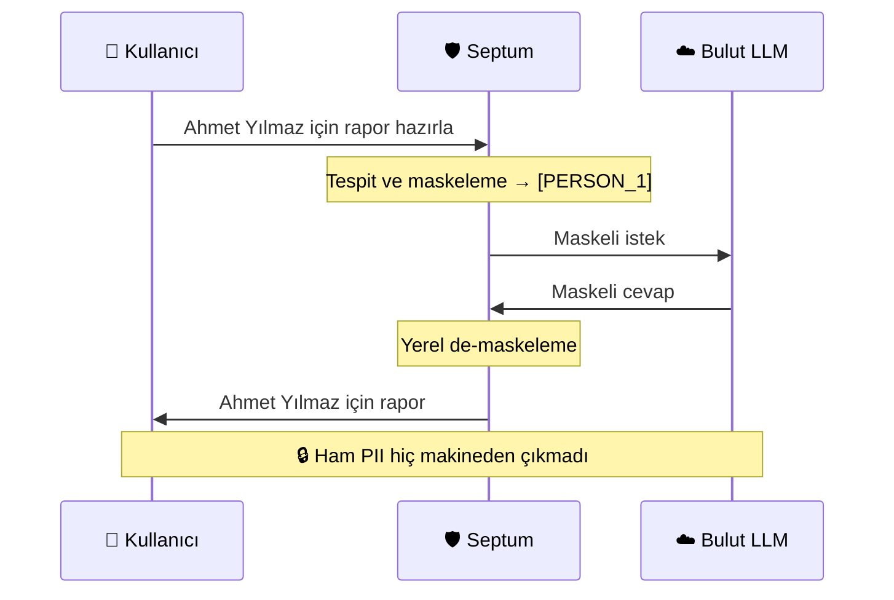
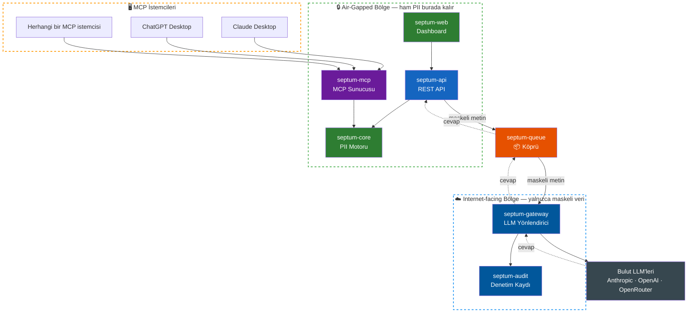

<p align="center">
  
</p>

<h3 align="center">Veriniz dışarı çıkmaz. Yapay zekanız çalışmaya devam eder.</h3>

<p align="center">
  <a href="https://github.com/byerlikaya/Septum/actions/workflows/tests.yml">
    
  </a>
  <a href="https://hub.docker.com/r/byerlikaya/septum">
    
  </a>
  <a href="https://hub.docker.com/r/byerlikaya/septum">
    
  </a>
  <a href="https://github.com/byerlikaya/Septum/stargazers">
    
  </a>
  <a href="LICENSE">
    
  </a>
  <a href="README.md">
    
  </a>
</p>

<p align="center">
  <a href="#nasıl-çalışır"><strong>Nasıl Çalışır</strong></a>
  &middot;
  <a href="#ekran-görüntüleri"><strong>Ekran Görüntüleri</strong></a>
  &middot;
  <a href="#hızlı-başlangıç"><strong>Hızlı Başlangıç</strong></a>
  &middot;
  <a href="docs/FEATURES.tr.md"><strong>Özellikler</strong></a>
  &middot;
  <a href="ARCHITECTURE.tr.md"><strong>Mimari</strong></a>
  &middot;
  <a href="CHANGELOG.md"><strong>Değişiklik Günlüğü</strong></a>
</p>

---

## Septum Nedir?

Septum, sizinle bulut LLM'lerin arasında duran bir **gizlilik öncelikli AI ara katmanıdır**. ChatGPT, Claude veya herhangi bir LLM'e hassas şirket verinizle soru sormanıza — ve rahatça sohbet etmenize — izin verirken, **kişisel verileri tespit edip maskeler; hiçbir şey bulutun yanından geçmeden önce**.

1. Dokümanlarınızı (PDF, Word, Excel, görsel, ses) yüklersiniz **ve** sohbette sorularınızı yazarsınız.
2. Septum kişisel verileri yerelde **tespit eder ve maskeler** — hem dokümanlarınızda *hem de* yazdığınız mesajlarda.
3. LLM'e yalnızca anonimleştirilmiş metin gider.
4. Cevap gerçek isim ve değerlerle **yerelde** geri birleştirilir.

> **Tek cümleyle:** Septum, LLM gücünü kullanmak isteyip kişisel veri sızdırmak istemeyen ekipler için bir güvenlik katmanıdır — veri ister bir dokümanda, ister az önce yazdığınız bir cümlede olsun.

**Önce ve sonra — LLM'in gerçekte gördüğü:**

```
Doküman parçası:  "Ahmet Yılmaz Berlin'de yaşıyor, e-posta ahmet.yilmaz@corp.de, TC 12345678901"
Maskeli:          "[PERSON_1] [LOCATION_1]'de yaşıyor, e-posta [EMAIL_1], TC [NATIONAL_ID_1]"

Kullanıcı sorusu: "Şu bilgilerle karşılama maili yaz: müşteri adı Ahmet Yılmaz,
                   e-posta ahmet.yilmaz@corp.de, üyelik no 12345678901."
Maskeli:          "Şu bilgilerle karşılama maili yaz: müşteri adı [PERSON_1],
                   e-posta [EMAIL_1], üyelik no [NATIONAL_ID_1]."
```

LLM placeholder'larla cevap verir. Septum, cevabı size göstermeden önce gerçek değerleri yerelde geri yazar.

---

## Kimler İçin?

- **Geliştiriciler** — gerçek müşteri verisiyle çalışan AI uygulamaları yazanlar
- **Ekipler** — GDPR, KVKK, HIPAA veya başka gizlilik regülasyonlarına tabi olanlar
- **Şirketler** — LLM'leri kendi iç dokümanları (sözleşmeler, İK dosyaları, sağlık kayıtları) üzerinde çalıştırmak isteyenler
- **Self-hosting sevenler** — tam kontrol isteyenler; veri kendi altyapınızın dışına çıkmaz

---

## Nasıl Çalışır



1. **Dokümanlarınızı yükleyin** — PDF, Office, görsel, ses. Septum dosya tipini, dili ve kişisel verileri otomatik tespit eder; tüm PII'yi maskeler; içeriği anonimleştirilmiş haliyle aramaya hazırlar.
2. **Chat'te soru sorun** — belirli dokümanları seçin ya da boş bırakın, kararı Septum'a bırakın. Seçim yokken yerel Ollama sınıflandırıcısı soruyu Otomatik RAG'a (tüm indekslenmiş dokümanları ara) ya da düz sohbet cevabına yönlendirir.
3. **Sorunuz da maskelenir** — aynı üç katmanlı hat yalnızca dokümanlar için değil, yazdığınız mesaj için de çalışır. İsimler, telefonlar, e-postalar, kimlik numaraları — retrieval öncesinde placeholder'a döner.
4. **Göndermeden önce onaylayın** — maskeli soru, getirilen parçalar ve buluta gidecek tam istek yan yana görünür. Onaylayın ya da reddedin.
5. **Cevap gerçek değerlerle gelir** — placeholder'lar yerelde geri yazılır; siz doğal, okunabilir bir cevap görürsünüz.

---

## Mimari

Septum, üç güvenlik bölgesine ayrılmış 7 bağımsız modülden oluşur. Air-gapped modüller ham PII'yi işler, internete erişmez. Bridge yalnızca maskeli placeholder taşır. Internet-facing modüller ham PII'yi asla görmez.



| Paket | Bölge | Görevi |
|:---|:---|:---|
| [`septum-core`](packages/core/) | Air-gapped | PII tespit, maskeleme, geri alma, regülasyon motoru |
| [`septum-mcp`](packages/mcp/) | Air-gapped | Claude Desktop, ChatGPT, Cursor için MCP sunucusu |
| [`septum-api`](packages/api/) | Air-gapped | FastAPI REST katmanı + model, servis, auth |
| [`septum-web`](packages/web/) | Air-gapped | Next.js 16 dashboard |
| [`septum-queue`](packages/queue/) | Köprü | Bölgeler arası broker (dosya / Redis Streams) |
| [`septum-gateway`](packages/gateway/) | Internet-facing | Bulut LLM yönlendirici — `septum-core`'u asla içe aktarmaz |
| [`septum-audit`](packages/audit/) | Internet-facing | Uyumluluk kaydı + SIEM export — `septum-core`'u asla içe aktarmaz |

Modül kontratları ve bölge kuralları [ARCHITECTURE.tr.md](ARCHITECTURE.tr.md) dosyasında.

---

## Öne Çıkan Özellikler

- **Yerel PII Koruması** — üç katmanlı tespit (Presidio + NER + isteğe bağlı Ollama), hem yüklenen dokümanlarda hem de yazdığınız mesajlarda çalışır. Dokümanlar şifreli saklanır (AES-256-GCM).
- **Onay Kapısı** — her LLM çağrısından önce maskeli prompt, getirilen parçalar ve buluta gidecek hazır istek yan yana görünür. Siz onaylamadan hiçbir şey gönderilmez.
- **17 Regülasyon Paketi** — GDPR, KVKK, CCPA, HIPAA, LGPD, PIPEDA, PDPA, APPI, PIPL, POPIA, DPDP, UK GDPR ve daha fazlası. Aynı anda birden çoğu aktif olabilir; en kısıtlayıcı kural kazanır. Bölgeye özgü kimlik doğrulayıcıları (TCKN, Aadhaar Verhoeff, NRIC/FIN, CPF, NINO, CNPJ, My Number ve fazlası) algoritmiktir.
- **Otomatik RAG Yönlendirme** — doküman seçilmediğinde yerel Ollama sınıflandırıcısı soruyu Otomatik RAG (tüm dokümanlarda ara) ya da düz sohbet cevabı yoluna yönlendirir. Manuel seçim gerekmez.
- **Özel Kurallar** — regex, anahtar kelime listesi ya da LLM-prompt tabanlı kendi tanıyıcılarınızı tanımlayın.
- **Zengin Format Desteği** — PDF, Office, hesap tabloları, görseller (OCR), ses (Whisper), e-postalar.
- **Hibrit Retrieval** — BM25 kelime eşleme + FAISS semantik arama, Reciprocal Rank Fusion ile birleştirilir.
- **Çoklu Sağlayıcı** — Anthropic, OpenAI, OpenRouter veya yerel Ollama. Arayüzden değiştirin.
- **JWT + RBAC + API Anahtarları** — ilk kullanıcı kurulum sihirbazında otomatik admin olur; admin arayüzünden rol yönetimi (admin / editör / viewer). Programatik API anahtarları SHA-256 hash'li saklanır, önek bazlı rate limit uygulanır.
- **MCP Sunucusu** — bağımsız `septum-mcp`, aynı yerel maskeleme hattını MCP uyumlu her istemciye açar (Claude Desktop, ChatGPT Desktop, Cursor, Windsurf ve SDK istemcileri).
- **Denetim Kaydı** — salt-ekleme uyumluluk günlüğü ve varlık tespit metrikleri. Denetim olaylarında ham PII yoktur.

Tam tespit benchmark'ı, regülasyon paket tablosu, MCP entegrasyon kılavuzu, REST API + kimlik doğrulama referansı ve "neden Septum" karşılaştırması için [docs/FEATURES.tr.md](docs/FEATURES.tr.md) dosyasına bakın.

---

## Ekran Görüntüleri

### Kurulum sihirbazı — `docker run`'dan çalışan sisteme 2 dakikadan az

<p align="center">
  
</p>

Veritabanını (SQLite ya da PostgreSQL), cache'i (in-memory ya da Redis), LLM sağlayıcısını (Anthropic, OpenAI, OpenRouter ya da yerel Ollama), gizlilik regülasyonlarını ve ses transkripsiyon modelini rehberli sihirbazdan seçin. `.env` dosyası yok, manuel yapılandırma yok.

### Onay kapısı — makinenizden ne çıktığını tam olarak görün

<p align="center">
  
</p>

Her LLM çağrısından önce Septum üç paneli yan yana gösterir: yazdığınız **maskeli prompt**, getirilen **doküman parçaları** (düzenlenebilir) ve buluta gidecek **tam hazırlanmış istek**. Onayladığınızda cevap yerelde gerçek değerlerle geri birleştirilmiş olarak gelir — asla bulutta.

Satır içi varlık renklendirmesiyle doküman önizleme, ayarlar turu, özel regülasyon kuralları ve denetim kaydı için `docs/FEATURES.tr.md` içindeki [UI Galerisi](docs/FEATURES.tr.md#ui-galerisi) bölümüne bakın.

---

## Hızlı Başlangıç

### Docker (önerilen)

```bash
docker pull byerlikaya/septum
docker run --name septum \
  --add-host=host.docker.internal:host-gateway \
  -p 3000:3000 \
  -v septum-data:/app/data \
  -v septum-uploads:/app/uploads \
  -v septum-anon-maps:/app/anon_maps \
  -v septum-vector-indexes:/app/vector_indexes \
  -v septum-bm25-indexes:/app/bm25_indexes \
  -v septum-models:/app/models \
  byerlikaya/septum
```

**http://localhost:3000** adresine gidin — sihirbaz sizi veritabanı, cache, LLM sağlayıcı, regülasyonlar ve ilk admin hesabı boyunca götürür. `.env` dosyası yok; veriler adlandırılmış volume'larda kalır.

**Güncelleme.** Container'ı durdurup silin, `docker pull byerlikaya/septum` çekin, aynı `docker run` komutunu çalıştırın. Verileriniz volume'larda korunur.

**Docker Compose.** `docker compose up` PostgreSQL, Redis, Ollama ve Septum'u birlikte başlatır. İlk chat öncesi bir model çekin: `docker compose exec ollama ollama pull llama3.2:3b`. Yalnız bulut sağlayıcı kullanacaksanız Ollama'yı `docker compose -f docker-compose.yml -f docker-compose.no-ollama.yml up` ile devre dışı bırakabilirsiniz.

**Deployment topolojileri** — farklı dağıtım şekilleri için dört compose varyantı gelir: standalone (tek container, SQLite), tam dev stack (tüm modüller tek host), sadece air-gapped bölge, sadece internet-facing bölge. Tam matris ve iki-host air-gap akışı için [ARCHITECTURE.tr.md § Deployment Topolojileri](ARCHITECTURE.tr.md#deployment-topolojileri)'ne bakın.

### Yerel geliştirme

```bash
./dev.sh --setup   # ilk kez: bağımlılıkları kur
./dev.sh           # dev sunucularını başlat (port 3000)
```

Kurulum sihirbazı ilk ziyarette açılır.

### Docker vs yerel

Tüm özellikler her iki modda da aynıdır. Fark hızlandırmada: yerel kurulum PyPI'nin host'unuza sunduğu torch varyantını kullanır (NVIDIA Linux'ta CUDA, Apple Silicon'da MPS); yayınlanan Docker imajı yalnız CPU'dur (NVIDIA Linux için tam CUDA runtime taşıyan ayrı bir `byerlikaya/septum:gpu` varyantı vardır). Tipik iş yüklerinde CPU yeterlidir; GPU yalnızca büyük hacimli OCR veya ses transkripsiyonunda belirgin fark yaratır.

---

## Daha Fazla Bilgi

- **[docs/FEATURES.tr.md](docs/FEATURES.tr.md)** — tespit benchmark'ı, regülasyon paketleri, MCP detayları, REST API + auth, neden-Septum karşılaştırması
- **[ARCHITECTURE.tr.md](ARCHITECTURE.tr.md)** — modül kontratları, bölge kuralları, deployment topolojileri, API referansı
- **[CHANGELOG.md](CHANGELOG.md)** — tarih bazlı sürüm notları

---

## Projeye Destek Olun

Septum açık kaynaklı (MIT) ve açıkta geliştiriliyor. Sizi bir gizlilik ihlalinden kurtardıysa, ekibinize hız kazandırdıysa ya da LLM akışınızı daha güvenli kıldıysa:

- ⭐ **[GitHub'da repoyu yıldızlayın](https://github.com/byerlikaya/Septum)** — bu projenin geliştirilmeye devam etmesi gerektiğine dair en güçlü sinyal.
- **Issue ve discussion açın** — ihtiyaç duyduğunuz hata ve özellikler yol haritasını şekillendirir.
- **Ekibinize anlatın** — gizlilik öncelikli AI araçları hâlâ nadir, kulaktan kulağa yayılmak her reklamdan değerli.

### Yıldız Geçmişi

<p align="center">
  <a href="https://star-history.com/#byerlikaya/Septum&Date">
    
  </a>
</p>

---

## Lisans

Ayrıntılar için [LICENSE](LICENSE) dosyasına bakın.
