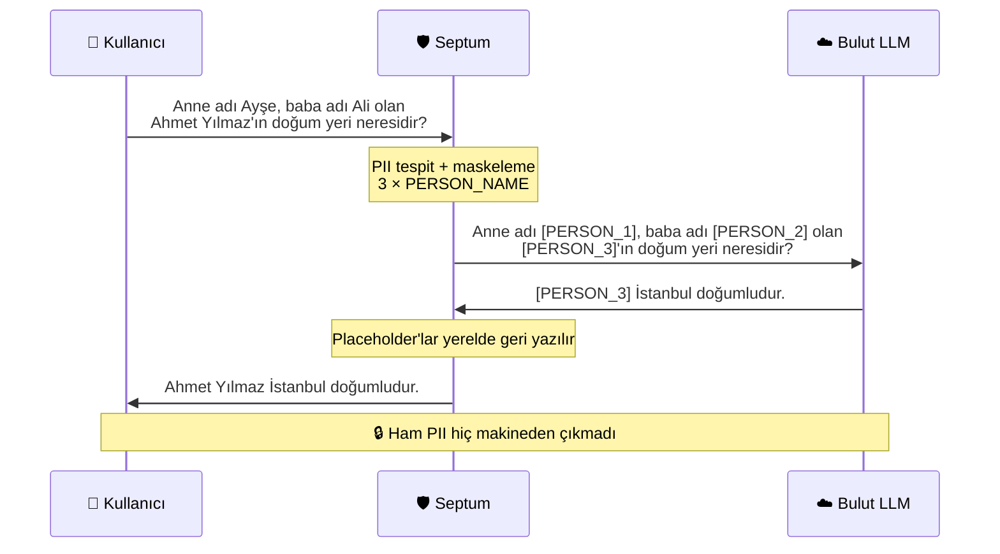
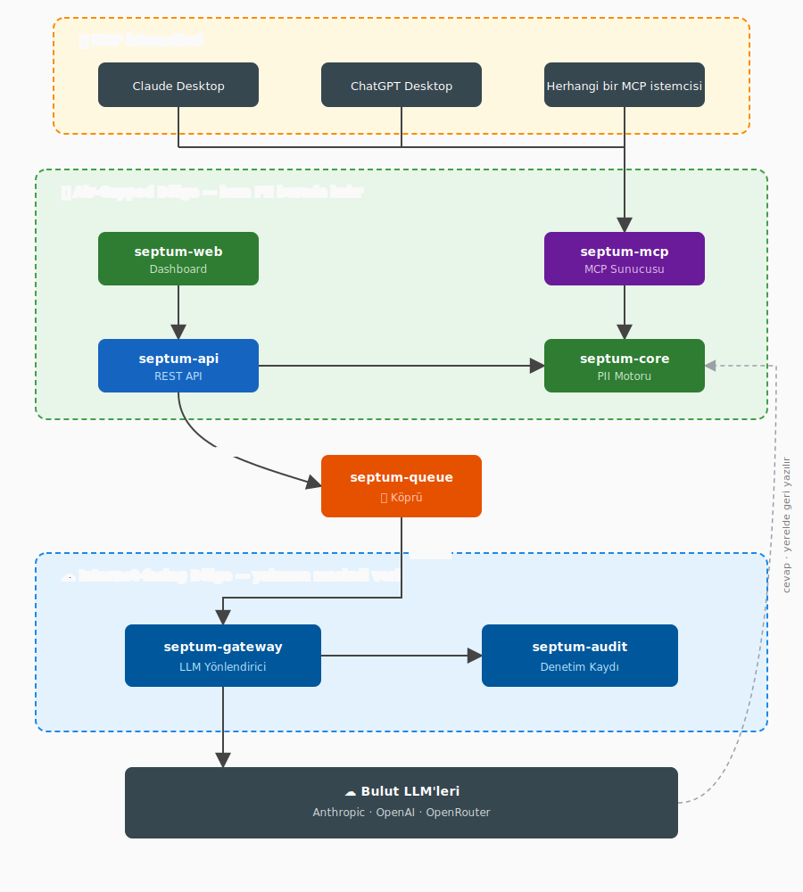

<p align="center">
  
</p>

<h3 align="center">Veriniz dışarı çıkmaz. Yapay zekanız çalışmaya devam eder.</h3>

<p align="center">
  <a href="https://github.com/byerlikaya/Septum/actions/workflows/tests.yml">
    
  </a>
  <a href="https://hub.docker.com/r/byerlikaya/septum">
    
  </a>
  <a href="https://hub.docker.com/r/byerlikaya/septum">
    
  </a>
  <a href="https://github.com/byerlikaya/Septum/stargazers">
    
  </a>
  <a href="LICENSE">
    
  </a>
  <a href="README.md">
    
  </a>
</p>

<p align="center">
  <a href="#nasıl-çalışır"><strong>Nasıl Çalışır</strong></a>
  &middot;
  <a href="#ekran-görüntüleri"><strong>Ekran Görüntüleri</strong></a>
  &middot;
  <a href="#hızlı-başlangıç"><strong>Hızlı Başlangıç</strong></a>
  &middot;
  <a href="docs/FEATURES.tr.md"><strong>Özellikler</strong></a>
  &middot;
  <a href="ARCHITECTURE.tr.md"><strong>Mimari</strong></a>
  &middot;
  <a href="CHANGELOG.md"><strong>Değişiklik Günlüğü</strong></a>
</p>

---

## Septum Nedir?

Septum, sizinle bulut LLM'leri arasında duran **gizlilik öncelikli bir AI ara katmanıdır**. ChatGPT, Claude, Gemini ya da başka bir LLM'e hassas şirket verilerinizle sorular sorabilir, rahatça sohbet edebilirsiniz; Septum kişisel bilgileri **buluta çıkmadan önce** yerelde tespit edip maskeler.


> **Tek cümleyle:** Septum, LLM gücünden faydalanıp kişisel veri sızdırmak istemeyen ekipler için bir güvenlik katmanıdır — veri ister bir dokümanda, ister yazdığınız bir cümlede olsun.

**Önce ve sonra — LLM'in gerçekte gördüğü:**

```
Doküman parçası:  "Ahmet Yılmaz Berlin'de yaşıyor, e-posta ahmet.yilmaz@corp.de, TC 12345678901"
Maskeli:          "[PERSON_1] [LOCATION_1]'de yaşıyor, e-posta [EMAIL_1], TC [NATIONAL_ID_1]"

Kullanıcı sorusu: "Şu bilgilerle karşılama maili yaz: müşteri adı Ahmet Yılmaz,
                   e-posta ahmet.yilmaz@corp.de, üyelik no 12345678901."
Maskeli:          "Şu bilgilerle karşılama maili yaz: müşteri adı [PERSON_1],
                   e-posta [EMAIL_1], üyelik no [NATIONAL_ID_1]."
```

LLM placeholder'larla cevap verir. Septum, cevabı size göstermeden önce gerçek değerleri yerelde geri yazar.

---

## Nasıl Çalışır?



1. **Dokümanlarınızı yükleyin** — Septum dosya tipini ve dili otomatik algılar, tüm kişisel verileri maskeler ve içeriği anonimleştirilmiş haliyle aramaya hazırlar.
2. **Sohbette soru sorun** — dilerseniz belirli dokümanları seçin, dilerseniz boş bırakıp kararı Septum'a bırakın. Seçim yoksa yerel Ollama sınıflandırıcısı soruyu ya Otomatik RAG'a (tüm indekslenmiş dokümanları arayıp ilgili parçaları çıkarır) ya da doğrudan sohbet yoluna yönlendirir.
3. **Sorunuz da maskelenir** — aynı üç katmanlı hat yalnızca dokümanlarda değil, sizin yazdığınız mesajda da çalışır. İsim, telefon, e-posta, kimlik numarası — hepsi retrieval öncesinde placeholder'a dönüşür.
4. **Göndermeden önce onaylayın** — maskeli sorunuz, getirilen parçalar ve buluta gidecek birleşik istek yan yana gösterilir. Onaylarsınız ya da reddedersiniz.
5. **Cevap gerçek değerlerle gelir** — placeholder'lar yerelde geri yazılır; siz doğal, okunabilir bir cevap görürsünüz.

---

## Mimari

Septum, üç güvenlik bölgesine ayrılmış 7 bağımsız modülden oluşur. Air-gapped modüller ham PII'yi işler ve internete çıkmaz. Köprü yalnızca maskeli placeholder taşır. Internet-facing modüller ham PII'yi asla görmez.

<p align="center">
  
</p>

| Paket | Bölge | Görevi |
|:---|:---|:---|
| [`septum-core`](packages/core/) | Air-gapped | PII tespit, maskeleme, geri alma, regülasyon motoru |
| [`septum-mcp`](packages/mcp/) | Air-gapped | Claude Desktop, ChatGPT, Cursor için MCP sunucusu |
| [`septum-api`](packages/api/) | Air-gapped | FastAPI REST katmanı + model, servis, auth |
| [`septum-web`](packages/web/) | Air-gapped | Next.js 16 dashboard |
| [`septum-queue`](packages/queue/) | Gateway | Bölgeler arası broker (dosya / Redis Streams) |
| [`septum-gateway`](packages/gateway/) | Internet-facing | Bulut LLM yönlendirici — `septum-core`'u asla içe aktarmaz |
| [`septum-audit`](packages/audit/) | Internet-facing | Uyumluluk kaydı + SIEM export — `septum-core`'u asla içe aktarmaz |

Modül kontratları ve bölge kuralları [ARCHITECTURE.tr.md](ARCHITECTURE.tr.md) dosyasında.

---

## Öne Çıkan Özellikler

- **Yerel PII Koruması** — üç katmanlı tespit (Presidio + NER + isteğe bağlı Ollama), hem yüklenen dokümanlarda hem de yazdığınız mesajlarda çalışır. Dokümanlar şifreli saklanır (AES-256-GCM).
- **Onay Kapısı** — her LLM çağrısından önce maskeli prompt, getirilen parçalar ve buluta gidecek hazır istek yan yana görünür. Siz onaylamadan hiçbir şey gönderilmez.
- **17 Regülasyon Paketi** — GDPR, KVKK, CCPA, HIPAA, LGPD, PIPEDA, PDPA, APPI, PIPL, POPIA, DPDP, UK GDPR ve daha fazlası. Aynı anda birden çoğu aktif olabilir; en kısıtlayıcı kural kazanır. Bölgeye özgü kimlik doğrulayıcıları (TCKN, Aadhaar Verhoeff, NRIC/FIN, CPF, NINO, CNPJ, My Number ve fazlası) algoritmiktir.
- **Otomatik RAG Yönlendirme** — doküman seçilmediğinde yerel Ollama sınıflandırıcısı soruyu ya Otomatik RAG'a (tüm dokümanları arar) ya da doğrudan sohbet yoluna yönlendirir. Manuel seçim gerekmez.
- **Özel Kurallar** — regex, anahtar kelime listesi ya da LLM-prompt tabanlı kendi tanıyıcılarınızı tanımlayın.
- **Zengin Format Desteği** — PDF, Office, hesap tabloları, görseller (OCR), ses (Whisper), e-postalar.
- **Hibrit Retrieval** — BM25 kelime eşleme + FAISS semantik arama, Reciprocal Rank Fusion ile birleştirilir.
- **Çoklu Sağlayıcı** — Anthropic, OpenAI, OpenRouter veya yerel Ollama. Arayüzden değiştirin.
- **JWT + RBAC + API Anahtarları** — ilk kullanıcı kurulum sihirbazında otomatik olarak admin yapılır; admin arayüzünden rol yönetimi (admin / editor / viewer) sağlanır. Programatik API anahtarları SHA-256 hash'li saklanır, rate limit anahtarın önekine göre uygulanır.
- **MCP Sunucusu** — bağımsız `septum-mcp`, aynı yerel maskeleme hattını MCP uyumlu her istemciye açar (Claude Desktop, ChatGPT Desktop, Cursor, Windsurf ve SDK istemcileri).
- **Denetim Kaydı** — salt-ekleme uyumluluk günlüğü ve varlık tespit metrikleri. Denetim olaylarında ham PII yoktur.

Tam tespit benchmark'ı, regülasyon paket tablosu, MCP entegrasyon kılavuzu, REST API + kimlik doğrulama referansı ve "neden Septum" karşılaştırması için [docs/FEATURES.tr.md](docs/FEATURES.tr.md) dosyasına bakın.

---

## Ekran Görüntüleri

### Kurulum Sihirbazı

<p align="center">
  
</p>

Veritabanı (SQLite ya da PostgreSQL), cache (in-memory ya da Redis), LLM sağlayıcı (Anthropic, OpenAI, OpenRouter ya da yerel Ollama), gizlilik regülasyonları ve ses transkripsiyon modeli — hepsi sihirbazdan seçilir.

### Onay Kapısı — Makinenizden ne çıktığını tam olarak görün

<p align="center">
  
</p>

Her LLM çağrısından önce Septum üç paneli yan yana gösterir: sizin yazdığınız **maskeli prompt**, getirilen **doküman parçaları** (düzenlenebilir) ve buluta gidecek **birleştirilmiş son istek**. Onayladığınızda cevap yerelde gerçek değerlerle yeniden yazılarak önünüze gelir — bu geri yazma adımı asla bulutta yapılmaz.

Satır içi varlık renklendirmesiyle doküman önizleme, ayarlar turu, özel regülasyon kuralları ve denetim kaydı için `docs/FEATURES.tr.md` içindeki [UI Galerisi](docs/FEATURES.tr.md#ui-galerisi) bölümüne bakın.

---

## Hızlı Başlangıç

### Docker (önerilen)

```bash
docker pull byerlikaya/septum
docker run --name septum \
  --add-host=host.docker.internal:host-gateway \
  -p 3000:3000 \
  -v septum-data:/app/data \
  -v septum-uploads:/app/uploads \
  -v septum-anon-maps:/app/anon_maps \
  -v septum-vector-indexes:/app/vector_indexes \
  -v septum-bm25-indexes:/app/bm25_indexes \
  -v septum-models:/app/models \
  byerlikaya/septum
```

**http://localhost:3000** adresini açın — sihirbaz veritabanı, cache, LLM sağlayıcı, regülasyonlar ve ilk admin hesabı kurulumu için sizi adım adım yönlendirir.

**Güncelleme.** Container'ı durdurup silin, `docker pull byerlikaya/septum` çekin, aynı `docker run` komutunu çalıştırın. Verileriniz volume'larda korunur.

**Docker Compose.** `docker compose up` PostgreSQL, Redis, Ollama ve Septum'u birlikte başlatır. İlk chat öncesi bir model çekin: `docker compose exec ollama ollama pull llama3.2:3b`. Yalnız bulut sağlayıcı kullanacaksanız Ollama'yı `docker compose -f docker-compose.yml -f docker-compose.no-ollama.yml up` ile devre dışı bırakabilirsiniz.

**Deployment topolojileri** — farklı dağıtım biçimleri için dört ayrı compose dosyası gelir: standalone (tek container, SQLite), tam dev stack (tüm modüller tek host'ta), yalnızca air-gapped bölge ve yalnızca internet-facing bölge. Tam matris ve iki-host air-gap akışı için [ARCHITECTURE.tr.md § Deployment Topolojileri](ARCHITECTURE.tr.md#deployment-topolojileri) bölümüne bakın.

### Yerel geliştirme

```bash
./dev.sh --setup   # ilk kez: bağımlılıkları kur
./dev.sh           # dev sunucularını başlat (port 3000)
```

Kurulum sihirbazı ilk ziyarette açılır.

### Docker vs Yerel

Tüm özellikler her iki modda da aynı şekilde çalışır. Tek fark hızlandırmadadır: yerel kurulum, PyPI'nin sisteminize uygun gördüğü torch sürümünü çeker (NVIDIA Linux'ta CUDA, Apple Silicon'da MPS). Yayınlanan Docker imajı ise yalnızca CPU üzerinde çalışır; NVIDIA Linux host'ları için tam CUDA runtime taşıyan ayrı bir `byerlikaya/septum:gpu` imajı da yayınlanır. Günlük iş yüklerinde CPU yeterlidir; GPU'nun farkı yalnızca toplu OCR veya uzun ses transkripsiyonlarında hissedilir.

---

## Daha Fazla Bilgi

- **[docs/FEATURES.tr.md](docs/FEATURES.tr.md)** — tespit benchmark'ı, regülasyon paketleri, MCP detayları, REST API + auth, neden-Septum karşılaştırması
- **[ARCHITECTURE.tr.md](ARCHITECTURE.tr.md)** — modül kontratları, bölge kuralları, deployment topolojileri, API referansı
- **[CHANGELOG.md](CHANGELOG.md)** — tarih bazlı sürüm notları

---

## Projeye Destek Olun

Septum açık kaynak bir projedir (MIT lisanslı) ve geliştirme süreci herkese açık yürütülür. Bir gizlilik ihlalinin önüne geçmenize, ekibinizin hızlanmasına ya da LLM akışınızın güvenli kalmasına yardımcı olduysa:

- ⭐ **[GitHub'da repoyu yıldızlayın](https://github.com/byerlikaya/Septum)** — bu projenin sürdürülmeye değer olduğunu gösteren en güçlü sinyal.
- **Issue ve discussion açın** — bildirdiğiniz her hata ve eksik özellik yol haritasını şekillendirir.
- **Ekibinize anlatın** — gizlilik öncelikli AI araçları hâlâ nadir; kulaktan kulağa yayılma her reklamdan daha etkili.


---

## Lisans

Ayrıntılar için [LICENSE](LICENSE) dosyasına bakın.
