<p align="center">
  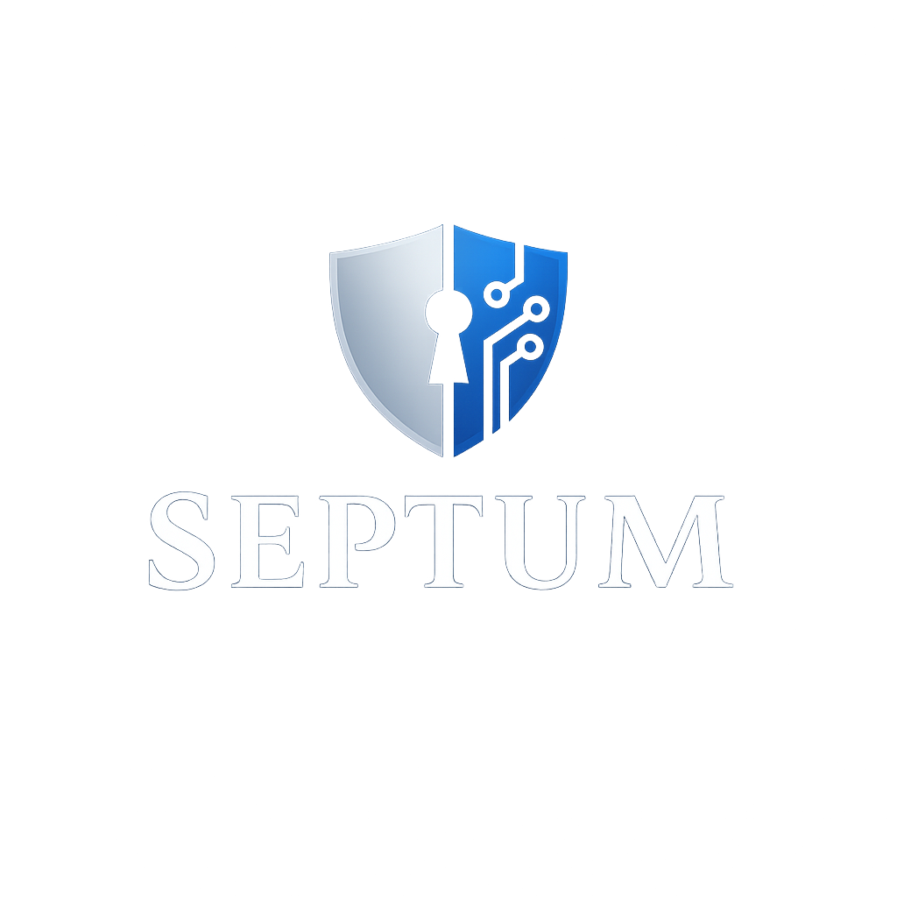
</p>

<p align="center">
  
  
  
  
  <a href="README.md">
    
  </a>
  <br />
  
  
</p>

<p align="center">
  <a href="#ekran-görüntüleri"><strong>Ekran görüntülerini gör</strong></a>
  ·
  <a href="CHANGELOG.md"><strong>Değişiklik günlüğü</strong></a>
  ·
  <a href="LICENSE"><strong>Lisans</strong></a>
</p>

## Septum — Gizlilik Odaklı Yapay Zekâ Asistanı

Septum, kurumların **kendi verilerini** büyük dil modelleri (LLM) ile kullanırken gizliliği koruması için tasarlanmış bir **ara katman (middleware)** ve web uygulamasıdır.

Kısaca:
- Dokümanlarınızı (PDF, Word, Excel, ODS [OpenDocument hesap tablosu], görsel, ses vb.) yüklersiniz.
- Septum, içindeki kişisel verileri (PII) **yerelde maskeleyip anonimleştirir**.
- Sorularınızı bu anonimleştirilmiş veriler üzerinden LLM’e sorar.
- Gelen cevabı yine yerelde, gerçek isimler ve değerlerle **geri yerine koyarak** size gösterir.

Buluta giden hiçbir içerik ham hâliyle veya doğrudan tanımlayıcı kişisel veri içerecek şekilde çıkmaz.

---

## Ne İşe Yarar?

- **Güvenli kurumsal doküman sorgulama**  
  - Politikalar, sözleşmeler, müşteri dosyaları, sağlık kayıtları, insan kaynakları dokümanları gibi hassas içerikleri LLM ile sorgulamanızı sağlar.
  - LLM cevabı üretirken gerçek kimlik bilgilerini görmez; sadece maske (ör. `[PERSON_1]`, `[EMAIL_2]`) görür.

- **Regülasyon uyumlu veri paylaşımı**  
  - GDPR, KVKK, HIPAA gibi regülasyonlara tabi verileri buluta göndermeden önce anonimleştirerek **uyum riskini azaltır**.

- **İç bilgiye dayalı akıllı asistan**  
  - Kendi dokümanlarınızı vektör veritabanına (RAG) gömerek, şirket içi arama ve soru–cevap deneyimi oluşturur.

Özetle: Septum, “LLM’e doküman verelim ama kişisel veriler dışarı çıkmasın” diyen kurumlar için bir **güvenlik katmanı** sağlar.

---

## Nerelerde Kullanılır?

- **Finans**  
  Müşteri sözleşmeleri, kredi dosyaları, iç prosedürler üzerinde arama ve özetleme yaparken PII’yi korumak için.

- **Sağlık**  
  Hasta dosyaları, epikrizler, laboratuvar raporları gibi **sağlık verilerini** anonimleştirip hekim destek araçlarında kullanmak için.

- **Hukuk & Uyumluluk**  
  Sözleşmeler, dava dosyaları, KVKK/GDPR dokümanları üzerinde arama ve analiz yaparken isim, TC, adres vb. bilgileri dışarı çıkarmadan çalışmak için.

- **İK ve Operasyon**  
  Personel dosyaları, performans raporları, maaş verileri gibi hassas bilgilerle çalışan iç asistanlar geliştirmek için.

Her yerde ortak amaç: **LLM gücünden faydalanırken, kişisel veriyi kurum sınırları içinde ve şifreli tutmak.**

---

## Başlıca Özellikler

- **Yerel PII Koruması**
  - Ham kişisel veriler (isim, TC, adres, e‑posta vb.) makineyi terk etmez.
  - Dosyalar diskte şifreli tutulur, çözme işlemi sadece görüntüleme anında ve bellek içinde yapılır.

- **Çoklu Regülasyon Desteği**
  - GDPR, KVKK, CCPA, HIPAA, LGPD vb. pek çok regülasyon için hazır paketler.
  - Birden fazla regülasyonu aynı anda etkinleştirip “en kısıtlayıcı” maskeleme politikasını uygulama.

- **Kullanıcı Tanımlı Kurallar**
  - “Şu regex’e uyan her şeyi maskele”, “Bu anahtar kelimeleri gördüğünde sakla”, “Maaşla ilgili her ifadeyi yakala” gibi özel kurallar tanımlayabilirsiniz.

- **Çok Formatlı Doküman Desteği**
  - PDF, Office ve hesap tablosu dosyaları (XLSX, ODS vb.), görseller (OCR), ses kayıtları (transkript), e‑postalar ve daha fazlası.

- **Onay Mekanizmalı Chat**
  - LLM’e gönderilmeden önce, hangi bilgilerin paylaşılacağını bir özet ekranında görür ve onay/vermezsiniz.
- **Profesyonel Hibrit Arama**
  - BM25 (kelime eşleme) ile FAISS (semantik benzerlik) yöntemlerini Reciprocal Rank Fusion (RRF) ile birleştirir.
  - Sözleşme/yasal doküman sorguları için tam kelime eşleştirme ile semantik anlayışı harmanlayarak üstün arama kalitesi sunar.
  - Ayarlanabilir ağırlıklar (alpha/beta) ile arama dengesini ince ayar yapabilirsiniz.

- **Yapısal Veri Çıkarımı**
  - PDF dokümanlardan tabloları ve anahtar-değer çiftlerini otomatik tespit eder (ör. "Çalışanın Unvanı: Mühendis").
  - Yapısal sözleşme bilgilerinin daha iyi aranması için metadata ile ayrı alan parçaları oluşturur.
  - Hassas tablo tespiti ve alan çıkarımı için pdfplumber kullanır.

- **Gelişmiş Semantik Parçalama**
  - Yapıyı korurken semantik tutarlılığa saygı gösteren akıllı doküman bölme.
  - Hibrit yaklaşım: yapısal aşama (numaralı bölümler) + semantik aşama (embedding tabanlı benzerlik).
  - Optimal parça sınırları için gradient eşiği ile LangChain'in SemanticChunker'ını kullanır.
  - Madde ortasında keyfi bölmeleri önler, LLM bağlam kalitesini artırır.


---

## Septum’u Nasıl Kullanırım? (Kısa Senaryo)

1. **Dokümanları yükleyin**  
   Dokümanlar sayfasından veya Sohbet ekranındaki yan paneldeki yükleme alanını kullanarak PDF, Word, Excel, görsel ya da ses dosyalarınızı Septum’a yüklersiniz.

2. **Septum veriyi işler ve anonimleştirir**  
   - Dosyanın türünü, dilini ve içindeki kişisel verileri otomatik tespit eder.
   - Kişisel verileri yerelde maskeler ve anonimleştirilmiş hâlini arama için hazırlar.

3. **Sorular sorun**  
   - “Şu sözleşmede iptal şartları neler?”,  
     “Bu müşterinin hangi ürünleri var?”,  
     “Son 6 ayda X ile ilgili hangi vaka kayıtları oluşturulmuş?” gibi sorular sorarsınız.  
   - Sohbet ekranından bir doküman yüklediğinizde, bu doküman varsayılan olarak seçilir ve sorularınız doğrudan bu doküman üzerinden çalışır.

4. **Gönderilmeden önce onay verin**  
   - Buluta gidecek anonimleştirilmiş içerik size gösterilir.
   - Onay verirseniz LLM’e sadece maskeli metin gönderilir.

5. **Cevabı gerçek verilerle görün**  
   - LLM cevabı döndüğünde, Septum kendi içinde placeholder’ları gerçek değerlerle eşleştirerek size anlamlı, okunabilir sonuç sunar.

---

## Kısa Teknik Özet

- **Backend**: Python + FastAPI  
  - Doküman işleme, anonimleştirme, şifreleme ve LLM entegrasyonu burada çalışır.
  - Tüm veri işleme ve PII koruma mantığı sunucu tarafındadır.

- **Frontend**: Next.js 16 + React 19  
  - Chat, doküman yönetimi, ayarlar ve regülasyon ekranlarını sunan web arayüzü.
  - Backend ile HTTP ve SSE (stream) üzerinden haberleşir.

Bu teknik detaylar geliştiriciler içindir; son kullanıcı genelde sadece web arayüzünü kullanır.

---

## Mimari Genel Bakış

Yüksek seviye akış:

1. **Doküman yükleme**
   - Frontend, `POST /api/documents/upload` ile dosya gönderir.
   - Backend:
     1. Dosya tipini **python‑magic** ile tespit eder.
     2. Dil tespiti yapar (lingua + langdetect).
     3. Format’a göre doğru ingester’a yönlendirir (PDF, DOCX, XLSX, ODS, Image, Audio, vb.).
     4. Ortaya çıkan düz metni **PolicyComposer + PIISanitizer** pipeline’ından geçirir.
     5. **Anonimleştirilmiş chunk’lar** üretir ve FAISS’e gömer.
     6. Orijinal dosyayı AES‑256‑GCM ile şifreleyerek diske yazar; metadata’yı SQLite’ta saklar.

2. **Chat akışı**
   - Frontend, `/api/chat/ask` endpoint’ine SSE ile mesaj gönderir.
   - Backend:
     1. Kullanıcı sorgusunu aynı sanitizer pipeline’ından geçirir (aktif regülasyonlar + custom rules).
     2. FAISS üzerinden bağlamsal chunk’ları çeker.
     3. **Approval Gate** ile hangi bilgilerin buluta gideceğini kullanıcıya gösterir.
     4. Kullanıcı onay verirse, sadece **placeholder içeren metni** bulut LLM’e yollar.
     5. Gelen cevap yerelde **de‑anonymizer** üzerinden geçirilerek placeholder’lar gerçek değerlere döner.
     6. Sonuç SSE üzerinden frontend’e iletilir.

3. **Ayarlar ve regülasyon yönetimi**
   - Settings ekranlarından:
     - LLM / Ollama / Whisper / OCR ayarları,
     - Varsayılan aktif regülasyonlar,
     - Custom recognizer’lar,
     - NER model map’leri yönetilir.

---

## PII Tespiti ve Anonimleştirme Akışı

Septum’un kalbinde, aktif regülasyon ve kurallara göre çalışan **çok katmanlı bir PII tespit pipeline’ı** bulunur. Bu yapı; regülasyon odaklı tanıyıcılar, dile duyarlı NER modelleri ve ülke‑spesifik doğrulayıcıları tek bir politika altında birleştirir.

Yüksek seviyede akış:

1. **Politika bileşimi**
   - Aktif regülasyon ruleset’leri (ör. GDPR, KVKK, HIPAA, CCPA, LGPD vb.) `PolicyComposer` üzerinden tek bir **bileşik politika** hâline getirilir.
   - Bu politika:
     - Korunması gereken tüm varlık tiplerinin birleşimini,
     - Çalıştırılması gereken (yerleşik + kullanıcı tanımlı) tanıyıcıların listesini içerir.
   - Regex, anahtar kelime veya LLM‑tabanlı tüm custom recognizer’lar da bu politika içine enjekte edilir.

2. **Katman 1 — Presidio tanıyıcıları**
   - Septum, ilk savunma hattı olarak **Microsoft Presidio** kullanır ve tanıyıcı paketlerini regülasyon bazında organize eder.
   - Her bir regülasyon paketi şu alanlar için tanıyıcılar sağlar:
     - Kimlik (isimler, ulusal kimlik numaraları, pasaport vb.)
     - İletişim (e‑posta, telefon, adres, IP, URL, sosyal medya hesabı)
     - Finansal tanımlayıcılar (kredi kartı, banka hesabı, IBAN/SWIFT, vergi no)
     - Sağlık, demografik ve kurumsal öznitelikler
   - Kullanıcılar bu katmanı **özel tanıyıcılar** ile genişletebilir (regex desenleri, anahtar kelime listeleri veya LLM‑tabanlı kurallar).
   - Ulusal kimlikler ve finansal tanımlayıcılar, yalancı pozitifleri azaltmak için **ülke‑spesifik checksum doğrulayıcıları** kullanır.
   - Sadece aktif regülasyonlara ait tanıyıcılar Presidio registry'sine yüklenir.

3. **Katman 2 — Dile özgü NER**
   - Her doküman ve sorgu için dil tespiti yapılır ve gerekirse çok dilli bir yedek modelle birlikte **dile uygun HuggingFace NER modeli** yüklenir.
   - Bu katman:
     - Presidio'yu, bağlama ve dile göre değişen varlıkları yakalayarak tamamlar.
     - Son teknoloji XLM‑RoBERTa tabanlı modeller kullanır (ör. 20 dil için `Davlan/xlm-roberta-base-wikiann-ner`, Türkçe için `akdeniz27/xlm-roberta-base-turkish-ner`).
     - Cihaz farkında çalışır (CUDA → MPS → CPU) ve cache'lenmiş pipeline'lar sayesinde performanslıdır.
   - Hangi dil için hangi modelin kullanılacağı, **NER Models** ayar ekranı üzerinden yapılandırılabilir.

4. **Katman 3 — Ollama bağlam‑duyarlı katman**
   - Etkinleştirildiğinde (`use_ollama_layer=True`), Septum ilk iki katmanın gözden kaçırabileceği bağlam‑bağımlı PII'leri tespit etmek için **yerel bir Ollama LLM** kullanır:
     - Takma adlar, kod adları ve gayriresmi atıflar (ör. daha önce "John Doe" tespit edilmişse "john").
     - Bağlam içinde aile üyesi isimleri (ör. "baba adı: ahmet", "anne: ayşe").
     - Kod adları, lakalar ve kuruma özgü etiketler.
   - Bu katman tam büyük/küçük harf uyumunu korur ve tamamen cihaz üzerinde çalışır; böylece hiçbir PII yerel makineden çıkmaz.
   - Sayısal ağırlıklı yapılandırılmış içerik (ör. fiyat listeleri, faturalar) için gürültülü tespitleri önlemek amacıyla devre dışı bırakılır.

5. **Anonimleştirme ve coreference**
   - Yukarıdaki katmanlardan çıkan tüm span'ler birleştirilir, yinelenenler ayıklanır ve `AnonymizationMap` içine aktarılır:
     - Her benzersiz varlık için kararlı bir placeholder atanır (ör. `[PERSON_1]`, `[EMAIL_2]`).
     - Coreference mantığı sayesinde aynı kişiye ait tekrar eden atıflar (tam isim → sadece isim gibi) **aynı** placeholder ile eşleştirilir.
     - İsteğe bağlı blocklist yapısı, tespit edilen varlıkların ötesinde de ek maskeleme uygulanmasına izin verir.
   - Anonymization map asla belleğin dışına çıkmaz ve diske yazılmaz.

6. **Çoklu regülasyon çatışmalarının ele alınması**
   - Birden fazla regülasyon aynı anda aktif olduğunda Septum her zaman **en kısıtlayıcı** maskeleme davranışını uygular:
     - Herhangi bir regülasyon bir değeri PII olarak işaretliyorsa, o değer PII kabul edilir.
     - Çakışan varlıklar tek bir placeholder altında birleştirilirken, hangi regülasyonların bu kararı tetiklediğine dair metadata korunur.

---

## Septum’u Bir AI Gizlilik Geçidi Olarak Kullanmak

Web arayüzünün ötesinde Septum, **herhangi bir LLM tabanlı uygulamanın önüne konumlanabilen bir HTTP geçidi (gateway)** olarak da çalışabilir. Uygulamanız bulut LLM’e doğrudan çağrı yapmak yerine, tüm trafiği önce Septum’a yönlendirir:

1. Gelen istek, etkin regülasyonlar ve özel kurallara göre PII’den arındırılır.
2. RAG etkinse, anonimleştirilmiş context chunk’ları vektör veritabanından çekilir.
3. Yalnızca **maskelenmiş metin** yapılandırılmış LLM sağlayıcısına iletilir.
4. Dönen cevap, yerelde tekrar anonimleştirme haritası kullanılarak gerçek değerlere map edilir.

Kavramsal akış:

Uygulamanız → **Septum (anonimleştir + RAG + onay)** → Bulut LLM  
Ham veri ve kişisel bilgiler ortamınızı terketmez.

Basitleştirilmiş bir örnek akış:

1. **Uygulamanız**, sohbet isteği gönderir:

   ```json
   POST /api/chat/ask
   {
     "messages": [
       { "role": "user", "content": "ACME Corp için son 3 sözleşmeyi özetle ve Ahmet Yılmaz ile ilgili kritik maddeleri çıkar." }
     ],
     "document_ids": [123, 124, 125],
     "metadata": {
       "regulations": ["gdpr", "kvkk"],
       "require_approval": true
     }
   }
   ```

2. **Septum**:
   - Sorgunun ve ilgili dokümanların dilini ve PII içeriğini tespit eder.
   - Kimlik bilgilerini placeholder’larla değiştirir (ör. `[PERSON_1]`, `[ORG_1]`).
   - Gerekirse anonimleştirilmiş chunk’ları vektör veritabanından çeker.
   - Hangi bilgilerin buluta gideceğini gösteren bir **onay ekranı** sunabilir.
   - Yalnızca maskeli içeriği, yapılandırılmış LLM sağlayıcısına iletir.

3. **Bulut LLM**, sadece placeholder içeren bir cevap döner.

4. **Septum**:
   - Bellekteki anonimleştirme haritasını kullanarak placeholder’ları tekrar gerçek değerlere çevirir.
   - Nihai, okunabilir cevabı HTTP/SSE üzerinden uygulamanıza iletir.

Bu modda Septum, uygulamalarınız için **tak‑çalıştır bir gizlilik katmanı** gibi davranır:

- Mevcut araçlar kendi arayüz ve iş mantıklarını korur.
- PII yönetimi, regülasyon kuralları ve denetlenebilirlik tek bir merkezi noktada toplanır.
- Arkada LLM sağlayıcısını değiştirmek veya birden fazla sağlayıcıyı karıştırmak, uygulama tarafındaki gizlilik modelini bozmaz.

---

## Backend (FastAPI) Yapısı

Backend kök dizini: `backend/`

- `app/main.py` — FastAPI uygulamasının tanımı ve router kayıtları  
- `app/config.py` — Pydantic Settings ile konfigürasyon  
- `app/database.py` — SQLite bağlantısı ve `RegulationRuleset` başlangıç verisi (seed)  
- `app/models/` — SQLAlchemy modelleri:  
  - `document.py`, `chunk.py`, `settings.py`, `regulation.py`, `custom_recognizer.py`  
- `app/schemas/` — Pydantic şemaları:  
  - `document.py`, `chat.py`, `settings.py`, `regulation.py`, `custom_recognizer.py`  
- `app/routers/` — FastAPI router’ları:  
  - `documents.py`, `chunks.py`, `chat.py`, `approval.py`, `settings.py`, `regulations.py`  
- `app/services/`:  
  - `ingestion/` — format‑spesifik ingester’lar (PDF, DOCX, XLSX, ODS, PPTX, image, audio, HTML, markdown, JSON, YAML, XML, email, EPUB, RTF)  
  - `recognizers/` — regülasyon paketleri (gdpr, hipaa, kvkk, lgpd, ccpa, …) ve `registry.py`  
  - `national_ids/` — ülkelere özgü kimlik doğrulayıcıları (TCKN, SSN, CPF, Aadhaar, IBAN vb.)  
  - `policy_composer.py` — aktif regülasyon ve özel kuralları tek bir politika hâline getirir  
  - `language_detector.py` — dil tespiti  
  - `ner_model_registry.py` — dil → model eşlemesi ve lazy loading  
  - `sanitizer.py` — PII tespit ve placeholder pipeline’ı  
  - `anonymization_map.py` — oturum bazlı anonimleştirme haritası + coreference yönetimi  
  - `document_processor.py`, `vector_store.py`, `llm_router.py`, `deanonymizer.py`, `approval_gate.py`  
- `app/utils/`:  
  - `device.py` — CPU/MPS/CUDA seçimi  
  - `crypto.py` — AES‑256‑GCM dosya şifreleme  
  - `text_utils.py` — Unicode NFC + locale‑farkında küçültme (lowercase)  
  - `logger.py` — ham PII içermeyen loglama  
- `tests/` — pytest senaryoları (sanitizer, anonymization_map, national_ids, policy_composer, custom_recognizers, document_processor, deanonymizer, llm_router, crypto, ingesters vb.).

FastAPI tarafında Context7 en iyi pratikleri takip edilir:

- API endpoint’leri **APIRouter** ile modüler hâle getirilir.  
- İstek/cevap doğrulaması Pydantic modellerle yapılır.  
- DB oturumu, ayarlar ve diğer bağımlılıklar `Depends(...)` ile enjekte edilir.  
- Tüm path fonksiyonları async’tir; CPU‑ağırlıklı işler thread pool içinde çalıştırılır.

---

## Frontend (Next.js App Router) Yapısı

Frontend kök dizini: `frontend/`

- `src/app/`  
  - `layout.tsx` — kök layout  
  - `page.tsx` — giriş / yönlendirme sayfası  
  - `chat/page.tsx` — backend’e SSE ile bağlı sohbet ekranı  
  - `documents/page.tsx` — doküman listesi ve yükleme sayfası  
  - `chunks/page.tsx` — chunk görünümleri  
  - `settings/` — alt sayfalar:  
    - `page.tsx` — genel ayarlar  
    - `regulations/page.tsx` — regülasyon yönetimi  
    - `custom-rules/page.tsx` — custom recognizer oluşturma ekranı  
- `src/components/`  
  - `layout/Sidebar.tsx`, `layout/Header.tsx`  
  - `chat/ChatWindow.tsx`, `MessageBubble.tsx`, `ApprovalModal.tsx`, `JsonOutputPanel.tsx`, `DeanonymizationBanner.tsx`  
  - `documents/DocumentUploader.tsx`, `DocumentList.tsx`, `DocumentCard.tsx`, `DocumentPreview.tsx`, `TranscriptionPreview.tsx`  
  - `chunks/ChunkList.tsx`, `ChunkCard.tsx`, `EntityBadge.tsx`  
  - `settings/*` — `LLMSettings`, `PrivacySettings`, `LocalModelSettings`, `RAGSettings`, `IngestionSettings`, `NERModelSettings`, `RegulationManager`, `CustomRuleBuilder`  
- `src/store/`  
  - `chatStore.ts`, `documentStore.ts`, `settingsStore.ts`, `regulationStore.ts`  
- `src/lib/`  
  - `api.ts` — backend HTTP istemcisi  
  - `types.ts` — paylaşılan tipler

Next.js tarafında Context7 en iyi pratikleri takip edilir:

- App Router (segment tabanlı routing) kullanılır.  
- SSE ve streaming cevaplar için `EventSource` veya `fetch` + `ReadableStream` kullanılır.  
- Tailwind CSS, `app`, `components` ve ilgili dizinleri tarayacak şekilde yapılandırılmıştır.

---

## Teknoloji Yığını

**Backend**
- Python, FastAPI, Uvicorn  
- Presidio Analyzer/Anonymizer  
- HuggingFace Transformers + sentence‑transformers  
- faiss‑cpu  
- lingua‑language‑detector, langdetect  
- EasyOCR, OpenCV, Pillow  
- Whisper, ffmpeg‑python  
- SQLAlchemy + aiosqlite  
- cryptography (AES‑256‑GCM)

**Frontend**
- Next.js 16 (App Router)  
- React 19  
- TypeScript  
- Tailwind CSS  
- axios, react‑dropzone, lucide‑react

---

## Kurulum

### 1. Ortak ön gereksinimler

- Python 3.10+  
- Node.js 18+ (Next.js 16 için)  
- ffmpeg (Whisper için)

### 2. Backend kurulumu

```bash
cd backend
python -m venv .venv
source .venv/bin/activate  # Windows: .venv\Scripts\activate
pip install --upgrade pip
pip install -r requirements.txt
```

`backend/.env.example` dosyasından `.env` oluşturun:

```bash
cp .env.example .env
```

Aşağıdaki değişkenleri kendi ortamınıza göre doldurun:

- `OPENAI_API_KEY`, `ANTHROPIC_API_KEY` (kullanıyorsanız)  
- `LLM_PROVIDER` (örn. `anthropic`)  
- `USE_OLLAMA`, `OLLAMA_BASE_URL`, `OLLAMA_CHAT_MODEL`, `OLLAMA_DEANON_MODEL`  
- `WHISPER_MODEL`  
- `ENCRYPTION_KEY` (32‑byte base64 veya hex; boş bırakılırsa uygulama ilk çalıştırmada kendi anahtar yönetimi mantığına göre otomatik üretir)  
- `DB_PATH`, `LOG_LEVEL`, `DEFAULT_ACTIVE_REGULATIONS` vb.

Ardından backend’i başlatın:

```bash
uvicorn app.main:app --reload
```

### 3. Frontend kurulumu

```bash
cd frontend
npm install
npm run dev
```

Varsayılan olarak:
- Backend: `http://localhost:8000`  
- Frontend: `http://localhost:3000`

`src/lib/api.ts` içindeki backend base URL’inin kendi ortamınızla uyumlu olduğundan emin olun.

---

## Testleri Çalıştırma

Projede Septum içinde tanımlı özel bir `/test` kuralı bulunur:

- Değişen dosyaya göre ilgili pytest dosyası çalıştırılır. Örneğin:  
  - `sanitizer.py` → `tests/test_sanitizer.py`  
  - `anonymization_map.py` → `tests/test_anonymization_map.py`  
  - `app/services/national_ids/*` → `tests/test_national_ids.py`  
  - `app/services/ingestion/*` → `tests/test_ingesters.py`  
  - vb.  
- Eşleşme bulunamazsa tüm test paketi çalıştırılır.

Testleri manuel olarak çalıştırmak için:

```bash
cd backend
pytest tests/ -v
```

Gerçek bulut LLM sağlayıcılarına istek gönderecek tüm testler **mock** edilmelidir; gerçek dış servis çağrısı yapan testler hata olarak değerlendirilir.

---

## Güvenlik ve Gizlilik (Önemli Noktalar)

- Ham PII asla log’lanmaz ve buluta gönderilmez.
- Anonymization map (maskeler → gerçek değerler) yalnızca bellek içinde tutulur, diske yazılmaz.
- Dosya tipleri uzantıya göre değil, içerik imzasına göre tespit edilir.
- Dosyalar diskte AES‑256‑GCM ile şifreli saklanır; çözme işlemi sadece önizleme sırasında ve bellek içinde yapılır.
- Birden fazla regülasyon aynı anda aktifken, her zaman **en kısıtlayıcı maskeleme** politikası uygulanır.

---

## Yol Haritası / Genişletme

- Yeni ülke regülasyonları için recognizer registry tarafında yeni regulation pack’ler eklenebilir.
- Yeni ulusal kimlik formatları için national ID modülünde yeni validator ve recognizer eklenebilir.
- Yeni doküman formatları için ingestion katmanında özel ingester implementasyonları eklenebilir.
- NER model haritası, Settings → NER Models ekranından kullanıcı tarafından güncellenebilir.

---

## Ekran Görüntüleri

**1. Sohbet deneyimi**

<p align="center">
  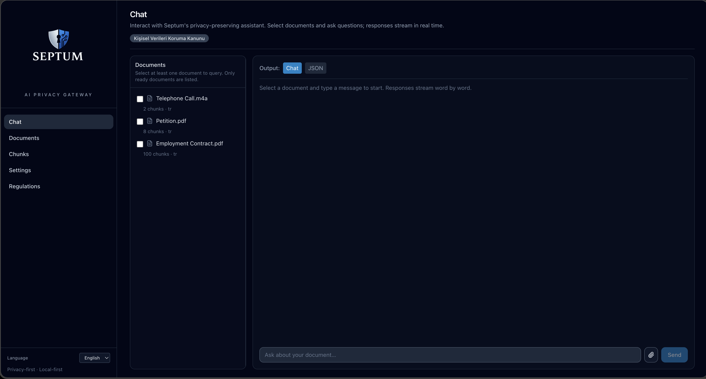
</p>

**2. Dokümanlar görünümü**

<p align="center">
  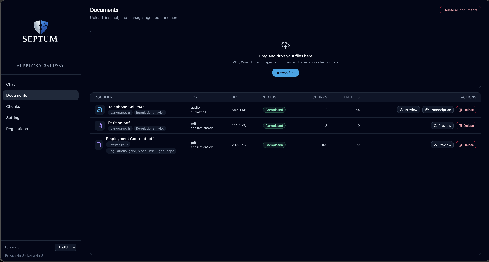
</p>

**3. Chunk ve varlıklar**

<p align="center">
  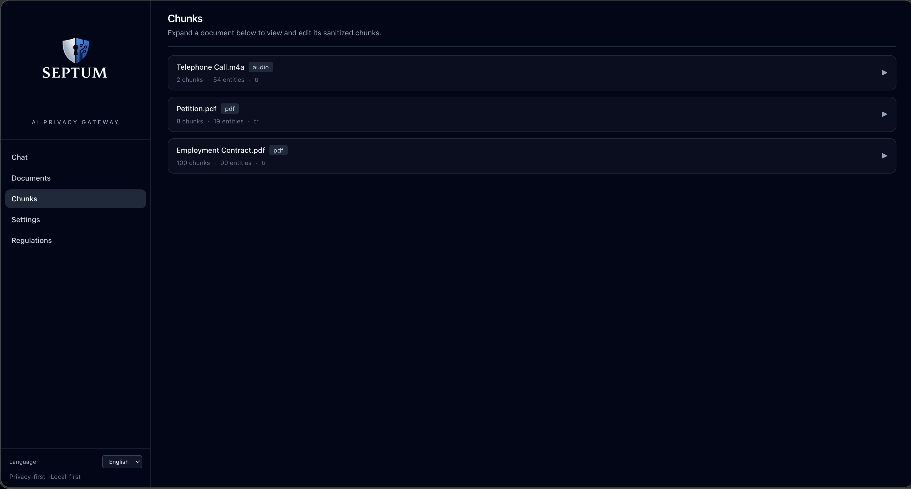
</p>

**4. Bulut LLM ayarları**

<p align="center">
  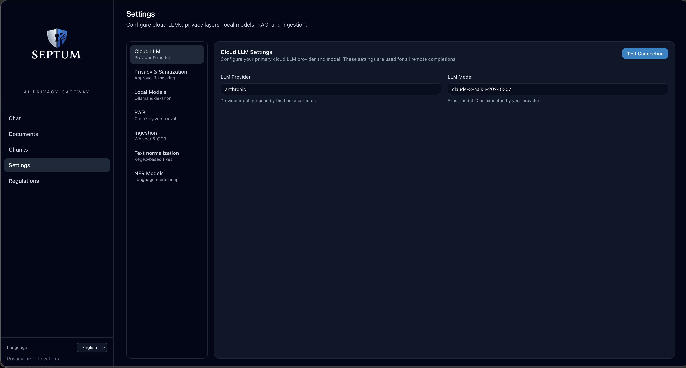
</p>

**5. Gizlilik ve anonimleştirme katmanları**

<p align="center">
  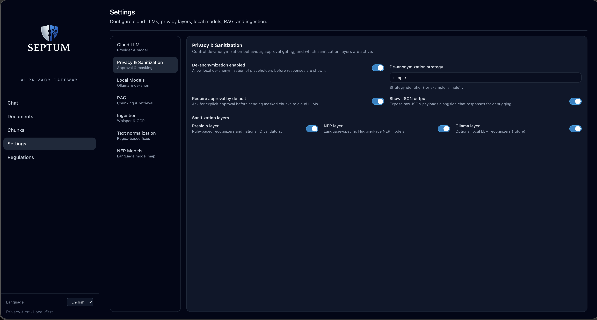
</p>

**6. Lokal model yapılandırması**

<p align="center">
  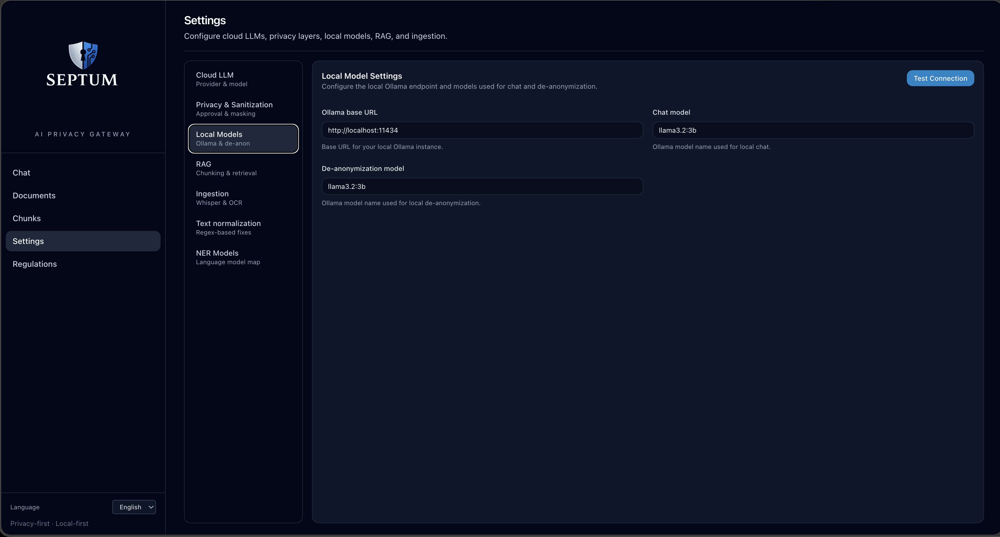
</p>

**7. RAG yapılandırması**

<p align="center">
  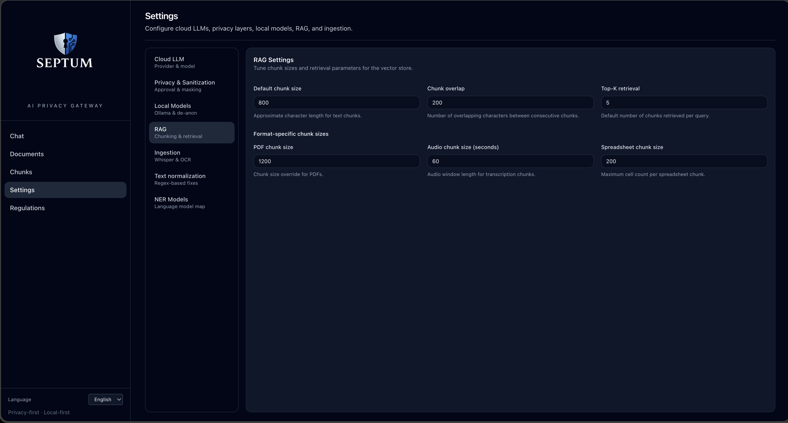
</p>

**8. Ingestion / içe aktarma ayarları**

<p align="center">
  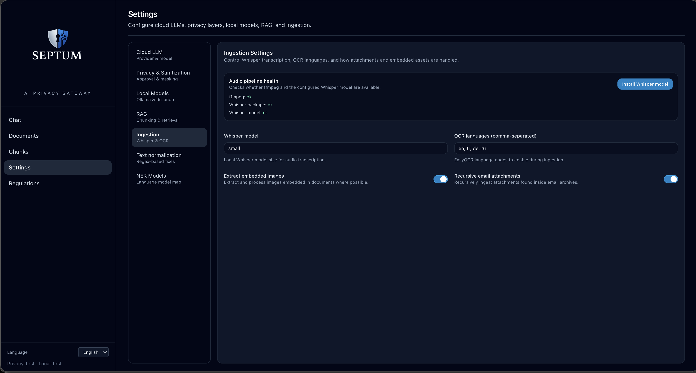
</p>

**9. Metin normalizasyon kuralları**

<p align="center">
  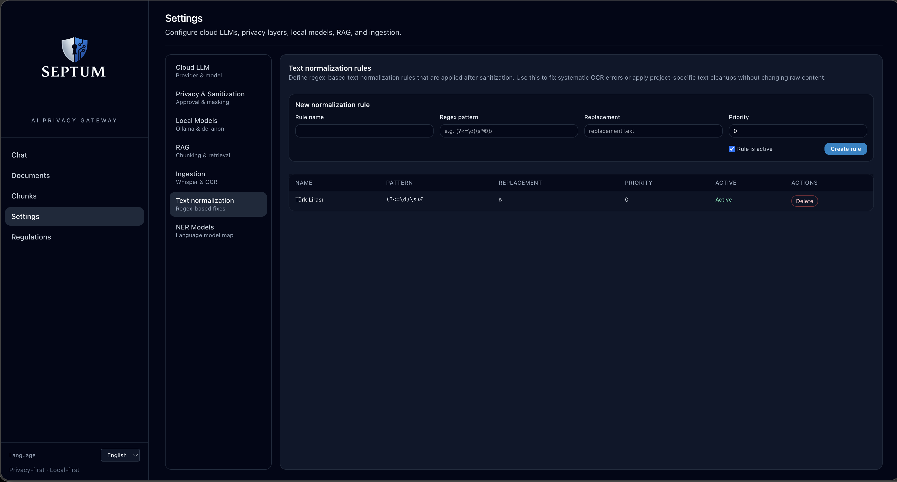
</p>

**10. NER model eşleştirmeleri**

<p align="center">
  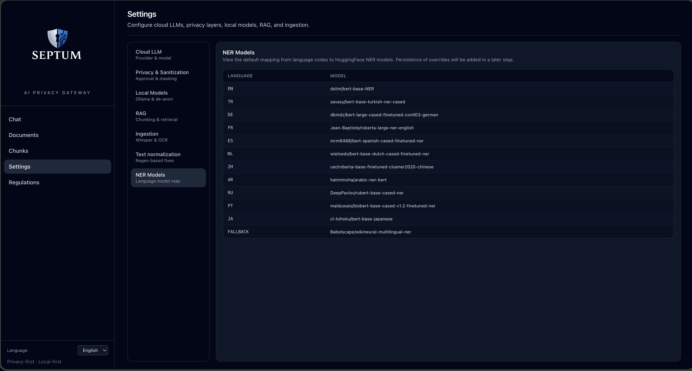
</p>

**11. Regülasyon yönetimi**

<p align="center">
  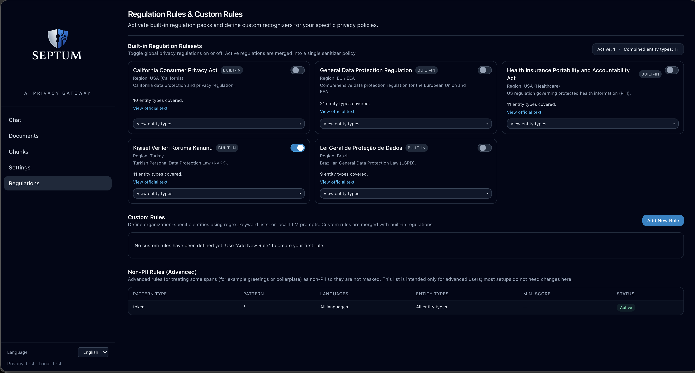
</p>

