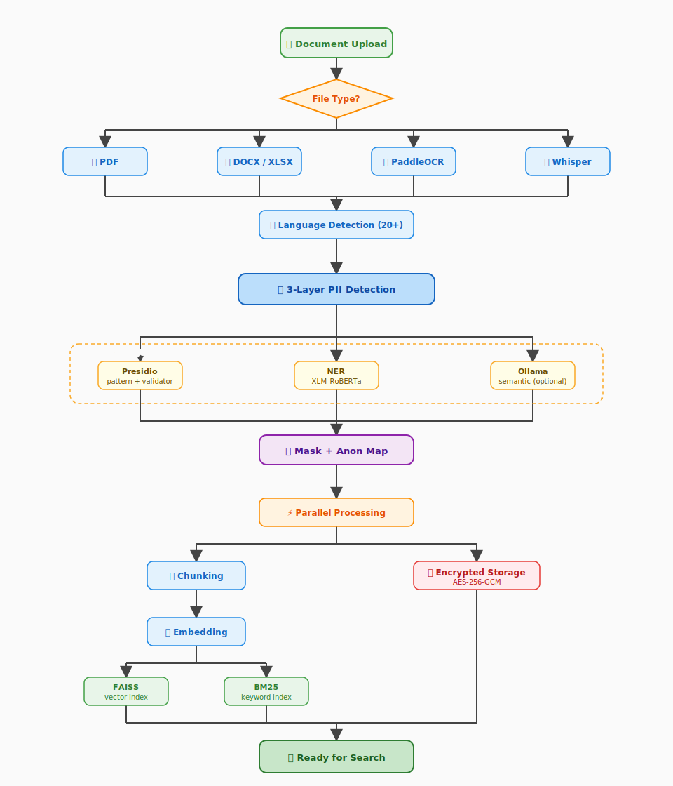

# Document Ingestion Pipeline

  <a href="../README.md"><strong>🏠 Home</strong></a>
  &nbsp;·&nbsp;
  <a href="INSTALLATION.md"><strong>🚀 Installation</strong></a>
  &nbsp;·&nbsp;
  <a href="BENCHMARK.md"><strong>📈 Benchmark</strong></a>
  &nbsp;·&nbsp;
  <a href="FEATURES.md"><strong>✨ Features</strong></a>
  &nbsp;·&nbsp;
  <a href="ARCHITECTURE.md"><strong>🏗️ Architecture</strong></a>
  &nbsp;·&nbsp;
  <strong>📊 Document Ingestion</strong>
  &nbsp;·&nbsp;
  <a href="SCREENSHOTS.md"><strong>📸 Screenshots</strong></a>

---

How Septum turns an uploaded file into searchable, anonymised content. Every step runs **locally** — raw PII never leaves the machine.

  

## Steps

1. **Upload** — a file reaches the API. Type is identified from content bytes (`python-magic`), **never** from the extension. A `.pdf` that is actually a PNG is routed to the OCR pipeline.
2. **Format-specific ingester** — PDF through `pypdf` with per-page extraction; DOCX / XLSX through `python-docx` and `openpyxl`; images and scanned PDFs through PaddleOCR; audio through OpenAI Whisper.
3. **Language detection** — the extracted text is classified across 20+ languages. The result drives the NER model choice and validator rules used by the next step.
4. **Three-layer PII detection** — three detectors run in series and their outputs are merged:
   - **Presidio** — regex patterns + algorithmic validators (TCKN checksum, Aadhaar Verhoeff, NRIC/FIN, CPF, NINO, CNPJ, My Number, and more).
   - **NER** — XLM-RoBERTa transformer for `PERSON_NAME`, `LOCATION`, `ORGANIZATION_NAME`.
   - **Ollama** — optional semantic layer for context-dependent PII that patterns cannot catch (off by default; set `SEPTUM_USE_OLLAMA=true` to enable).
   Overlapping spans are merged; coreferences are resolved so "Ahmet" and "Mr. Yılmaz" collapse to the same placeholder index.
5. **Masking + anonymisation map** — every detected entity is replaced with a stable, type-indexed placeholder (`[PERSON_1]`, `[EMAIL_ADDRESS_3]`). The `original → placeholder` map is persisted per-document, encrypted at rest, and never leaves the air-gapped zone.
6. **Parallel processing** — two tracks run concurrently on the masked output:
   - **Chunking → Embedding → FAISS + BM25** — the masked text is split semantically (paragraph-aware with overlap), each chunk is embedded with sentence-transformers, and written to both the FAISS vector index and the BM25 keyword index.
   - **Encrypted storage** — the original file is sealed with AES-256-GCM on disk. It is never decrypted outside the air-gapped zone.
7. **Ready for search** — when all three tracks (FAISS, BM25, encrypted blob) complete, the document is flagged `ingestion_status="completed"` and becomes queryable from chat.

  <a href="../README.md"><strong>🏠 Home</strong></a>
  &nbsp;·&nbsp;
  <a href="INSTALLATION.md"><strong>🚀 Installation</strong></a>
  &nbsp;·&nbsp;
  <a href="BENCHMARK.md"><strong>📈 Benchmark</strong></a>
  &nbsp;·&nbsp;
  <a href="FEATURES.md"><strong>✨ Features</strong></a>
  &nbsp;·&nbsp;
  <a href="ARCHITECTURE.md"><strong>🏗️ Architecture</strong></a>
  &nbsp;·&nbsp;
  <strong>📊 Document Ingestion</strong>
  &nbsp;·&nbsp;
  <a href="SCREENSHOTS.md"><strong>📸 Screenshots</strong></a>

