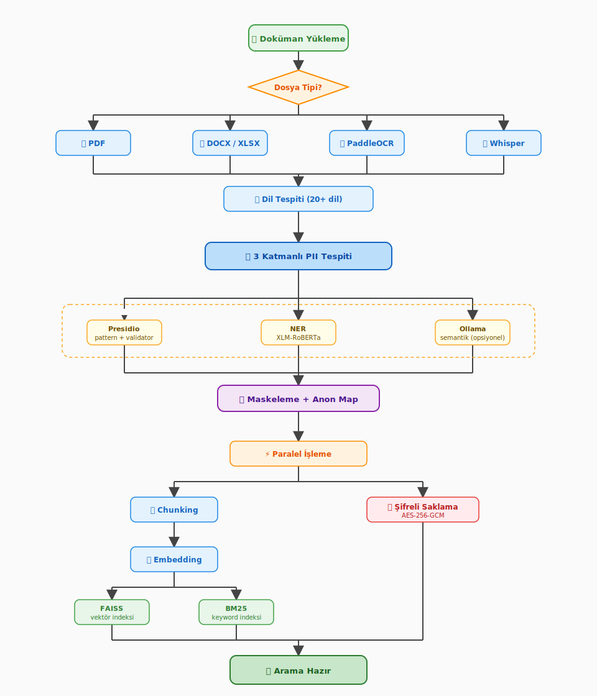

# Doküman İşleme Akışı

Septum'un yüklenen bir dosyayı aranabilir, anonimleştirilmiş içeriğe nasıl dönüştürdüğü. Her adım **yerelde** çalışır — ham PII makineden çıkmaz.

  

## Adımlar

1. **Yükleme** — dosya API'ye ulaşır. Tip, uzantıya değil içerik baytlarına bakılarak belirlenir (`python-magic`). Uzantısı `.pdf` olan ama aslında PNG olan bir dosya OCR hattına yönlendirilir.
2. **Formata özgü ingester** — PDF için `pypdf` ile sayfa-başına çıkarma; DOCX / XLSX için `python-docx` ve `openpyxl`; görseller ve taranmış PDF'ler için PaddleOCR; ses dosyaları için OpenAI Whisper.
3. **Dil tespiti** — çıkarılan metin 20+ dil arasında sınıflandırılır. Bir sonraki adımın NER model seçimi ve validator kuralları bu sonuca göre belirlenir.
4. **Üç katmanlı PII tespiti** — üç detektör sırayla çalışır ve çıktıları birleştirilir:
   - **Presidio** — regex pattern'ler + algoritmik validator'lar (TCKN checksum, Aadhaar Verhoeff, NRIC/FIN, CPF, NINO, CNPJ, My Number, ve daha fazlası).
   - **NER** — `PERSON_NAME`, `LOCATION`, `ORGANIZATION_NAME` için XLM-RoBERTa transformer.
   - **Ollama** — pattern'lerin yakalayamadığı bağlam-bağımlı PII için opsiyonel semantik katman (varsayılan kapalı; etkinleştirmek için `SEPTUM_USE_OLLAMA=true`).
   Çakışan span'ler birleştirilir; coreference çözümlenir, böylece "Ahmet" ve "Bay Yılmaz" aynı placeholder indeksine toplanır.
5. **Maskeleme + anonimleştirme haritası** — her tespit edilen entity, kararlı, tipe-indeksli bir placeholder ile değiştirilir (`[PERSON_1]`, `[EMAIL_ADDRESS_3]`). `original → placeholder` haritası doküman bazında, diskte şifreli saklanır ve air-gapped bölgeden asla çıkmaz.
6. **Paralel işleme** — maskeli çıktı üzerinde iki hat eşzamanlı çalışır:
   - **Chunking → Embedding → FAISS + BM25** — maskeli metin anlamsal olarak bölünür (paragraf-farkında, overlap'li), her chunk sentence-transformers ile embed edilir ve hem FAISS vektör indeksine hem BM25 keyword indeksine yazılır.
   - **Şifreli saklama** — orijinal dosya diskte AES-256-GCM ile mühürlenir. Air-gapped bölge dışında asla deşifre edilmez.
7. **Arama hazır** — üç hat da (FAISS, BM25, şifreli blob) bittiğinde doküman `ingestion_status="completed"` olarak işaretlenir ve chat üzerinden sorgulanabilir hale gelir.

## Neden bu şekil?

- **Önce tip tespiti**: PDF üzerinde Whisper pipeline'ı ya da Word dokümanı üzerinde OCR çalıştırmayız.
- **NER'den önce dil**: NER model seçimi ve validator kurallarının ikisi de tespit edilen dile bağlı.
- **PII tespiti çıkarılan metin üzerinde çalışır**, *chunking / embedding / BM25* ise **maskeli** çıktıyı tüketir. Her downstream artefakt yalnızca placeholder içerir — sızan bir indeks dosyası hiçbir PII ifşa etmez.
- **Chunking ve şifreli saklama bağımsızdır**; paralel koşmak büyük dosyalarda ingest duvar-saat süresini doğruluk ödünü vermeden yarıya indirir.

## Ayrıca bakın

- [FEATURES.tr.md](FEATURES.tr.md) — tespit benchmark'ı, regülasyon paketleri ve MCP derinlemesine
- [ARCHITECTURE.tr.md](ARCHITECTURE.tr.md) — modül mimarisi, bölge semantiği, dağıtım topolojileri
