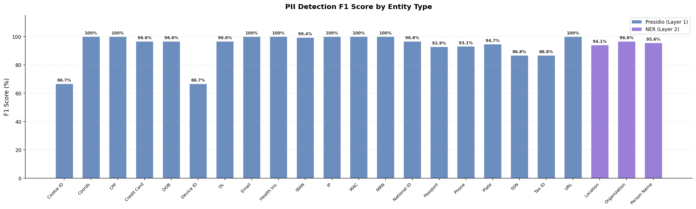
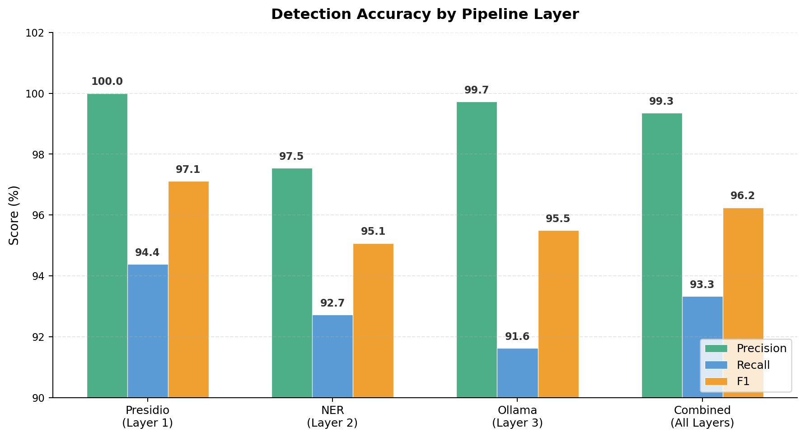
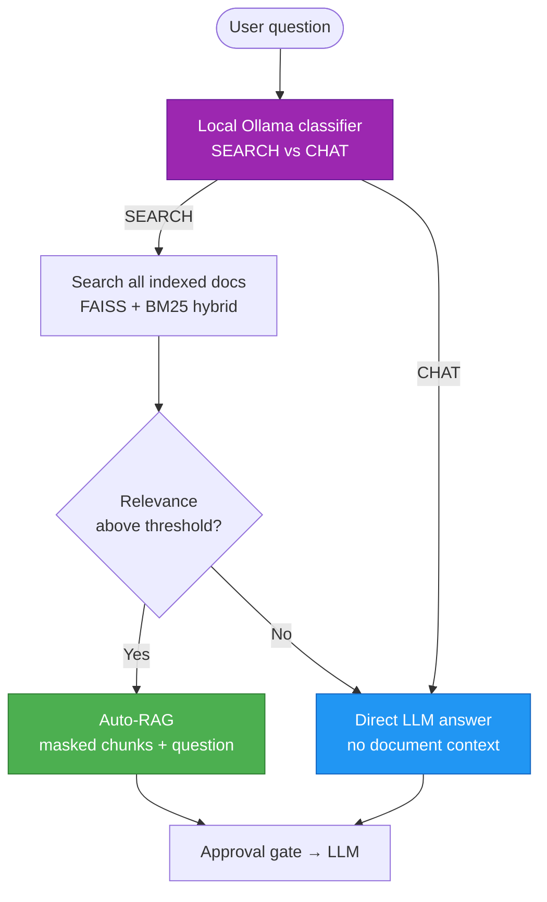

# Septum — Features & Detection Reference

<p align="center">
  <a href="../README.md"><strong>🏠 Home</strong></a>
  &nbsp;·&nbsp;
  <strong>✨ Features</strong>
  &nbsp;·&nbsp;
  <a href="ARCHITECTURE.md"><strong>🏗️ Architecture</strong></a>
  &nbsp;·&nbsp;
  <a href="DOCUMENT_INGESTION.md"><strong>📊 Document Ingestion</strong></a>
  &nbsp;·&nbsp;
  <a href="SCREENSHOTS.md"><strong>📸 Screenshots</strong></a>
  &nbsp;·&nbsp;
  <a href="../CONTRIBUTING.md"><strong>🤝 Contributing</strong></a>
  &nbsp;·&nbsp;
  <a href="../CHANGELOG.md"><strong>📝 Changelog</strong></a>
</p>

---

> In-depth reference for everything that did not fit in the [main README](../README.md).
> For module-level architecture see the [Architecture](ARCHITECTURE.md) doc.

## Table of Contents

- [Detection Pipeline](#detection-pipeline)
- [Benchmark Results](#benchmark-results)
- [Regulation Packs](#regulation-packs)
- [Auto-RAG Routing](#auto-rag-routing)
- [Why Septum](#why-septum)
- [MCP Integration](#mcp-integration)
- [REST API & Authentication](#rest-api--authentication)

For the full visual tour, see the [Screenshots](SCREENSHOTS.md) gallery.

---

## Detection Pipeline

Septum runs a three-layer detection pipeline, entirely locally. Each layer
is additive — layers are merged through a coreference resolver so the same
person shows up as a single `[PERSON_1]` placeholder regardless of how they
were named.


| Layer | Technology | Entity types |
|:---:|:---|:---|
| 1 | **Presidio** — regex patterns with algorithmic validators (Luhn, IBAN MOD-97, TCKN, CPF, SSN). Context-aware recognisers with multilingual keywords. | EMAIL_ADDRESS, PHONE_NUMBER, IP_ADDRESS, CREDIT_CARD_NUMBER, IBAN, NATIONAL_ID, MEDICAL_RECORD_NUMBER, HEALTH_INSURANCE_ID, POSTAL_ADDRESS, DATE_OF_BIRTH, MAC_ADDRESS, URL, COORDINATES, COOKIE_ID, DEVICE_ID, SOCIAL_SECURITY_NUMBER, CPF, PASSPORT_NUMBER, DRIVERS_LICENSE, TAX_ID, LICENSE_PLATE |
| 2 | **NER** — HuggingFace XLM-RoBERTa with per-language model selection (20+ languages). ALL CAPS input auto-normalised to title case before inference. | PERSON_NAME, LOCATION, ORGANIZATION_NAME |
| 3 | **Ollama** — local LLM for context validation, alias detection, and semantic entities. | PERSON_NAME aliases/nicknames; DIAGNOSIS, MEDICATION, RELIGION, POLITICAL_OPINION, SEXUAL_ORIENTATION, ETHNICITY, CLINICAL_NOTE, BIOMETRIC_ID, DNA_PROFILE |

**Coreference resolution.** After all three layers have produced spans, the
sanitiser collapses co-referring mentions: `"John"`, `"J. Doe"`, and
`"Mr. Doe"` in the same document all map to `[PERSON_1]`. This works
across sentences and across chunks of the same document.

**Layer 3 is optional.** Set `use_ollama_semantic_layer=false` in settings
to skip it. Layers 1 and 2 handle structured identifiers and names; Layer
3 adds semantic sensitive-category detection that regex and NER cannot
cover. Detection accuracy depends on the Ollama model — the benchmark
below uses `aya-expanse:8b`.

---

## Benchmark Results

All 17 built-in regulations active. **3,268 algorithmically generated PII
values** across 23 entity types (valid Luhn, IBAN MOD-97, TCKN checksums).
150 samples per Presidio type, 160 person names (mixed case + ALL CAPS,
EN/TR), 100 locations (EN/TR), 30 organisation names (EN/TR), plus alias
detection. Fixed seed for full reproducibility.

<p align="center">
  
</p>

<p align="center">
  
</p>

| Layer | Entities | Types | Precision | Recall | F1 |
|:---|:---:|:---:|:---:|:---:|:---:|
| **Presidio (L1)** — patterns + validators | 1,710 | 20 | 100% | 94.4% | 97.1% |
| **NER (L2)** — XLM-RoBERTa + ALL CAPS normalisation | 770 | 3 | 97.5% | 92.7% | 95.1% |
| **Ollama (L3)** — aya-expanse:8b | 788 | 3 | 99.7% | 91.6% | 95.5% |
| **Combined** | **3,268** | **23** | **99.3%** | **93.3%** | **96.2%** |

> NER (L2) detects ALL CAPS names (common in medical/legal documents) via
> automatic titlecase normalisation, and recognises organisation names.
> Ollama (L3) validates candidates and catches aliases. Benchmark includes
> adversarial edge cases (spaced IBANs, dotted phone numbers, etc.) that
> lower Presidio recall to real-world levels. Reproducible:
> `pytest tests/benchmark_detection.py -v -s`

### Coverage & limitations

**No PII detection system is 100% accurate.** Septum's benchmark is
transparent about where it wins and where it does not:

- **All 37 regulation entity types are detectable** — 21 via Presidio, 3
  via NER, 9 via Ollama, and 7 via parent-type coverage (CITY covered by
  LOCATION, FIRST_NAME by PERSON_NAME, etc.).
- **23 entity types are actively benchmarked** across 3,268 values in 14
  languages with adversarial edge cases.
- **Semantic types** (DIAGNOSIS, MEDICATION, RELIGION, POLITICAL_OPINION)
  are detected only by the Ollama layer and require a local LLM to be
  running.
- **Context-dependent recognisers** (DATE_OF_BIRTH, PASSPORT_NUMBER, SSN,
  TAX_ID) require contextual keywords near the value to reduce false
  positives. Multilingual keyword lists cover 8+ languages.
- **Adversarial formats** (spaced TCKNs, dotted phone numbers) show lower
  detection rates than controlled-format tests. Reported honestly in the
  benchmark.

**The Approval Gate is the safety net.** Before any text is sent to the
LLM, you see exactly what will be transmitted and can reject it.
Automated detection reduces risk; human review eliminates it.

Benchmark models: NER uses `akdeniz27/xlm-roberta-base-turkish-ner` (TR)
and `Davlan/xlm-roberta-base-wikiann-ner` (all other languages). Ollama
layer uses `aya-expanse:8b`. Larger Ollama models generally improve
semantic detection at the cost of latency.

---

## Regulation Packs

17 built-in regulation packs ship with Septum. Multiple can be active
simultaneously — the sanitiser applies the union of rules and the most
restrictive rule wins.

| Region | Code | Regulation |
|:---|:---|:---|
| 🇪🇺 EU / EEA | `gdpr` | General Data Protection Regulation |
| 🇺🇸 USA (Healthcare) | `hipaa` | Health Insurance Portability and Accountability Act |
| 🇹🇷 Turkey | `kvkk` | Personal Data Protection Law (6698) |
| 🇧🇷 Brazil | `lgpd` | Lei Geral de Proteção de Dados |
| 🇺🇸 USA (California) | `ccpa` | California Consumer Privacy Act |
| 🇺🇸 USA (California) | `cpra` | California Privacy Rights Act |
| 🇬🇧 United Kingdom | `uk_gdpr` | UK GDPR |
| 🇨🇦 Canada | `pipeda` | Personal Information Protection and Electronic Documents Act |
| 🇹🇭 Thailand | `pdpa_th` | Personal Data Protection Act |
| 🇸🇬 Singapore | `pdpa_sg` | Personal Data Protection Act |
| 🇯🇵 Japan | `appi` | Act on the Protection of Personal Information |
| 🇨🇳 China | `pipl` | Personal Information Protection Law |
| 🇿🇦 South Africa | `popia` | Protection of Personal Information Act |
| 🇮🇳 India | `dpdp` | Digital Personal Data Protection Act |
| 🇸🇦 Saudi Arabia | `pdpl_sa` | Personal Data Protection Law |
| 🇳🇿 New Zealand | `nzpa` | Privacy Act 2020 |
| 🇦🇺 Australia | `australia_pa` | Privacy Act 1988 |

Each row is a loadable pack under
[`packages/core/septum_core/recognizers/`](../packages/core/septum_core/recognizers/).
Legal sources for every entity type live in
[`packages/core/docs/REGULATION_ENTITY_SOURCES.md`](../packages/core/docs/REGULATION_ENTITY_SOURCES.md).

**Region-specific national ID validators** are algorithmic, not
pattern-only: TCKN (Turkey, mod-10 + mod-11 checksum), Aadhaar (India,
Verhoeff), CPF (Brazil, two-digit checksum), NRIC/FIN (Singapore, letter
checksum), Resident ID (China, ISO 7064 MOD 11-2), NINO (UK), CNPJ
(Brazil), My Number (Japan), and more. Invalid checksums are rejected, so
random 11-digit strings do not trigger false positives.

**Custom rules.** The dashboard lets admins define custom rulesets with
regex patterns, keyword lists, or LLM-prompt based detection. Custom
rules sit alongside built-in packs — policy composition rules still apply.

---

## Auto-RAG Routing

When no documents are selected in the chat sidebar, Septum decides
automatically whether to search documents or answer as a plain chatbot.



Three paths result:

1. **Manual RAG** — user explicitly selects documents. Classifier skipped;
   the selection drives retrieval as before.
2. **Auto-RAG** — no selection, classifier says SEARCH, relevance score
   above threshold. Chunks retrieved across all user documents.
3. **Pure LLM** — no selection, classifier says CHAT or relevance below
   threshold. No document context attached; the LLM answers freely.

The SSE meta event gained a `rag_mode: "manual" | "auto" | "none"` field
plus `matched_document_ids` so the dashboard can show a badge on each
assistant message. Threshold lives in the RAG settings tab as
`rag_relevance_threshold` (default 0.35).

---

## Why Septum

| Capability | Septum | Plain ChatGPT / Claude | Azure Presidio | LangChain pipeline |
|:---|:---:|:---:|:---:|:---:|
| PII masked before cloud | **Yes** | No | Detection only | Build yourself |
| Multi-regulation (17 packs) | **Yes** | No | No | Build yourself |
| Approval gate before LLM | **Yes** | No | No | Build yourself |
| De-anonymisation (real values) | **Yes** | N/A | No | Build yourself |
| Document RAG with hybrid retrieval | **Yes** | No | No | Partial |
| Auto-RAG intent routing | **Yes** | No | No | Build yourself |
| Custom detection rules | **Yes** | No | Limited | Build yourself |
| Ready-to-use web UI | **Yes** | N/A | No | No |
| Audit trail & compliance | **Yes** | No | No | Build yourself |
| Works with any LLM provider | **Yes** | Single | Azure only | Configurable |
| Fully self-hosted | **Yes** | No | Cloud service | Depends |

Other tools offer pieces of the puzzle — detection here, a vector store
there. Septum is the complete end-to-end pipeline: detection →
anonymisation → mapping → retrieval → approval → LLM call →
de-anonymisation → audit. Out of the box, with a UI, for any regulation.

---

## MCP Integration

Septum ships a standalone **Model Context Protocol** server,
[`septum-mcp`](../packages/mcp/), that plugs the same local PII masking
pipeline into any MCP-aware client. MCP is an open, vendor-neutral
[specification](https://modelcontextprotocol.io) — the server supports
all three standard transports:

- **stdio** (default) — for subprocess-launching clients: Claude
  Desktop, Cursor, Windsurf, ChatGPT Desktop, Zed, and anything built
  against the Python / TypeScript / Rust / Go / C# / Java SDKs.
- **streamable-http** — modern HTTP transport for remote, browser, or
  containerised clients. Bearer-token auth via
  `Authorization: Bearer <SEPTUM_MCP_HTTP_TOKEN>`.
- **sse** — legacy HTTP + Server-Sent Events transport, kept for
  clients that haven't migrated to streamable-http yet.

`septum-core` runs in-process; raw PII never reaches the network.

**Tools exposed:**

| Tool | Purpose |
|:---|:---|
| `mask_text` | Mask PII in a snippet and return a session id. |
| `unmask_response` | Restore originals inside an LLM reply using the session id. |
| `detect_pii` | Read-only scan — returns entities without retaining a session. |
| `scan_file` | Read a local file (`.txt`, `.md`, `.csv`, `.json`, `.pdf`, `.docx`) and scan it. |
| `list_regulations` | List the 17 built-in regulation packs with their declared entity types. |
| `get_session_map` | Return `{original → placeholder}` for local debugging only. |

**Stdio client** (Claude Desktop, Cursor, Windsurf, Zed, ChatGPT Desktop):

```json
{
  "mcpServers": {
    "septum": {
      "command": "septum-mcp",
      "env": {
        "SEPTUM_REGULATIONS": "gdpr,kvkk",
        "SEPTUM_LANGUAGE": "en"
      }
    }
  }
}
```

**HTTP client** (remote agent, browser extension, shared team server):

```json
{
  "mcpServers": {
    "septum": {
      "url": "https://mcp.example.com/mcp",
      "headers": {
        "Authorization": "Bearer <your-token>"
      }
    }
  }
}
```

Run the HTTP server yourself:

```bash
SEPTUM_MCP_HTTP_TOKEN=$(openssl rand -hex 32) \
  septum-mcp --transport streamable-http --host 0.0.0.0 --port 8765
```

See [`packages/mcp/README.md`](../packages/mcp/README.md) for the
complete HTTP deployment guide (Docker, compose profiles, TLS
reverse-proxy pattern), environment variable reference, and
end-to-end tool examples.

---

## REST API & Authentication

The Septum backend ships a FastAPI REST layer documented at `/docs`
(Swagger) and `/redoc`. Two authentication methods are supported.

### JWT (browser sessions, short-lived)

The setup wizard creates the first admin account; subsequent logins
return a JWT good for 24 hours.

```bash
curl -X POST http://localhost:3000/api/auth/login \
  -H 'Content-Type: application/json' \
  -d '{"email": "admin@example.com", "password": "your-password"}'
# → {"access_token": "...", "token_type": "bearer"}
```

### API keys (CI/CD, MCP integrations, long-lived)

Admins issue programmatic API keys via `POST /api/api-keys`. The raw key
is shown **once** at creation; only its 8-character prefix and a SHA-256
hash are persisted.

```bash
# Create a key (response includes raw_key — store it now, you cannot retrieve it later)
curl -X POST http://localhost:3000/api/api-keys \
  -H 'Authorization: Bearer <jwt>' \
  -H 'Content-Type: application/json' \
  -d '{"name": "ci-pipeline", "expires_at": null}'

# Use it on any subsequent request
curl -H 'X-API-Key: sk-septum-<64 hex chars>' http://localhost:3000/api/auth/me

# List keys (prefixes + metadata only — raw keys are never returned again)
curl -H 'X-API-Key: sk-septum-…' http://localhost:3000/api/api-keys

# Revoke
curl -X DELETE -H 'X-API-Key: sk-septum-…' http://localhost:3000/api/api-keys/{id}
```

### Rate limits

| Endpoint | Limit |
|:---|:---|
| `POST /api/auth/register` | 3 / minute |
| `POST /api/auth/login` | 5 / minute |
| `POST /api/api-keys` | 10 / minute |
| Everything else | 60 / minute (configurable via `RATE_LIMIT_DEFAULT`) |

API-key requests are rate-limited by **key prefix**, not IP, so services
behind a shared NAT each get their own quota. Anonymous and JWT requests
fall back to the remote IP. Limits are stored in Redis when configured;
otherwise in-process memory (single-node dev only).

### Quick API example

```bash
# Upload a document
curl -X POST http://localhost:3000/api/documents/upload \
  -H "Authorization: Bearer $TOKEN" \
  -F "file=@contract.pdf"

# Ask a question (streamed response via SSE)
curl -N -X POST http://localhost:3000/api/chat/ask \
  -H "Authorization: Bearer $TOKEN" \
  -H "Content-Type: application/json" \
  -d '{"message": "What are the termination clauses?", "document_id": 1}'
```

The chat endpoint returns Server-Sent Events:
`meta` → `approval_required` → `answer_chunk` → `end`.

For the complete API reference, pipeline details, and deployment
topologies, see the [Architecture](ARCHITECTURE.md) doc.

