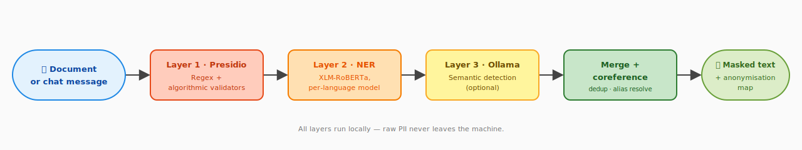
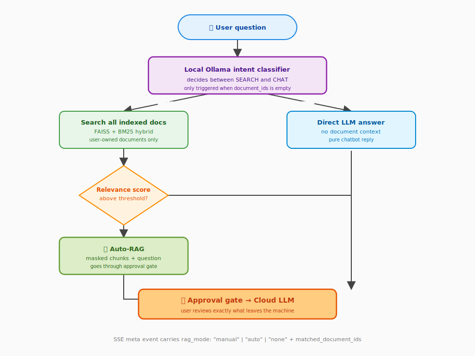

# Septum — Features & Detection Reference

<p align="center">
  <a href="../README.md"><strong>🏠 Home</strong></a>
  &nbsp;·&nbsp;
  <strong>✨ Features</strong>
  &nbsp;·&nbsp;
  <a href="ARCHITECTURE.md"><strong>🏗️ Architecture</strong></a>
  &nbsp;·&nbsp;
  <a href="DOCUMENT_INGESTION.md"><strong>📊 Document Ingestion</strong></a>
  &nbsp;·&nbsp;
  <a href="SCREENSHOTS.md"><strong>📸 Screenshots</strong></a>
  &nbsp;·&nbsp;
  <a href="../CONTRIBUTING.md"><strong>🤝 Contributing</strong></a>
  &nbsp;·&nbsp;
  <a href="../CHANGELOG.md"><strong>📝 Changelog</strong></a>
</p>

---

## Table of Contents

- [Detection Pipeline](#detection-pipeline)
- [Benchmark Results](#benchmark-results)
- [Regulation Packs](#regulation-packs)
- [Auto-RAG Routing](#auto-rag-routing)
- [Why Septum](#why-septum)
- [MCP Integration](#mcp-integration)
- [REST API & Authentication](#rest-api--authentication)

---

## Detection Pipeline

Septum runs a three-layer detection pipeline, entirely locally. Each layer
is additive — layers are merged through a coreference resolver so the same
person shows up as a single `[PERSON_1]` placeholder regardless of how they
were named.

<p align="center">
  <a href="#detection-pipeline"></a>
</p>

| Layer | Technology | Entity types |
|:---:|:---|:---|
| 1 | **Presidio** — regex patterns with algorithmic validators (Luhn, IBAN MOD-97, TCKN, CPF, SSN). Context-aware recognisers with multilingual keywords. | EMAIL_ADDRESS, PHONE_NUMBER, IP_ADDRESS, CREDIT_CARD_NUMBER, IBAN, NATIONAL_ID, MEDICAL_RECORD_NUMBER, HEALTH_INSURANCE_ID, POSTAL_ADDRESS, DATE_OF_BIRTH, MAC_ADDRESS, URL, COORDINATES, COOKIE_ID, DEVICE_ID, SOCIAL_SECURITY_NUMBER, CPF, PASSPORT_NUMBER, DRIVERS_LICENSE, TAX_ID, LICENSE_PLATE |
| 2 | **NER** — HuggingFace XLM-RoBERTa with per-language model selection (20+ languages). ALL CAPS input auto-normalised to title case. LOCATION + ORGANIZATION_NAME pass through a multi-word-or-high-score gate to drop common-noun mis-fires (see Coverage & limitations). | PERSON_NAME, LOCATION, ORGANIZATION_NAME |
| 3 | **Ollama** — local LLM for context validation, alias detection, and semantic entities. | PERSON_NAME aliases/nicknames; DIAGNOSIS, MEDICATION, RELIGION, POLITICAL_OPINION, SEXUAL_ORIENTATION, ETHNICITY, CLINICAL_NOTE, BIOMETRIC_ID, DNA_PROFILE |

**Coreference resolution.** After all three layers have produced spans, the
sanitiser collapses co-referring mentions: `"John"`, `"J. Doe"`, and
`"Mr. Doe"` in the same document all map to `[PERSON_1]`. This works
across sentences and across chunks of the same document.

**Layer 3 is optional.** Set `use_ollama_semantic_layer=false` in settings
to skip it. Layers 1 and 2 handle structured identifiers and names; Layer
3 adds semantic sensitive-category detection that regex and NER cannot
cover. Detection accuracy depends on the Ollama model — the benchmark
below uses `aya-expanse:8b`.

---

## Benchmark Results

All 17 built-in regulations active, evaluated across **five independent data sources plus two robustness probes**:

1. **Septum synthetic corpus** — **3,468 algorithmically generated PII values** across 23 entity types in **16 languages** (ar, de, en, es, fr, hi, it, ja, ko, nl, pl, pt, ru, th, tr, zh). The only way to cover checksummed IDs (valid Luhn, IBAN MOD-97, TCKN) that no public dataset carries, plus a 31-doc semantic-contextual subset (60 entities across DIAGNOSIS / MEDICATION / RELIGION / POLITICAL_OPINION / ETHNICITY / SEXUAL_ORIENTATION) that measures Ollama's unique contribution. Fixed seed — fully reproducible.
2. **Microsoft [presidio-evaluator](https://github.com/microsoft/presidio-research)** — 200 synthetic Faker sentences, the reference PII evaluation framework used by the Presidio team. Entity map excludes DATE_TIME / TIME / TITLE / SEX / CARDISSUER / NRP — labels that are not PII under any of Septum's 17 regulations — so the recall number reflects masking quality, not category mismatches.
3. **[Babelscape/wikineural](https://huggingface.co/datasets/Babelscape/wikineural)** — 50 Wikipedia held-out sentences × 9 languages. Caveat: the XLM-RoBERTa NER models Septum uses were trained on the related WikiANN corpus, so these numbers skew toward an upper bound on real-world performance for this language set.
4. **[ai4privacy/pii-masking-300k](https://huggingface.co/datasets/ai4privacy/pii-masking-300k)** — 50 validation samples × 6 languages (en/de/fr/es/it/nl). Modern PII-specific dataset built from scratch; the models Septum uses were NOT trained on it, so this is the closest the benchmark gets to a true out-of-distribution check.
5. **[CoNLL-2003](https://aclanthology.org/W03-0419/)** — 200 samples from the classical EN news-domain held-out test split. Not in any Septum-relevant training corpus.
6. **[DFKI-SLT/few-nerd](https://huggingface.co/datasets/DFKI-SLT/few-nerd)** (supervised split) — multi-domain Wikipedia NER used as a cross-domain robustness probe. Only person / organization / location map to Septum's PII categories.
7. **Robustness probes** — 15 PII-free paragraphs in 9 languages (false-positive rate) + 18 obfuscated PII inputs (leetspeak, Unicode homoglyphs, zero-width joiners, mixed-case emails, bracketed emails, escaped credit cards, line-wrapped TCKNs and IBANs, international phone formats, "at / dot" ASCII obfuscation).

<p align="center">
  <a href="#benchmark-results"></a>
</p>

<p align="center">
  <a href="#benchmark-results"></a>
</p>

### Septum synthetic corpus (per-layer)

| Layer | Entities | Types | Precision | Recall | F1 |
|:---|:---:|:---:|:---:|:---:|:---:|
| **Presidio (L1)** — patterns + validators (controlled + extended + adversarial) | 1,710 | 20 | 100% | 96.4% | 98.2% |
| **NER (L2)** — XLM-RoBERTa + ALL CAPS normalisation (16 languages) | 840 | 3 | 99.9% | 90.8% | 95.1% |
| **Ollama (L3)** — aya-expanse:8b (alias + semantic-contextual) | 918 | 9 | 99.9% | 90.6% | 95.0% |
| **Combined** | **3,468** | **23** | **99.9%** | **93.5%** | **96.6%** |

**Ollama semantic subset** (DIAGNOSIS / MEDICATION / RELIGION / POLITICAL_OPINION / ETHNICITY / SEXUAL_ORIENTATION — entity types Presidio and NER cannot express): 60 entities across 31 docs, **F1 96.6%** (Precision 98.3%, Recall 95.0%).

**Ollama ablation** — same 205-doc corpus (semantic + alias + NER) with Ollama OFF vs ON: **+3.49 pp recall, +1.95 pp F1**. This is the honest measurement of Ollama's marginal value; on the semantic subset alone Ollama lifts recall from near-zero to 95% because no other layer can express those categories.

### External reference datasets

| Source | Entities | Types | Precision | Recall | F1 |
|:---|:---:|:---:|:---:|:---:|:---:|
| **Microsoft presidio-evaluator** (EN, synthetic Faker, 200 samples) | 326 | 11 | 98.2% | 66.6% | 79.3% |
| **Babelscape/wikineural** (9 langs × 50 = 450 samples, held-out Wikipedia NER) | 634 | 3 | 95.5% | 76.5% | 84.9% |
| **ai4privacy/pii-masking-300k** (6 langs, real OOD — not in training data) | 1,456 | 12 | 96.4% | 54.5% | 69.6% |
| **CoNLL-2003** (EN news, 372 PER/ORG/LOC scored + 35 MISC excluded by design) | 372 | 3 | 97.9% | 37.4% | 54.1% |
| **DFKI-SLT/few-nerd** (multi-domain Wikipedia, 200 test samples) | 361 | 3 | 95.7% | 68.4% | 79.8% |

CoNLL-2003 recall is partly structural: 35 of 407 gold entities (**8.6%**) are MISC-class — nationalities, events, works-of-art — that are not PII under any of Septum's 17 regulation packs and are intentionally excluded from scoring. The headline 54.1% reflects recall *after* MISC is dropped and combines (a) Septum's deliberate policy that bare place names in free news text are not PII by themselves (GDPR Art. 4(1) rationale) with (b) the conservative LOCATION / ORGANIZATION gates on short single-token mentions. Ai4Privacy exposes real gaps around USERNAME and fine-grained address sub-types that the current regulation packs do not target directly — that's actionable signal, not a rounding error.

<p align="center">
  <a href="#benchmark-results"></a>
</p>

### Robustness

| Probe | Volume | Result |
|:---|:---:|:---:|
| **Clean-text false-positive rate** (15 PII-free paragraphs, 439 tokens across 9 languages) | 0 FP | **0.00 FP / 1k tokens** |
| **Adversarial pack** (18 realistic obfuscated PII inputs: leetspeak, Unicode homoglyphs, zero-width joiners, mixed-case emails, bracketed emails, escaped credit cards, line-wrapped TCKNs and IBANs, international phone formats, "at / dot" ASCII obfuscation) | 20 planted | P 100% · R 90.0% · **F1 94.7%** |

The adversarial pack is intentionally biased toward the attempts a real user or attacker would type — contrived triple-spaced IBANs and other "nobody would actually paste this" constructions are excluded so the score reflects real-world resilience rather than stress-test theatre. The 10% recall gap is where an obfuscation-normalising custom-rules layer would pay off.

### Per-language breakdown (Ollama pipeline)

<p align="center">
  <a href="#benchmark-results"></a>
</p>

F1 is uniform and very high across Latin-script languages (EN 98.3%, DE 100%, ES 100%, FR 95.8%, IT 100%, NL 100%, PL 98.6%, PT 97.1%, RU 100%, TR 96.8%) and remains strong on Arabic (92.3%) and Hindi (100%). The honest weak spots are CJK and Thai: **Thai 87.1%, Korean 83.3%, Japanese 65.4%, Chinese 54.2%**. The CJK minimum-span-length floor is now language-aware (2 glyphs for ZH / JA / KO / TH, 3 elsewhere) which already lifted Chinese from 44.4% to 54.2%; closing the rest of the gap requires per-language NER fine-tuning, which is on the roadmap, not claimed to be solved today.

> NER (L2) detects ALL CAPS names (common in medical/legal documents) via
> automatic titlecase normalisation, and recognises organisation names.
> LOCATION output goes through a conservative gate (multi-word OR confidence
> ≥ 0.95) so common-noun mis-fires like Turkish "Doğum" or German form
> headers are filtered out while real placenames like "İstanbul", "Berlin"
> still pass through. Ollama (L3) validates candidates and catches aliases.
> Benchmark includes adversarial edge cases (spaced IBANs, dotted phone
> numbers, etc.) that lower Presidio recall to real-world levels.
> Reproducible: `pytest packages/api/tests/benchmark_detection.py -v -s`

### Coverage & limitations

**No PII detection system is 100% accurate.** Septum's benchmark is
transparent about where it wins and where it does not:

- **LOCATION output passes through a multi-word-or-high-score gate** (same
  shape as ORGANIZATION_NAME). Multilingual XLM-RoBERTa models produce
  stochastic single-token LOC mis-fires on common nouns and form-field
  headers in every language Septum supports (Turkish "Doğum", German form
  headers, etc.); chasing those per-language via stopword lists does not
  scale across the 50+ locales the middleware must handle. The gate drops
  single-token spans below 0.95 confidence — real placenames like
  "İstanbul", "Berlin" routinely score 0.97+ and multi-word locations
  ("New York") bypass the score gate entirely. Structured address PII is
  additionally captured by Presidio's `StructuralAddressRecognizer` and
  the per-regulation POSTAL_ADDRESS / STREET_ADDRESS recognisers.
- **All 37 regulation entity types are detectable** — 21 via Presidio, 3
  via NER, 9 via Ollama, and the rest via parent-type coverage
  (FIRST_NAME by PERSON_NAME, CITY by LOCATION, etc.).
- **23 entity types are actively benchmarked** across 3,408 values in 16
  languages with adversarial edge cases.
- **Semantic types** (DIAGNOSIS, MEDICATION, RELIGION, POLITICAL_OPINION)
  are detected only by the Ollama layer and require a local LLM to be
  running.
- **Context-dependent recognisers** (DATE_OF_BIRTH, PASSPORT_NUMBER, SSN,
  TAX_ID) require contextual keywords near the value to reduce false
  positives. Multilingual keyword lists cover 8+ languages.
- **Adversarial formats** (spaced TCKNs, dotted phone numbers) show lower
  detection rates than controlled-format tests. Reported honestly in the
  benchmark.

**The Approval Gate is the safety net.** Before any text is sent to the
LLM, you see exactly what will be transmitted and can reject it.
Automated detection reduces risk; human review eliminates it.

Benchmark models: NER uses `akdeniz27/xlm-roberta-base-turkish-ner` (TR)
and `Davlan/xlm-roberta-base-wikiann-ner` (all other languages). Ollama
layer uses `aya-expanse:8b`. Larger Ollama models generally improve
semantic detection at the cost of latency.

---

## Regulation Packs

17 built-in regulation packs ship with Septum. Multiple can be active
simultaneously — the sanitiser applies the union of rules and the most
restrictive rule wins.

| Region | Code | Regulation |
|:---|:---|:---|
| 🇪🇺 EU / EEA | `gdpr` | General Data Protection Regulation |
| 🇺🇸 USA (Healthcare) | `hipaa` | Health Insurance Portability and Accountability Act |
| 🇹🇷 Turkey | `kvkk` | Personal Data Protection Law (6698) |
| 🇧🇷 Brazil | `lgpd` | Lei Geral de Proteção de Dados |
| 🇺🇸 USA (California) | `ccpa` | California Consumer Privacy Act |
| 🇺🇸 USA (California) | `cpra` | California Privacy Rights Act |
| 🇬🇧 United Kingdom | `uk_gdpr` | UK GDPR |
| 🇨🇦 Canada | `pipeda` | Personal Information Protection and Electronic Documents Act |
| 🇹🇭 Thailand | `pdpa_th` | Personal Data Protection Act |
| 🇸🇬 Singapore | `pdpa_sg` | Personal Data Protection Act |
| 🇯🇵 Japan | `appi` | Act on the Protection of Personal Information |
| 🇨🇳 China | `pipl` | Personal Information Protection Law |
| 🇿🇦 South Africa | `popia` | Protection of Personal Information Act |
| 🇮🇳 India | `dpdp` | Digital Personal Data Protection Act |
| 🇸🇦 Saudi Arabia | `pdpl_sa` | Personal Data Protection Law |
| 🇳🇿 New Zealand | `nzpa` | Privacy Act 2020 |
| 🇦🇺 Australia | `australia_pa` | Privacy Act 1988 |

Each row is a loadable pack under `packages/core/septum_core/recognizers/`. Legal sources for every entity type live in the [regulation entity sources doc](../packages/core/docs/REGULATION_ENTITY_SOURCES.md).

**Region-specific national ID validators** are algorithmic, not
pattern-only: TCKN (Turkey, mod-10 + mod-11 checksum), Aadhaar (India,
Verhoeff), CPF (Brazil, two-digit checksum), NRIC/FIN (Singapore, letter
checksum), Resident ID (China, ISO 7064 MOD 11-2), NINO (UK), CNPJ
(Brazil), My Number (Japan), and more. Invalid checksums are rejected, so
random 11-digit strings do not trigger false positives.

**Custom rules.** The dashboard lets admins define custom rulesets with
regex patterns, keyword lists, or LLM-prompt based detection. Custom
rules sit alongside built-in packs — policy composition rules still apply.

---

## Auto-RAG Routing

When no documents are selected in the chat sidebar, Septum decides
automatically whether to search documents or answer as a plain chatbot.

<p align="center">
  <a href="#auto-rag-routing"></a>
</p>

Three paths result:

1. **Manual RAG** — user explicitly selects documents. Classifier skipped;
   the selection drives retrieval as before.
2. **Auto-RAG** — no selection, classifier says SEARCH, relevance score
   above threshold. Chunks retrieved across all user documents.
3. **Pure LLM** — no selection, classifier says CHAT or relevance below
   threshold. No document context attached; the LLM answers freely.

The SSE meta event gained a `rag_mode: "manual" | "auto" | "none"` field
plus `matched_document_ids` so the dashboard can show a badge on each
assistant message. Threshold lives in the RAG settings tab as
`rag_relevance_threshold` (default 0.35).

---

## Why Septum

| Capability | Septum | Plain ChatGPT / Claude | Azure Presidio | LangChain pipeline |
|:---|:---:|:---:|:---:|:---:|
| PII masked before cloud | **Yes** | No | Detection only | Build yourself |
| Multi-regulation (17 packs) | **Yes** | No | No | Build yourself |
| Approval gate before LLM | **Yes** | No | No | Build yourself |
| De-anonymisation (real values) | **Yes** | N/A | No | Build yourself |
| Document RAG with hybrid retrieval | **Yes** | No | No | Partial |
| Auto-RAG intent routing | **Yes** | No | No | Build yourself |
| Custom detection rules | **Yes** | No | Limited | Build yourself |
| Ready-to-use web UI | **Yes** | N/A | No | No |
| Audit trail & compliance | **Yes** | No | No | Build yourself |
| Works with any LLM provider | **Yes** | Single | Azure only | Configurable |
| Fully self-hosted | **Yes** | No | Cloud service | Depends |

Other tools offer pieces of the puzzle — detection here, a vector store
there. Septum is the complete end-to-end pipeline: detection →
anonymisation → mapping → retrieval → approval → LLM call →
de-anonymisation → audit. Out of the box, with a UI, for any regulation.

---

## MCP Integration

Septum ships a standalone **Model Context Protocol** server,
[`septum-mcp`](../packages/mcp/), that plugs the same local PII masking
pipeline into any MCP-aware client. MCP is an open, vendor-neutral
[specification](https://modelcontextprotocol.io) — the server supports
all three standard transports:

- **stdio** (default) — for subprocess-launching clients: Claude
  Desktop, Cursor, Windsurf, ChatGPT Desktop, Zed, and anything built
  against the Python / TypeScript / Rust / Go / C# / Java SDKs.
- **streamable-http** — modern HTTP transport for remote, browser, or
  containerised clients. Bearer-token auth via
  `Authorization: Bearer <SEPTUM_MCP_HTTP_TOKEN>`.
- **sse** — legacy HTTP + Server-Sent Events transport, kept for
  clients that haven't migrated to streamable-http yet.

`septum-core` runs in-process; raw PII never reaches the network.

**Tools exposed:**

| Tool | Purpose |
|:---|:---|
| `mask_text` | Mask PII in a snippet and return a session id. |
| `unmask_response` | Restore originals inside an LLM reply using the session id. |
| `detect_pii` | Read-only scan — returns entities without retaining a session. |
| `scan_file` | Read a local file (`.txt`, `.md`, `.csv`, `.json`, `.pdf`, `.docx`) and scan it. |
| `list_regulations` | List the 17 built-in regulation packs with their declared entity types. |
| `get_session_map` | Return `{original → placeholder}` for local debugging only. |

**Stdio client** (Claude Desktop, Cursor, Windsurf, Zed, ChatGPT Desktop):

```json
{
  "mcpServers": {
    "septum": {
      "command": "septum-mcp",
      "env": {
        "SEPTUM_REGULATIONS": "gdpr,kvkk",
        "SEPTUM_LANGUAGE": "en"
      }
    }
  }
}
```

**HTTP client** (remote agent, browser extension, shared team server):

```json
{
  "mcpServers": {
    "septum": {
      "url": "https://mcp.example.com/mcp",
      "headers": {
        "Authorization": "Bearer <your-token>"
      }
    }
  }
}
```

Run the HTTP server yourself:

```bash
SEPTUM_MCP_HTTP_TOKEN=$(openssl rand -hex 32) \
  septum-mcp --transport streamable-http --host 0.0.0.0 --port 8765
```

See the [MCP server guide](../packages/mcp/README.md) for the
complete HTTP deployment guide (Docker, compose profiles, TLS
reverse-proxy pattern), environment variable reference, and
end-to-end tool examples.

---

## REST API & Authentication

The Septum backend ships a FastAPI REST layer documented at `/docs`
(Swagger) and `/redoc`. Two authentication methods are supported.

### JWT (browser sessions, short-lived)

The setup wizard creates the first admin account; subsequent logins
return a JWT good for 24 hours.

```bash
curl -X POST http://localhost:3000/api/auth/login \
  -H 'Content-Type: application/json' \
  -d '{"email": "admin@example.com", "password": "your-password"}'
# → {"access_token": "...", "token_type": "bearer"}
```

### API keys (CI/CD, MCP integrations, long-lived)

Admins issue programmatic API keys via `POST /api/api-keys`. The raw key
is shown **once** at creation; only its 8-character prefix and a SHA-256
hash are persisted.

```bash
# Create a key (response includes raw_key — store it now, you cannot retrieve it later)
curl -X POST http://localhost:3000/api/api-keys \
  -H 'Authorization: Bearer <jwt>' \
  -H 'Content-Type: application/json' \
  -d '{"name": "ci-pipeline", "expires_at": null}'

# Use it on any subsequent request
curl -H 'X-API-Key: sk-septum-<64 hex chars>' http://localhost:3000/api/auth/me

# List keys (prefixes + metadata only — raw keys are never returned again)
curl -H 'X-API-Key: sk-septum-…' http://localhost:3000/api/api-keys

# Revoke
curl -X DELETE -H 'X-API-Key: sk-septum-…' http://localhost:3000/api/api-keys/{id}
```

### Rate limits

| Endpoint | Limit |
|:---|:---|
| `POST /api/auth/register` | 3 / minute |
| `POST /api/auth/login` | 5 / minute |
| `POST /api/api-keys` | 10 / minute |
| Everything else | 60 / minute (configurable via `RATE_LIMIT_DEFAULT`) |

API-key requests are rate-limited by **key prefix**, not IP, so services
behind a shared NAT each get their own quota. Anonymous and JWT requests
fall back to the remote IP. Limits are stored in Redis when configured;
otherwise in-process memory (single-node dev only).

### Quick API example

```bash
# Upload a document
curl -X POST http://localhost:3000/api/documents/upload \
  -H "Authorization: Bearer $TOKEN" \
  -F "file=@contract.pdf"

# Ask a question (streamed response via SSE)
curl -N -X POST http://localhost:3000/api/chat/ask \
  -H "Authorization: Bearer $TOKEN" \
  -H "Content-Type: application/json" \
  -d '{"message": "What are the termination clauses?", "document_id": 1}'
```

The chat endpoint returns Server-Sent Events:
`meta` → `approval_required` → `answer_chunk` → `end`.

For the complete API reference, pipeline details, and deployment
topologies, see the [Architecture](ARCHITECTURE.md) doc.

---

<p align="center">
  <a href="../README.md"><strong>🏠 Home</strong></a>
  &nbsp;·&nbsp;
  <strong>✨ Features</strong>
  &nbsp;·&nbsp;
  <a href="ARCHITECTURE.md"><strong>🏗️ Architecture</strong></a>
  &nbsp;·&nbsp;
  <a href="DOCUMENT_INGESTION.md"><strong>📊 Document Ingestion</strong></a>
  &nbsp;·&nbsp;
  <a href="SCREENSHOTS.md"><strong>📸 Screenshots</strong></a>
  &nbsp;·&nbsp;
  <a href="../CONTRIBUTING.md"><strong>🤝 Contributing</strong></a>
  &nbsp;·&nbsp;
  <a href="../CHANGELOG.md"><strong>📝 Changelog</strong></a>
</p>

