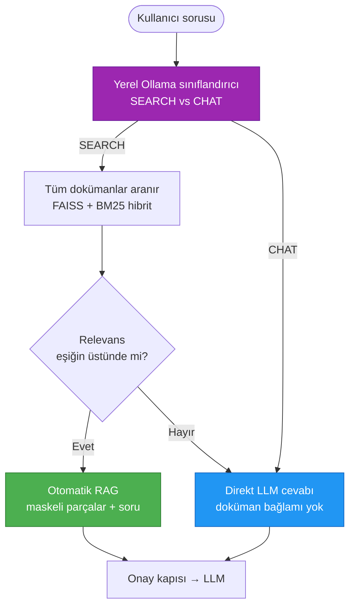

# Septum — Özellik ve Tespit Referansı

> [README.md](../README.tr.md) dışında kalan her şey için ayrıntılı referans.
> Modül seviyesindeki mimari için [ARCHITECTURE.tr.md](../ARCHITECTURE.tr.md)'ye bakın.

## İçindekiler

- [Tespit Hattı](#tespit-hattı)
- [Benchmark Sonuçları](#benchmark-sonuçları)
- [Regülasyon Paketleri](#regülasyon-paketleri)
- [Otomatik RAG Yönlendirme](#otomatik-rag-yönlendirme)
- [Neden Septum](#neden-septum)
- [MCP Entegrasyonu](#mcp-entegrasyonu)
- [REST API ve Kimlik Doğrulama](#rest-api-ve-kimlik-doğrulama)
- [UI Galerisi](#ui-galerisi)

---

## Tespit Hattı

Septum, üç katmanlı tespit hattını tamamen yerelde çalıştırır. Her
katman bir öncekinin üzerine ekler; ardından tüm bulgular bir
coreference çözümleyicisinden geçirilir. Böylece aynı kişi metinde
farklı biçimlerde geçse bile tek bir `[PERSON_1]` placeholder olarak
görünür.


| Katman | Teknoloji | Tespit edilen varlık tipleri |
|:---:|:---|:---|
| 1 | **Presidio** — algoritmik doğrulayıcılarla desteklenen regex örüntüleri (Luhn, IBAN MOD-97, TCKN, CPF, SSN). Çok dilli anahtar kelimeler üzerinden çalışan bağlam duyarlı tanıyıcılar. | EMAIL_ADDRESS, PHONE_NUMBER, IP_ADDRESS, CREDIT_CARD_NUMBER, IBAN, NATIONAL_ID, MEDICAL_RECORD_NUMBER, HEALTH_INSURANCE_ID, POSTAL_ADDRESS, DATE_OF_BIRTH, MAC_ADDRESS, URL, COORDINATES, COOKIE_ID, DEVICE_ID, SOCIAL_SECURITY_NUMBER, CPF, PASSPORT_NUMBER, DRIVERS_LICENSE, TAX_ID, LICENSE_PLATE |
| 2 | **NER** — dile göre model seçimi yapan HuggingFace XLM-RoBERTa (20+ dil). Tamamı BÜYÜK HARF olan girdi, çıkarım öncesi otomatik olarak başlık harflerine normalize edilir. | PERSON_NAME, LOCATION, ORGANIZATION_NAME |
| 3 | **Ollama** — bağlam doğrulama, takma ad tespiti ve semantik varlıklar için yerel LLM. | PERSON_NAME takma adları; DIAGNOSIS, MEDICATION, RELIGION, POLITICAL_OPINION, SEXUAL_ORIENTATION, ETHNICITY, CLINICAL_NOTE, BIOMETRIC_ID, DNA_PROFILE |

**Coreference çözümleme.** Üç katman span'ları ürettikten sonra
sanitizer aynı kişiye yapılan tüm atıfları tek bir placeholder altında
birleştirir. Aynı dokümandaki `"John"`, `"J. Doe"` ve `"Mr. Doe"`
ifadelerinin hepsi `[PERSON_1]` olarak görünür. Bu çözümleme cümleler
arasında ve aynı dokümanın farklı parçaları arasında da çalışır.

**3. katman isteğe bağlıdır.** Ayarlarda `use_ollama_semantic_layer=false`
yaparak atlayabilirsiniz. 1. ve 2. katmanlar yapısal kimlikleri ve
isimleri yakalar; 3. katman ise regex ve NER'in göremediği hassas-kategori
(sağlık, din, siyasi görüş vb.) tespiti ekler. Doğruluk Ollama modeline
bağlıdır — aşağıdaki benchmark `aya-expanse:8b` ile yapılmıştır.

---

## Benchmark Sonuçları

Benchmark, 17 hazır regülasyonun tamamı aktifken çalıştırıldı. Veri
kümesi **23 varlık tipi üzerinden algoritmik olarak üretilmiş 3.268 PII
değerinden** oluşur (geçerli Luhn, IBAN MOD-97, TCKN checksum'ları).
Presidio tipi başına 150 örnek, 160 kişi adı (karışık + BÜYÜK HARF,
EN/TR), 100 konum (EN/TR), 30 kurum adı (EN/TR) ve takma ad tespiti
dahil. Seed sabit tutuldu — sonuçlar bire bir tekrarlanabilir.

<p align="center">
  
</p>

<p align="center">
  
</p>

| Katman | Varlık | Tip | Precision | Recall | F1 |
|:---|:---:|:---:|:---:|:---:|:---:|
| **Presidio (L1)** — örüntü + doğrulayıcı | 1.710 | 20 | %100 | %94,4 | %97,1 |
| **NER (L2)** — XLM-RoBERTa + BÜYÜK HARF normalize | 770 | 3 | %97,5 | %92,7 | %95,1 |
| **Ollama (L3)** — aya-expanse:8b | 788 | 3 | %99,7 | %91,6 | %95,5 |
| **Birleşik** | **3.268** | **23** | **%99,3** | **%93,3** | **%96,2** |

> NER (L2), başlık harfine otomatik normalize ederek tıbbi ve hukuki
> dokümanlarda sık görülen BÜYÜK HARF isimleri yakalar; kurum adlarını da
> tanır. Ollama (L3) adayları doğrular ve takma adları yakalar. Benchmark
> veri kümesi boşluklu IBAN, noktalı telefon gibi adversarial edge case'leri
> de içerir; bu durum Presidio'nun recall'unu gerçek dünya seviyesine çeker.
> Testi kendiniz de çalıştırabilirsiniz:
> `pytest tests/benchmark_detection.py -v -s`

### Kapsam ve sınırlar

**Hiçbir PII tespit sistemi %100 doğru değildir.** Septum'un benchmark'ı
nerede güçlü olduğu, nerede olmadığı konusunda açıktır:

- **37 regülasyon varlık tipinin tamamı tespit edilebilir** — 21'i
  Presidio, 3'ü NER, 9'u Ollama, 7'si ana-tip kapsamıyla (CITY,
  LOCATION'a dahil; FIRST_NAME, PERSON_NAME'e dahil vb.).
- **14 dilde 3.268 değer üzerinden 23 varlık tipi aktif olarak benchmark
  ediliyor.**
- **Semantik tipler** (DIAGNOSIS, MEDICATION, RELIGION,
  POLITICAL_OPINION) yalnızca Ollama katmanı tarafından tespit edilir ve
  çalışan bir yerel LLM gerektirir.
- **Bağlam bağımlı tanıyıcılar** (DATE_OF_BIRTH, PASSPORT_NUMBER, SSN,
  TAX_ID) false positive'leri azaltmak için değerin yakınında bağlam
  anahtar kelimesi arar. 8+ dilde anahtar kelime listesi.
- **Adversarial formatlar** (boşluklu TCKN, noktalı telefon) kontrollü
  format testlerinden daha düşük tespit oranı gösterir. Benchmark'ta
  dürüstçe raporlanıyor.

**Onay Mekanizması güvenlik ağıdır.** LLM'e gönderilmeden önce tam olarak
ne gideceğini görür, gerektiğinde reddedersiniz. Otomatik tespit riski
azaltır; son kararı veren insan incelemesi riski tamamen ortadan
kaldırır.

Benchmark modelleri: NER,
`akdeniz27/xlm-roberta-base-turkish-ner` (TR) ve
`Davlan/xlm-roberta-base-wikiann-ner` (diğer diller) kullanır. Ollama
katmanı `aya-expanse:8b` ile çalışır. Daha büyük Ollama modelleri
genelde semantik tespiti iyileştirir; karşılığında gecikme artar.

---

## Regülasyon Paketleri

Septum 17 hazır regülasyon paketiyle gelir. Birden fazlası aynı anda
aktif olabilir — sanitizer kuralların birleşimini uygular, en kısıtlayıcı
olan kazanır.

| Bölge | Kod | Regülasyon |
|:---|:---|:---|
| 🇪🇺 AB / AEA | `gdpr` | General Data Protection Regulation |
| 🇺🇸 ABD (Sağlık) | `hipaa` | Health Insurance Portability and Accountability Act |
| 🇹🇷 Türkiye | `kvkk` | 6698 sayılı Kişisel Verilerin Korunması Kanunu |
| 🇧🇷 Brezilya | `lgpd` | Lei Geral de Proteção de Dados |
| 🇺🇸 ABD (Kaliforniya) | `ccpa` | California Consumer Privacy Act |
| 🇺🇸 ABD (Kaliforniya) | `cpra` | California Privacy Rights Act |
| 🇬🇧 Birleşik Krallık | `uk_gdpr` | UK GDPR |
| 🇨🇦 Kanada | `pipeda` | Personal Information Protection and Electronic Documents Act |
| 🇹🇭 Tayland | `pdpa_th` | Personal Data Protection Act |
| 🇸🇬 Singapur | `pdpa_sg` | Personal Data Protection Act |
| 🇯🇵 Japonya | `appi` | Act on the Protection of Personal Information |
| 🇨🇳 Çin | `pipl` | Personal Information Protection Law |
| 🇿🇦 Güney Afrika | `popia` | Protection of Personal Information Act |
| 🇮🇳 Hindistan | `dpdp` | Digital Personal Data Protection Act |
| 🇸🇦 Suudi Arabistan | `pdpl_sa` | Personal Data Protection Law |
| 🇳🇿 Yeni Zelanda | `nzpa` | Privacy Act 2020 |
| 🇦🇺 Avustralya | `australia_pa` | Privacy Act 1988 |

Her satır,
[`packages/core/septum_core/recognizers/`](../packages/core/septum_core/recognizers/)
altında yüklenebilir bir pakettir. Her varlık tipinin hukuki kaynağı
[`packages/core/docs/REGULATION_ENTITY_SOURCES.md`](../packages/core/docs/REGULATION_ENTITY_SOURCES.md)
dosyasındadır.

**Bölgeye özgü kimlik numarası doğrulayıcıları** sadece örüntü değil,
algoritmiktir: TCKN (Türkiye, mod-10 + mod-11 checksum), Aadhaar
(Hindistan, Verhoeff), CPF (Brezilya, iki basamaklı checksum), NRIC/FIN
(Singapur, harf checksum'ı), Resident ID (Çin, ISO 7064 MOD 11-2), NINO
(İngiltere), CNPJ (Brezilya), My Number (Japonya) ve daha fazlası.
Geçersiz checksum'lar reddedilir, yani rastgele 11 haneli bir dize
false-positive üretmez.

**Özel kurallar.** Dashboard üzerinden adminler regex, anahtar kelime
veya LLM-prompt tabanlı özel kuralset tanımlayabilir. Özel kurallar
hazır paketlerle yan yana çalışır — policy composition kuralları yine
geçerlidir.

---

## Otomatik RAG Yönlendirme

Sohbet kenar çubuğunda doküman seçilmediğinde Septum, doküman araması
mı yapacağına yoksa doğrudan sohbet yoluyla mı yanıt vereceğine kendisi
karar verir.



Üç yol oluşur:

1. **Manuel RAG** — kullanıcı açıkça doküman seçer. Sınıflandırıcı
   atlanır; retrieval seçilen dokümanlarda çalışır.
2. **Otomatik RAG** — seçim yok, sınıflandırıcı SEARCH diyor ve relevans
   skoru eşiğin üzerinde. Kullanıcının tüm dokümanlarından parçalar
   getirilir.
3. **Düz LLM** — seçim yok, sınıflandırıcı CHAT diyor veya relevans
   eşiğin altında. Doküman bağlamı eklenmez; LLM serbestçe yanıtlar.

SSE meta event'i `rag_mode: "manual" | "auto" | "none"` ve
`matched_document_ids` alanlarını içerir; dashboard her asistan mesajında
rozet göstermek için bunu kullanır. Eşik değeri RAG ayarlar sekmesinde
`rag_relevance_threshold` olarak tutulur (varsayılan 0.35).

---

## Neden Septum

| Yetenek | Septum | Düz ChatGPT / Claude | Azure Presidio | LangChain Pipeline |
|:---|:---:|:---:|:---:|:---:|
| Buluta gitmeden önce PII maskeleme | **Evet** | Hayır | Sadece tespit | Kendin yap |
| Çoklu regülasyon (17 paket) | **Evet** | Hayır | Hayır | Kendin yap |
| LLM öncesi onay kapısı | **Evet** | Hayır | Hayır | Kendin yap |
| Placeholder geri yazma (gerçek değerler) | **Evet** | Yok | Hayır | Kendin yap |
| Hibrit retrieval ile doküman RAG | **Evet** | Hayır | Hayır | Kısmen |
| Otomatik RAG niyet yönlendirme | **Evet** | Hayır | Hayır | Kendin yap |
| Özel tespit kuralları | **Evet** | Hayır | Sınırlı | Kendin yap |
| Hazır web arayüzü | **Evet** | Yok | Hayır | Hayır |
| Denetim kaydı ve uyumluluk | **Evet** | Hayır | Hayır | Kendin yap |
| Herhangi bir LLM sağlayıcısı | **Evet** | Tek | Sadece Azure | Yapılandırılabilir |
| Tamamen self-hosted | **Evet** | Hayır | Bulut servisi | Duruma bağlı |

Diğer araçlar bulmacanın parçalarını sunar — şurada tespit, burada bir
vektör deposu. Septum uçtan uca komple hat: tespit → anonimleştirme →
eşleme → retrieval → onay → LLM çağrısı → placeholder geri yazma → denetim. Kutudan
çıktığı gibi, arayüzüyle, herhangi bir regülasyon için.

---

## MCP Entegrasyonu

Septum, aynı yerel PII maskeleme hattını herhangi bir MCP uyumlu istemciye
bağlayan bağımsız bir **Model Context Protocol** sunucusu,
[`septum-mcp`](../packages/mcp/), ile birlikte gelir. MCP açık ve
sağlayıcıdan bağımsız bir [spesifikasyondur](https://modelcontextprotocol.io) —
sunucu stdio üzerinden çalışır, `septum-core`'u süreç içinde yükler ve
ağa hiçbir zaman erişmez. Protokolü konuşan her istemci kutudan çıktığı
gibi çalışır: Claude Desktop, ChatGPT Desktop, Cursor, Windsurf, ayrıca
Python / TypeScript / Rust / Go / C# / Java SDK'leriyle yazılmış her araç.

**Sunulan araçlar:**

| Araç | Amaç |
|:---|:---|
| `mask_text` | Bir metindeki PII'yi maskeler ve bir session id döndürür. |
| `unmask_response` | LLM yanıtındaki orijinal değerleri session id ile geri yazar. |
| `detect_pii` | Salt-okunur tarama — session tutmadan varlıkları listeler. |
| `scan_file` | Yerel dosyayı (`.txt`, `.md`, `.csv`, `.json`, `.pdf`, `.docx`) okuyup tarar. |
| `list_regulations` | 17 hazır regülasyon paketini ve varlık tiplerini listeler. |
| `get_session_map` | `{orijinal → placeholder}` eşlemesini yalnızca yerel hata ayıklama için döndürür. |

**Örnek istemci yapılandırması** (Claude Desktop / ChatGPT Desktop;
diğer istemciler eşdeğer bir `mcpServers` bloğu kullanır):

```json
{
  "mcpServers": {
    "septum": {
      "command": "septum-mcp",
      "env": {
        "SEPTUM_REGULATIONS": "gdpr,kvkk",
        "SEPTUM_LANGUAGE": "tr"
      }
    }
  }
}
```

Üç kurulum yöntemi (pip, uvx, repo-local), tam ortam değişkeni referansı
ve uçtan uca kullanım örnekleri için
[`packages/mcp/README.md`](../packages/mcp/README.md) dosyasına bakın.

---

## REST API ve Kimlik Doğrulama

Septum backend'i, `/docs` (Swagger) ve `/redoc` altında belgelenen bir
FastAPI REST katmanı sunar. İki kimlik doğrulama yöntemi desteklenir.

### JWT (tarayıcı oturumu, kısa ömürlü)

Kurulum sihirbazı ilk admin hesabını oluşturur; sonraki login'lerde 24
saat geçerli bir JWT döndürülür.

```bash
curl -X POST http://localhost:3000/api/auth/login \
  -H 'Content-Type: application/json' \
  -d '{"email": "admin@example.com", "password": "sifreniz"}'
# → {"access_token": "...", "token_type": "bearer"}
```

### API anahtarları (CI/CD, MCP entegrasyonları, uzun ömürlü)

Adminler `POST /api/api-keys` ile programatik API anahtarı oluşturur. Ham
anahtar yalnızca **bir kez** gösterilir; kalıcı olarak yalnızca 8
karakterlik önek ve SHA-256 hash'i tutulur.

```bash
# Anahtar oluştur (yanıt raw_key içerir — şimdi kaydedin, sonradan geri alamazsınız)
curl -X POST http://localhost:3000/api/api-keys \
  -H 'Authorization: Bearer <jwt>' \
  -H 'Content-Type: application/json' \
  -d '{"name": "ci-pipeline", "expires_at": null}'

# Sonraki tüm isteklerde kullanın
curl -H 'X-API-Key: sk-septum-<64 hex>' http://localhost:3000/api/auth/me

# Anahtarları listele (sadece önek ve metadata — ham anahtar bir daha dönmez)
curl -H 'X-API-Key: sk-septum-…' http://localhost:3000/api/api-keys

# İptal et
curl -X DELETE -H 'X-API-Key: sk-septum-…' http://localhost:3000/api/api-keys/{id}
```

### Rate limit

| Endpoint | Limit |
|:---|:---|
| `POST /api/auth/register` | dakikada 3 |
| `POST /api/auth/login` | dakikada 5 |
| `POST /api/api-keys` | dakikada 10 |
| Diğer hepsi | dakikada 60 (`RATE_LIMIT_DEFAULT` ile yapılandırılır) |

API anahtarıyla gelen isteklere IP yerine **anahtar öneki** bazında rate
limit uygulanır — böylece paylaşılan NAT arkasındaki her servis kendi
kotasına sahip olur. Anonim ve JWT isteklerde ise IP bazlı limit
geçerlidir. Redis yapılandırıldığında limit sayaçları Redis'te tutulur;
aksi halde süreç içi bellekte saklanır (tek node'luk geliştirme için
uygundur).

### Hızlı API örneği

```bash
# Doküman yükle
curl -X POST http://localhost:3000/api/documents/upload \
  -H "Authorization: Bearer $TOKEN" \
  -F "file=@sozlesme.pdf"

# Soru sor (SSE ile stream yanıt)
curl -N -X POST http://localhost:3000/api/chat/ask \
  -H "Authorization: Bearer $TOKEN" \
  -H "Content-Type: application/json" \
  -d '{"message": "Fesih şartları nedir?", "document_id": 1}'
```

Sohbet endpoint'i Server-Sent Events döndürür:
`meta` → `approval_required` → `answer_chunk` → `end`.

Tam API referansı, hat detayları ve deployment topolojileri için
[ARCHITECTURE.tr.md](../ARCHITECTURE.tr.md) dosyasına bakın.

---

## UI Galerisi

### Doküman önizleme — varlıklar satır içinde renklendirilir

<p align="center">
  
</p>

Tespit edilen her varlık — isim, adres, doğum tarihi, telefon, tıbbi
teşhis, kimlik — orijinal doküman üzerinde varlık tipine göre
renklendirilir. Her varlığa tıkladığınızda konumuna gidersiniz; yan
panelde her eşleşme skoru ve placeholder'ıyla listelenir.

### Ayarlar — 5 sekmelik tur

<table>
  <tr>
    <td width="50%" align="center">
      <b>LLM Sağlayıcı</b><br />
      
    </td>
    <td width="50%" align="center">
      <b>Gizlilik ve Sanitizasyon</b> — 3 katmanlı hat<br />
      
    </td>
  </tr>
  <tr>
    <td align="center">
      <b>RAG ve Hibrit Retrieval</b><br />
      
    </td>
    <td align="center">
      <b>Doküman Ingest</b><br />
      
    </td>
  </tr>
  <tr>
    <td colspan="2" align="center">
      <b>Altyapı</b> — veritabanı, cache, LLM gateway<br />
      
    </td>
  </tr>
</table>

### Özel regülasyon kuralları

<p align="center">
  
</p>

17 hazır paketin yanında kendi tanıyıcılarınızı tanımlayın. Üç yöntem:
regex örüntüsü, anahtar kelime listesi veya LLM-prompt tabanlı tespit.
Politika birleştirme kuralları yine geçerlidir — en kısıtlayıcı kural
kazanır.

### Denetim kaydı

<p align="center">
  
</p>

Salt-ekleme uyumluluk günlüğü ve varlık tespit metrikleri. Denetim
olaylarında ham PII yoktur — yalnızca varlık tipi, adet, regülasyon id
ve zaman damgası tutulur. `/api/audit/export` üzerinden JSON / CSV /
Splunk HEC export alabilirsiniz.
