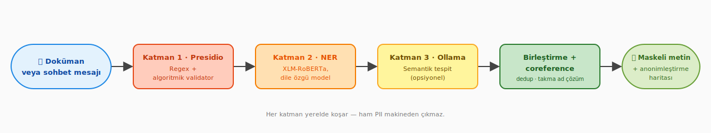
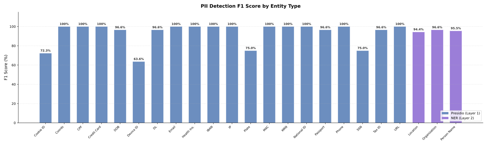
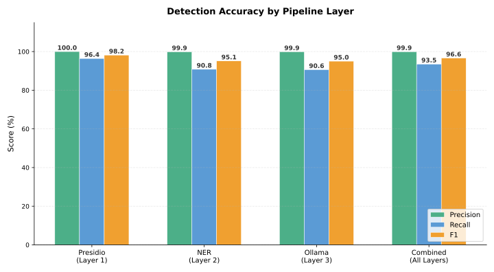
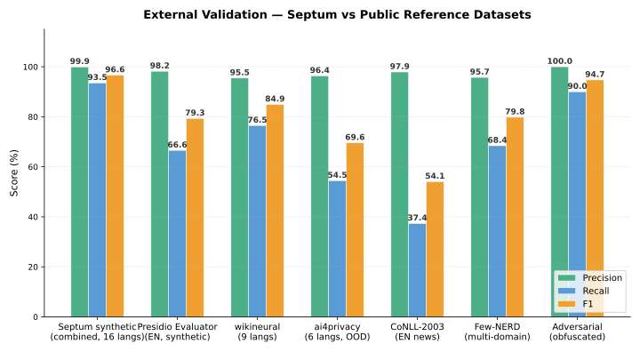
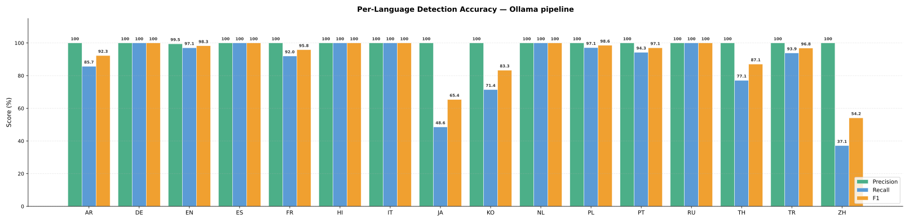
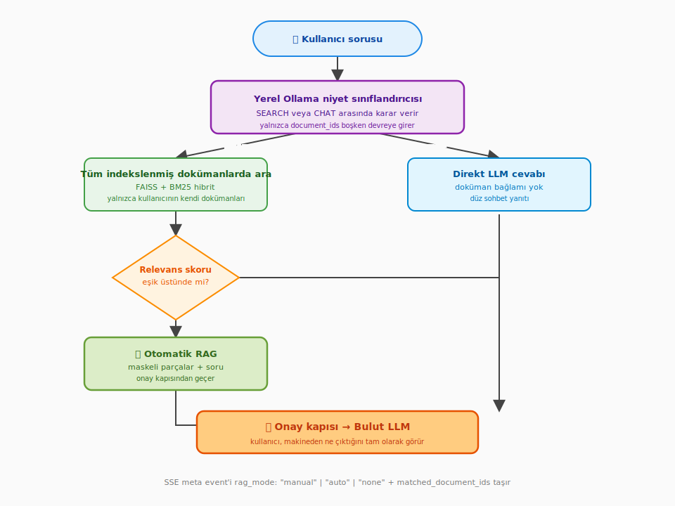

# Septum — Özellik ve Tespit Referansı

<p align="center">
  <a href="../README.tr.md"><strong>🏠 Ana Sayfa</strong></a>
  &nbsp;·&nbsp;
  <strong>✨ Özellikler</strong>
  &nbsp;·&nbsp;
  <a href="ARCHITECTURE.tr.md"><strong>🏗️ Mimari</strong></a>
  &nbsp;·&nbsp;
  <a href="DOCUMENT_INGESTION.tr.md"><strong>📊 Doküman İşleme</strong></a>
  &nbsp;·&nbsp;
  <a href="SCREENSHOTS.tr.md"><strong>📸 Ekran Görüntüleri</strong></a>
  &nbsp;·&nbsp;
  <a href="../CONTRIBUTING.tr.md"><strong>🤝 Katkı</strong></a>
  &nbsp;·&nbsp;
  <a href="../CHANGELOG.md"><strong>📝 Changelog</strong></a>
</p>

---

## İçindekiler

- [Tespit Hattı](#tespit-hattı)
- [Benchmark Sonuçları](#benchmark-sonuçları)
- [Regülasyon Paketleri](#regülasyon-paketleri)
- [Otomatik RAG Yönlendirme](#otomatik-rag-yönlendirme)
- [Neden Septum](#neden-septum)
- [MCP Entegrasyonu](#mcp-entegrasyonu)
- [REST API ve Kimlik Doğrulama](#rest-api-ve-kimlik-doğrulama)

---

## Tespit Hattı

Septum, üç katmanlı tespit hattını tamamen yerelde koşturur. Her katman bir öncekinin üzerine eklenir; son adımda tüm bulgular bir coreference çözümleyicisinden geçer. Böylece aynı kişi metinde farklı biçimlerde geçse bile tek bir `[PERSON_1]` placeholder'ı olarak görünür.

<p align="center">
  <a href="#tespit-hattı"></a>
</p>

| Katman | Teknoloji | Tespit ettiği varlık tipleri |
|:---:|:---|:---|
| 1 | **Presidio** — algoritmik doğrulayıcılarla desteklenen regex örüntüleri (Luhn, IBAN MOD-97, TCKN, CPF, SSN). Çok dilli anahtar kelimelerle çalışan bağlam duyarlı tanıyıcılar. | EMAIL_ADDRESS, PHONE_NUMBER, IP_ADDRESS, CREDIT_CARD_NUMBER, IBAN, NATIONAL_ID, MEDICAL_RECORD_NUMBER, HEALTH_INSURANCE_ID, POSTAL_ADDRESS, DATE_OF_BIRTH, MAC_ADDRESS, URL, COORDINATES, COOKIE_ID, DEVICE_ID, SOCIAL_SECURITY_NUMBER, CPF, PASSPORT_NUMBER, DRIVERS_LICENSE, TAX_ID, LICENSE_PLATE |
| 2 | **NER** — dile göre model seçen HuggingFace XLM-RoBERTa (20+ dil). Tamamı BÜYÜK HARF girdi otomatik başlık-harfine çevrilir. LOCATION ve ORGANIZATION_NAME çıktıları, ortak-isim yanlış pozitiflerini elemek için çok-kelimeli-veya-yüksek-skor kapısından geçer (Kapsam ve sınırlar bölümüne bakın). | PERSON_NAME, LOCATION, ORGANIZATION_NAME |
| 3 | **Ollama** — bağlam doğrulama, takma ad tespiti ve semantik varlıklar için yerel LLM. | PERSON_NAME takma adları; DIAGNOSIS, MEDICATION, RELIGION, POLITICAL_OPINION, SEXUAL_ORIENTATION, ETHNICITY, CLINICAL_NOTE, BIOMETRIC_ID, DNA_PROFILE |

**Coreference çözümleme.** Üç katman span'leri ürettikten sonra sanitizer, aynı kişiye yapılan tüm atıfları tek bir placeholder altında toplar. Aynı dokümandaki `"John"`, `"J. Doe"` ve `"Mr. Doe"` ifadelerinin hepsi tek bir `[PERSON_1]` olarak görünür. Bu çözümleme cümleler arasında ve aynı dokümanın farklı parçaları arasında da çalışır.

**3. katman isteğe bağlıdır.** Ayarlardan `use_ollama_semantic_layer=false` yaparak atlayabilirsiniz. 1. ve 2. katmanlar yapısal kimlikleri ve isimleri yakalar; 3. katman ise regex ve NER'in göremediği hassas-kategori (sağlık, din, siyasi görüş vb.) tespiti ekler. Doğruluk tercih edilen Ollama modeline bağlıdır — aşağıdaki benchmark `aya-expanse:8b` ile alınmıştır.

---

## Benchmark Sonuçları

Benchmark, 17 hazır regülasyonun tamamı aktifken **dört bağımsız veri kaynağı ve iki dayanıklılık probu** üzerinde koşturuldu:

1. **Septum sentetik korpus** — **16 dilde** (ar, de, en, es, fr, hi, it, ja, ko, nl, pl, pt, ru, th, tr, zh) 23 varlık tipi üzerinde algoritmik olarak üretilmiş **3.435 PII değeri**. Hiçbir public dataset'in taşımadığı checksum'lı kimlikleri (geçerli Luhn, IBAN MOD-97, TCKN) kapsamanın tek yolu, ayrıca Ollama'nın eşsiz katkısını ölçmek için 15 dokümanlık semantik-bağlamsal alt küme (DIAGNOSIS / MEDICATION / RELIGION / POLITICAL_OPINION / ETHNICITY / SEXUAL_ORIENTATION). Seed sabit — tam tekrarlanabilir.
2. **Microsoft [presidio-evaluator](https://github.com/microsoft/presidio-research)** — 200 sentetik Faker cümlesi, Presidio ekibinin kullandığı referans PII değerlendirme çerçevesi.
3. **[Babelscape/wikineural](https://huggingface.co/datasets/Babelscape/wikineural)** — 9 dilde × 50 Wikipedia held-out cümle. Uyarı: Septum'un kullandığı XLM-RoBERTa NER modelleri ilgili WikiANN korpusu üzerinde eğitildi; bu sayılar sıkı OOD testten ziyade üst sınıra yakındır.
4. **[ai4privacy/pii-masking-300k](https://huggingface.co/datasets/ai4privacy/pii-masking-300k)** — 6 dilde (en/de/fr/es/it/nl) × 50 validation cümlesi. Sıfırdan yazılmış modern PII-odaklı dataset; Septum'un kullandığı modeller bunun üzerinde eğitilmedi, dolayısıyla gerçek out-of-distribution testine en yakın kaynak.
5. **[CoNLL-2003](https://aclanthology.org/W03-0419/)** — klasik EN haber-alanı held-out test setinden 200 cümle. Septum ile ilgili hiçbir eğitim korpusunda yok.
6. **Dayanıklılık probları** — 15 PII-içermeyen paragraf (yanlış pozitif oranı) + 10 gizlenmiş PII girdisi (leetspeak, Unicode homoglyph, zero-width birleştirici, boşluklu IBAN, parantezli e-posta, yorum içine saklanmış kredi kartı, satır-sonu kırılmış TCKN).

<p align="center">
  <a href="#benchmark-sonuçları"></a>
</p>

<p align="center">
  <a href="#benchmark-sonuçları"></a>
</p>

### Septum sentetik korpus (katman bazında)

| Katman | Varlık | Tip | Precision | Recall | F1 |
|:---|:---:|:---:|:---:|:---:|:---:|
| **Presidio (L1)** — örüntü + doğrulayıcı (controlled + extended + adversarial) | 1.710 | 20 | %100 | %96,4 | %98,2 |
| **NER (L2)** — XLM-RoBERTa + BÜYÜK HARF normalize (16 dil) | 840 | 3 | %99,9 | %90,8 | %95,1 |
| **Ollama (L3)** — aya-expanse:8b (alias + semantik-bağlamsal) | 885 | 9 | %100 | %90,4 | %95,0 |
| **Birleşik** | **3.435** | **23** | **%100** | **%93,5** | **%96,6** |

**Ollama semantik alt kümesi** (DIAGNOSIS / MEDICATION / RELIGION / POLITICAL_OPINION / ETHNICITY / SEXUAL_ORIENTATION — Presidio ve NER'in ifade edemediği tipler): 15 dokümanda 27 varlık, **F1 %94,1** (Precision %100, Recall %88,9).

**Ollama ablation** — aynı 189 dokümanlı korpus Ollama KAPALI ve AÇIK: **+1,24 pp recall, +0,75 pp F1**. Fark tam agregada ılımlı görünür çünkü dokümanların çoğu PERSON_NAME / ORG / LOC (NER'in işi). Semantik alt kümede Ollama, recall'u sıfırın üstüne çıkarabilen tek katman.

### Dış referans veri kümeleri

| Kaynak | Varlık | Tip | Precision | Recall | F1 |
|:---|:---:|:---:|:---:|:---:|:---:|
| **Microsoft presidio-evaluator** (EN, sentetik Faker, 200 cümle) | 245 | 8 | %98,8 | %66,5 | %79,5 |
| **Babelscape/wikineural** (9 dil × 50 = 450 cümle, held-out Wikipedia NER) | 634 | 3 | %96,0 | %75,9 | %84,8 |
| **ai4privacy/pii-masking-300k** (6 dil, gerçek OOD — eğitim verisinde yok) | 1.456 | 12 | %95,6 | %55,4 | %70,2 |
| **CoNLL-2003** (EN haber, gold-standard held-out split) | 372 | 3 | %97,9 | %37,6 | %54,4 |

CoNLL-2003 recall'u bilinçli olarak düşük: Septum serbest haber metnindeki tek başına yer adlarını varsayılan olarak PII saymıyor (GDPR Art. 4(1) gerekçesi — yer adı tek başına kişiyi tanımlamaz). Ai4Privacy USERNAME ve ince-taneli adres alt tipleri etrafındaki — mevcut regülasyon paketlerinin doğrudan hedeflemediği — boşlukları ortaya çıkarıyor.

<p align="center">
  <a href="#benchmark-sonuçları"></a>
</p>

### Dayanıklılık

| Prob | Hacim | Sonuç |
|:---|:---:|:---:|
| **Temiz metin yanlış pozitif oranı** (9 dilde 439 tokenli 15 PII-içermeyen paragraf) | 0 FP | **0,00 FP / 1k token** |
| **Adversarial paket** (10 gizlenmiş PII girdisi: leetspeak, homoglyph, zero-width, boşluklu IBAN, parantezli, yorum içinde CC, sarmalanmış TCKN) | 12 yerleştirilmiş | P %100 · R %66,7 · **F1 %80,0** |

Adversarial sonuç bilinçli olarak kusurlu — Septum hattında hiçbir şey özellikle obfuskasyon için ayarlı değil, bu ham dayanıklılık. %33'lük recall açığı, özel keyword-tabanlı kuralların değerli olacağını dürüstçe gösteriyor.

### Dil bazlı kırılım (Ollama hattı)

<p align="center">
  <a href="#benchmark-sonuçları"></a>
</p>

F1, Latin-yazı dillerinde (EN %98,3, DE %100, ES %100, FR %98,0, IT %100, NL %100, PL %98,6, PT %97,1, RU %100, TR %96,2) birbirine yakın ve çok yüksek; Arapça (%97,1) ve Hintçede (%100) de güçlü kalıyor. Dürüst zayıf noktalar Asya yazıları: **Tayca %88,9, Korece %81,4, Japonca %65,4, Çince %44,4** — CJK yazılarında NER tokenizasyon davranışı ve bu yazılar için sınırlı çok-dilli korpus kapsamı nedeniyle. Çince ve Japonca, Septum'un en çok iyileşmeye ihtiyaç duyduğu iki dil; bu rakamlar saklanmadan olduğu gibi raporlanır.

> NER (L2), otomatik başlık-harfi normalizasyonu sayesinde tıbbi ve hukuki dokümanlarda sık görülen BÜYÜK HARF isimleri de yakalar; kurum adlarını da tanır. LOCATION çıktısı conservative bir filtreden geçer (çok-kelimeli VEYA güven skoru ≥ 0,95) — böylece "Doğum" veya Almanca form başlıkları gibi ortak-isim yanlış pozitifleri elenir, "İstanbul" / "Berlin" gibi gerçek yer isimleri ise geçer. Ollama (L3) adayları doğrular ve takma adları yakalar. Benchmark veri kümesi boşluklu IBAN, noktalı telefon gibi zorlayıcı formatları da içerir; bu durum Presidio'nun recall değerini gerçek dünya seviyesine çeker. Testi kendiniz çalıştırabilirsiniz:
> `pytest packages/api/tests/benchmark_detection.py -v -s`

### Kapsam ve sınırlar

**Hiçbir PII tespit sistemi %100 doğru değildir.** Septum'un benchmark'ı nerede güçlü olduğu ve nerede olmadığı konusunda açıktır:

- **LOCATION çıktısı çok-kelimeli-veya-yüksek-skor kapısından geçer** (ORGANIZATION_NAME ile aynı yapı). Çok dilli XLM-RoBERTa modelleri, Septum'un desteklediği her dilde ortak isimler ve form alan başlıklarında stokastik tek-token LOC yanlış pozitifleri üretir (Türkçe "Doğum", Almanca form başlıkları vb.); bu yanlış pozitifleri dil-başına stopword listesiyle kovalamak 50+ lokalde ölçeklenmez. Kapı, 0,95 güven skorunun altındaki tek-token span'leri eler — "İstanbul", "Berlin" gibi gerçek yer isimleri tipik olarak 0,97+ skor alır; "New York" gibi çok-kelimeli lokasyonlar skor kapısını tamamen atlar. Yapılandırılmış adres PII'si ayrıca Presidio'nun `StructuralAddressRecognizer`'ı ve regülasyon bazlı POSTAL_ADDRESS / STREET_ADDRESS tanıyıcılarıyla yakalanır.
- **37 regülasyon varlık tipinin tamamı tespit edilebilir** — 21'i Presidio, 3'ü NER, 9'u Ollama, geri kalanı ana-tip kapsamıyla (FIRST_NAME, PERSON_NAME'e; CITY, LOCATION'a dâhil vb.).
- **16 dilde 3.408 değer üzerinden 23 varlık tipi aktif olarak benchmark'a tabi tutulur.**
- **Semantik tipler** (DIAGNOSIS, MEDICATION, RELIGION, POLITICAL_OPINION) yalnızca Ollama katmanı tarafından yakalanır; bunun için yerel bir LLM'in çalışıyor olması gerekir.
- **Bağlama bağlı tanıyıcılar** (DATE_OF_BIRTH, PASSPORT_NUMBER, SSN, TAX_ID) yalancı pozitif oranını düşürmek için değerin yakınında bağlam anahtar kelimesi arar. 8+ dilde anahtar kelime listesi bulunur.
- **Zorlayıcı formatlar** (boşluklu TCKN, noktalı telefon) kontrollü format testlerine göre daha düşük tespit oranı gösterir. Benchmark bu durumu dürüstçe raporlar.

**Onay Mekanizması güvenlik ağıdır.** LLM'e gönderilmeden önce tam olarak ne gideceğini görürsünüz, gerektiğinde reddedersiniz. Otomatik tespit riski azaltır; son sözü veren insan incelemesi riski tamamen ortadan kaldırır.

Benchmark modelleri: NER, Türkçe için `akdeniz27/xlm-roberta-base-turkish-ner`, diğer diller için `Davlan/xlm-roberta-base-wikiann-ner` kullanır. Ollama katmanı `aya-expanse:8b` ile koşar. Daha büyük Ollama modelleri genelde semantik tespiti iyileştirir; karşılığında gecikme artar.

---

## Regülasyon Paketleri

Septum 17 hazır regülasyon paketiyle gelir. Birden fazlası aynı anda aktif olabilir — sanitizer kuralların birleşimini uygular, en kısıtlayıcı olan kazanır.

| Bölge | Kod | Regülasyon |
|:---|:---|:---|
| 🇪🇺 AB / AEA | `gdpr` | General Data Protection Regulation |
| 🇺🇸 ABD (Sağlık) | `hipaa` | Health Insurance Portability and Accountability Act |
| 🇹🇷 Türkiye | `kvkk` | 6698 sayılı Kişisel Verilerin Korunması Kanunu |
| 🇧🇷 Brezilya | `lgpd` | Lei Geral de Proteção de Dados |
| 🇺🇸 ABD (Kaliforniya) | `ccpa` | California Consumer Privacy Act |
| 🇺🇸 ABD (Kaliforniya) | `cpra` | California Privacy Rights Act |
| 🇬🇧 Birleşik Krallık | `uk_gdpr` | UK GDPR |
| 🇨🇦 Kanada | `pipeda` | Personal Information Protection and Electronic Documents Act |
| 🇹🇭 Tayland | `pdpa_th` | Personal Data Protection Act |
| 🇸🇬 Singapur | `pdpa_sg` | Personal Data Protection Act |
| 🇯🇵 Japonya | `appi` | Act on the Protection of Personal Information |
| 🇨🇳 Çin | `pipl` | Personal Information Protection Law |
| 🇿🇦 Güney Afrika | `popia` | Protection of Personal Information Act |
| 🇮🇳 Hindistan | `dpdp` | Digital Personal Data Protection Act |
| 🇸🇦 Suudi Arabistan | `pdpl_sa` | Personal Data Protection Law |
| 🇳🇿 Yeni Zelanda | `nzpa` | Privacy Act 2020 |
| 🇦🇺 Avustralya | `australia_pa` | Privacy Act 1988 |

Her satır, `packages/core/septum_core/recognizers/` altında yüklenebilir bir pakettir. Her varlık tipinin hukuki kaynağı ise [hukuki kaynaklar belgesinde](../packages/core/docs/REGULATION_ENTITY_SOURCES.md) listelidir.

**Bölgeye özgü kimlik numarası doğrulayıcıları** sadece örüntüye değil, algoritmaya dayanır: TCKN (Türkiye, mod-10 + mod-11 checksum), Aadhaar (Hindistan, Verhoeff), CPF (Brezilya, iki basamaklı checksum), NRIC/FIN (Singapur, harf checksum'ı), Resident ID (Çin, ISO 7064 MOD 11-2), NINO (İngiltere), CNPJ (Brezilya), My Number (Japonya) ve diğerleri. Geçersiz checksum reddedilir; rastgele 11 haneli bir dize yalancı pozitif üretmez.

**Özel kurallar.** Dashboard üzerinden adminler regex, anahtar kelime ya da LLM promptu tabanlı özel kuralset tanımlayabilir. Özel kurallar hazır paketlerle yan yana çalışır — policy composition kuralları yine geçerlidir.

---

## Otomatik RAG Yönlendirme

Sohbet kenar çubuğunda doküman seçilmediğinde Septum, doküman araması mı yapacağına yoksa doğrudan sohbet yoluyla mı cevap vereceğine kendisi karar verir.

<p align="center">
  <a href="#otomatik-rag-yönlendirme"></a>
</p>

Üç yol oluşur:

1. **Manuel RAG** — kullanıcı açıkça doküman seçer. Sınıflandırıcı atlanır; retrieval seçilen dokümanlarda çalışır.
2. **Otomatik RAG** — seçim yok, sınıflandırıcı `SEARCH` diyor ve relevans skoru eşiğin üzerinde. Kullanıcının tüm dokümanlarından parçalar getirilir.
3. **Düz LLM** — seçim yok, sınıflandırıcı `CHAT` diyor ya da relevans eşiğin altında. Doküman bağlamı eklenmez; LLM serbestçe cevaplar.

SSE meta event'i `rag_mode: "manual" | "auto" | "none"` ve `matched_document_ids` alanlarını taşır; dashboard her asistan mesajında hangi yolun seçildiğini rozetle gösterir. Eşik değeri, RAG ayarlar sekmesinde `rag_relevance_threshold` olarak tutulur (varsayılan 0,35).

---

## Neden Septum

| Yetenek | Septum | Düz ChatGPT / Claude | Azure Presidio | LangChain Pipeline |
|:---|:---:|:---:|:---:|:---:|
| Buluta gitmeden önce PII maskeleme | **Evet** | Hayır | Sadece tespit | Elle geliştirilir |
| Çoklu regülasyon (17 paket) | **Evet** | Hayır | Hayır | Elle geliştirilir |
| LLM öncesi onay kapısı | **Evet** | Hayır | Hayır | Elle geliştirilir |
| Placeholder geri yazma (gerçek değerler) | **Evet** | Yok | Hayır | Elle geliştirilir |
| Hibrit retrieval ile doküman RAG | **Evet** | Hayır | Hayır | Kısmen |
| Otomatik RAG niyet yönlendirme | **Evet** | Hayır | Hayır | Elle geliştirilir |
| Özel tespit kuralları | **Evet** | Hayır | Sınırlı | Elle geliştirilir |
| Hazır web arayüzü | **Evet** | Yok | Hayır | Hayır |
| Denetim kaydı ve uyumluluk | **Evet** | Hayır | Hayır | Elle geliştirilir |
| Herhangi bir LLM sağlayıcısı | **Evet** | Tek | Sadece Azure | Yapılandırılabilir |
| Tamamen self-hosted | **Evet** | Hayır | Bulut servisi | Duruma bağlı |

Diğer araçlar bulmacanın yalnızca parçalarını sunar — şurada tespit, burada bir vektör deposu. Septum ise uçtan uca komple bir hattır: tespit → anonimleştirme → eşleme → retrieval → onay → LLM çağrısı → placeholder geri yazma → denetim. Kutudan çıktığı gibi, arayüzüyle, herhangi bir regülasyon için.

---

## MCP Entegrasyonu

Septum, aynı yerel PII maskeleme hattını MCP uyumlu her istemciye bağlayan bağımsız bir **Model Context Protocol** sunucusuyla ([`septum-mcp`](../packages/mcp/)) birlikte gelir. MCP açık ve sağlayıcıdan bağımsız bir [spesifikasyondur](https://modelcontextprotocol.io); sunucu üç standart taşımanın üçünü de destekler:

- **stdio** (varsayılan) — alt-süreç olarak başlatılan istemciler için: Claude Desktop, Cursor, Windsurf, ChatGPT Desktop, Zed ve Python / TypeScript / Rust / Go / C# / Java SDK'leriyle yazılmış her araç.
- **streamable-http** — uzak, tarayıcı ya da container içi istemciler için modern HTTP taşıması. `Authorization: Bearer <SEPTUM_MCP_HTTP_TOKEN>` üzerinden bearer token kimlik doğrulaması.
- **sse** — streamable-http'ye henüz geçmemiş istemciler için tutulan legacy HTTP + Server-Sent Events taşıması.

`septum-core` süreç içinde çalışır; ham PII ağa hiç erişmez.

**Sunulan araçlar:**

| Araç | Amaç |
|:---|:---|
| `mask_text` | Bir metindeki PII'yi maskeler ve bir session id döndürür. |
| `unmask_response` | LLM yanıtındaki orijinal değerleri session id ile geri yazar. |
| `detect_pii` | Salt-okunur tarama — session tutmadan varlıkları listeler. |
| `scan_file` | Yerel dosyayı (`.txt`, `.md`, `.csv`, `.json`, `.pdf`, `.docx`) okuyup tarar. |
| `list_regulations` | 17 hazır regülasyon paketini ve varlık tiplerini listeler. |
| `get_session_map` | `{orijinal → placeholder}` eşlemesini yalnızca yerel hata ayıklama için döndürür. |

**Stdio istemcisi** (Claude Desktop, Cursor, Windsurf, Zed, ChatGPT Desktop):

```json
{
  "mcpServers": {
    "septum": {
      "command": "septum-mcp",
      "env": {
        "SEPTUM_REGULATIONS": "gdpr,kvkk",
        "SEPTUM_LANGUAGE": "tr"
      }
    }
  }
}
```

**HTTP istemcisi** (uzak ajan, tarayıcı uzantısı, paylaşılan takım sunucusu):

```json
{
  "mcpServers": {
    "septum": {
      "url": "https://mcp.example.com/mcp",
      "headers": {
        "Authorization": "Bearer <token>"
      }
    }
  }
}
```

HTTP sunucusunu kendiniz çalıştırmak için:

```bash
SEPTUM_MCP_HTTP_TOKEN=$(openssl rand -hex 32) \
  septum-mcp --transport streamable-http --host 0.0.0.0 --port 8765
```

Tam HTTP deployment kılavuzu (Docker, compose profilleri, TLS reverse-proxy kalıbı), ortam değişkeni referansı ve uçtan uca kullanım örnekleri için [MCP sunucu kılavuzuna](../packages/mcp/README.md) bakın.

---

## REST API ve Kimlik Doğrulama

Septum backend'i, `/docs` (Swagger) ve `/redoc` altında belgelenen bir FastAPI REST katmanı sunar. İki kimlik doğrulama yöntemi desteklenir.

### JWT (tarayıcı oturumu, kısa ömürlü)

Kurulum sihirbazı ilk admin hesabını oluşturur; sonraki login'lerde 24 saat geçerli bir JWT döndürülür.

```bash
curl -X POST http://localhost:3000/api/auth/login \
  -H 'Content-Type: application/json' \
  -d '{"email": "admin@example.com", "password": "sifreniz"}'
# → {"access_token": "...", "token_type": "bearer"}
```

### API anahtarları (CI/CD, MCP entegrasyonları, uzun ömürlü)

Adminler `POST /api/api-keys` ile programatik API anahtarı oluşturur. Ham anahtar yalnızca **bir kez** gösterilir; kalıcı olarak yalnızca 8 karakterlik önek ve SHA-256 hash'i tutulur.

```bash
# Anahtar oluştur (yanıt raw_key içerir — şimdi kaydedin, sonradan geri alamazsınız)
curl -X POST http://localhost:3000/api/api-keys \
  -H 'Authorization: Bearer <jwt>' \
  -H 'Content-Type: application/json' \
  -d '{"name": "ci-pipeline", "expires_at": null}'

# Sonraki tüm isteklerde kullanın
curl -H 'X-API-Key: sk-septum-<64 hex>' http://localhost:3000/api/auth/me

# Anahtarları listele (sadece önek ve metadata — ham anahtar bir daha dönmez)
curl -H 'X-API-Key: sk-septum-…' http://localhost:3000/api/api-keys

# İptal et
curl -X DELETE -H 'X-API-Key: sk-septum-…' http://localhost:3000/api/api-keys/{id}
```

### Rate limit

| Endpoint | Limit |
|:---|:---|
| `POST /api/auth/register` | dakikada 3 |
| `POST /api/auth/login` | dakikada 5 |
| `POST /api/api-keys` | dakikada 10 |
| Diğer hepsi | dakikada 60 (`RATE_LIMIT_DEFAULT` ile yapılandırılır) |

API anahtarıyla gelen isteklere IP yerine **anahtar öneki** bazında rate limit uygulanır — böylece paylaşılan NAT arkasındaki her servis kendi kotasına sahip olur. Anonim ve JWT isteklerde ise IP bazlı limit geçerlidir. Redis yapılandırıldığında limit sayaçları Redis'te tutulur; aksi hâlde süreç içi bellekte saklanır (tek-node geliştirme için uygundur).

### Hızlı API örneği

```bash
# Doküman yükle
curl -X POST http://localhost:3000/api/documents/upload \
  -H "Authorization: Bearer $TOKEN" \
  -F "file=@sozlesme.pdf"

# Soru sor (SSE ile stream yanıt)
curl -N -X POST http://localhost:3000/api/chat/ask \
  -H "Authorization: Bearer $TOKEN" \
  -H "Content-Type: application/json" \
  -d '{"message": "Fesih şartları nedir?", "document_id": 1}'
```

Sohbet uç noktası Server-Sent Events döndürür:
`meta` → `approval_required` → `answer_chunk` → `end`.

Tam API referansı, hat detayları ve deployment topolojileri için [Mimari](ARCHITECTURE.tr.md) dokümanına bakın.

---

<p align="center">
  <a href="../README.tr.md"><strong>🏠 Ana Sayfa</strong></a>
  &nbsp;·&nbsp;
  <strong>✨ Özellikler</strong>
  &nbsp;·&nbsp;
  <a href="ARCHITECTURE.tr.md"><strong>🏗️ Mimari</strong></a>
  &nbsp;·&nbsp;
  <a href="DOCUMENT_INGESTION.tr.md"><strong>📊 Doküman İşleme</strong></a>
  &nbsp;·&nbsp;
  <a href="SCREENSHOTS.tr.md"><strong>📸 Ekran Görüntüleri</strong></a>
  &nbsp;·&nbsp;
  <a href="../CONTRIBUTING.tr.md"><strong>🤝 Katkı</strong></a>
  &nbsp;·&nbsp;
  <a href="../CHANGELOG.md"><strong>📝 Changelog</strong></a>
</p>
