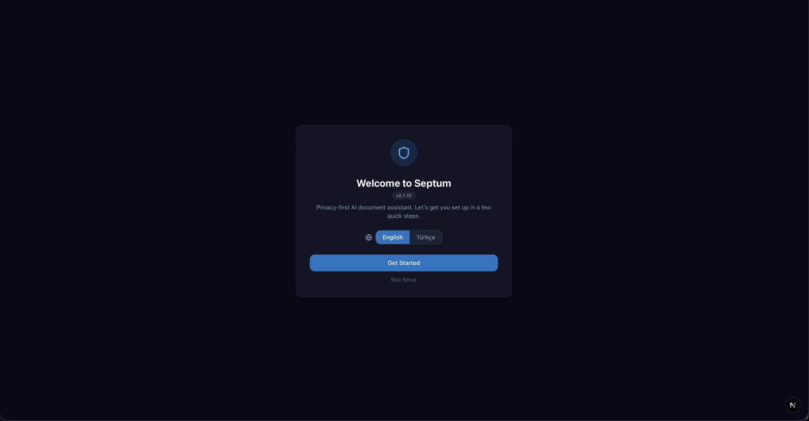
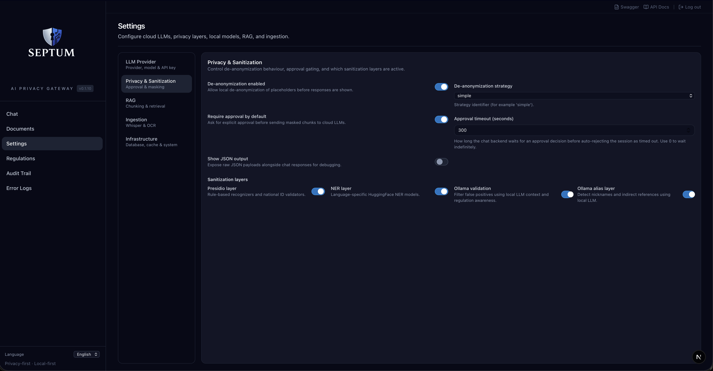
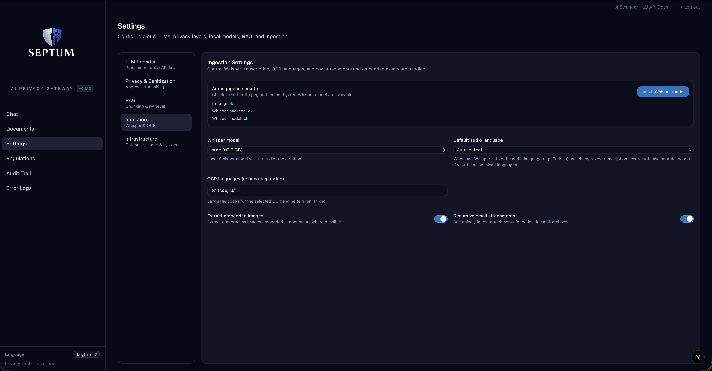
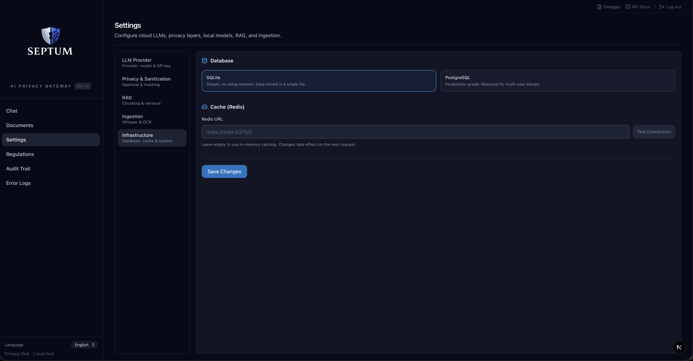
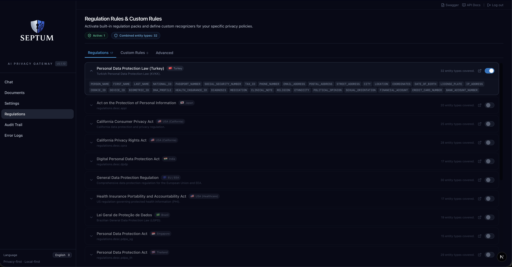

# Septum — Screenshots

  <a href="../README.md"><strong>🏠 Home</strong></a>
  &nbsp;·&nbsp;
  <a href="INSTALLATION.md"><strong>🚀 Installation</strong></a>
  &nbsp;·&nbsp;
  <a href="BENCHMARK.md"><strong>📈 Benchmark</strong></a>
  &nbsp;·&nbsp;
  <a href="FEATURES.md"><strong>✨ Features</strong></a>
  &nbsp;·&nbsp;
  <a href="ARCHITECTURE.md"><strong>🏗️ Architecture</strong></a>
  &nbsp;·&nbsp;
  <a href="DOCUMENT_INGESTION.md"><strong>📊 Document Ingestion</strong></a>
  &nbsp;·&nbsp;
  <strong>📸 Screenshots</strong>

---

A visual tour of every Septum screen — the setup wizard, chat approval
flow, document preview with entity highlights, settings tabs, custom
regulation rules, and the audit trail.

For high-level explanations see the [main README](../README.md); for deep
feature and API references see the [Features](FEATURES.md) doc.

---

## Setup Wizard

  

Pick your database (SQLite or PostgreSQL), cache (in-memory or Redis),
LLM provider (Anthropic, OpenAI, OpenRouter, or local Ollama), privacy
regulations, and audio transcription model — all from the wizard.

---

## Approval Gate — See exactly what leaves your machine

  

Before every LLM call, Septum shows three side-by-side panes: the
masked prompt you typed, the retrieved document chunks (editable), and
the full assembled prompt that will actually be sent to the cloud.
Approve it and the answer comes back with real values restored —
locally, never in the cloud.

---

## Document Preview with entity highlights

  

Every detected entity — names, addresses, dates of birth, phone
numbers, medical diagnoses, IDs — is highlighted inline on the
original document with a colour coded by entity type. Click any entity
to jump to its location; the side panel lists every match with its
score and placeholder.

---

## Settings — the 5-tab tour

<table>
  <tr>
    <td width="50%" align="center">
      <b>LLM Provider</b> 
      
    </td>
    <td width="50%" align="center">
      <b>Privacy & Sanitization</b> — 3-layer pipeline 
      
    </td>
  </tr>
  <tr>
    <td align="center">
      <b>RAG & Hybrid Retrieval</b> 
      
    </td>
    <td align="center">
      <b>Document Ingestion</b> 
      
    </td>
  </tr>
  <tr>
    <td colspan="2" align="center">
      <b>Infrastructure</b> — database, cache, LLM gateway 
      
    </td>
  </tr>
</table>

---

## Custom Regulation Rules

  

Define your own detectors alongside the 17 built-in packs. Three
methods: regex patterns, keyword lists, or LLM-prompt based detection.
Policy composition rules still apply — the most restrictive rule wins.

---

## Audit Trail

  

Append-only compliance log with entity detection metrics. No raw PII
in audit events — only entity types, counts, regulation ids, and
timestamps. JSON / CSV / Splunk HEC export available via
`/api/audit/export`.

---

  <a href="../README.md"><strong>🏠 Home</strong></a>
  &nbsp;·&nbsp;
  <a href="INSTALLATION.md"><strong>🚀 Installation</strong></a>
  &nbsp;·&nbsp;
  <a href="BENCHMARK.md"><strong>📈 Benchmark</strong></a>
  &nbsp;·&nbsp;
  <a href="FEATURES.md"><strong>✨ Features</strong></a>
  &nbsp;·&nbsp;
  <a href="ARCHITECTURE.md"><strong>🏗️ Architecture</strong></a>
  &nbsp;·&nbsp;
  <a href="DOCUMENT_INGESTION.md"><strong>📊 Document Ingestion</strong></a>
  &nbsp;·&nbsp;
  <strong>📸 Screenshots</strong>

