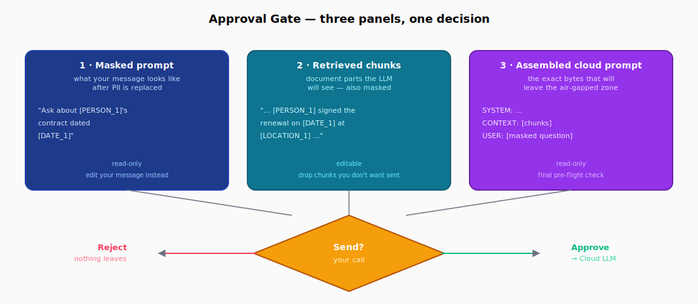
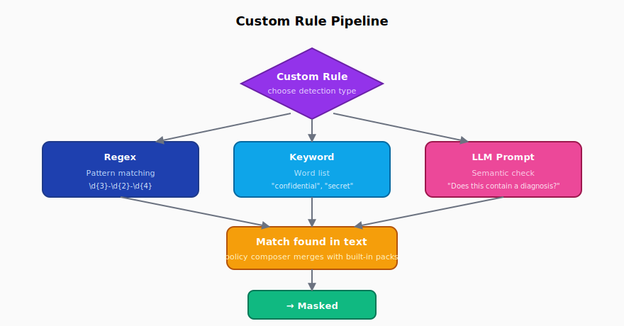

# Septum — Workflows

How the moving pieces fit together when you actually use Septum. Each
section answers a single "how does X work?" question with the same
shape: a diagram, a step-by-step walkthrough, and the practical
trade-offs.

## Chat flow

The single most important Septum surface. A user types a message that
may or may not contain PII; the system masks it, retrieves matching
document chunks (also masked), pauses for human review, calls the
cloud LLM with placeholder text, then restores real values locally
before showing the answer.

  

Step by step:

1. **Type the message.** Chat input accepts free text. You can paste
   names, emails, IDs, an entire snippet of an internal email — none
   of it has to be redacted up front.
2. **Local PII detection on the message.** The same three-layer
   pipeline that processes uploaded documents (Presidio + NER +
   optional Ollama) scans the message *before anything else happens*.
   Every entity gets a deterministic placeholder.
3. **Auto-RAG routing.** If you didn't explicitly select documents, a
   local Ollama classifier decides whether the question wants document
   context (auto-RAG) or is fine as a plain chatbot turn (pure LLM).
   See the [Auto-RAG section in Features](features#auto-rag-routing).
4. **Hybrid retrieval.** When auto-RAG fires, BM25 keyword search and
   FAISS semantic search are both run; results are fused with
   Reciprocal Rank Fusion. The chunks pulled in are the ones already
   stored in masked form — raw text never leaves the air-gapped zone.
5. **Approval gate.** Three panels open: your masked prompt, the
   retrieved chunks, and the assembled cloud prompt that will be sent.
   Approve or reject — see [Approval gate](#approval-gate) below.
6. **Cloud LLM call.** The masked prompt is forwarded by
   `septum-gateway` (internet-facing zone) to your chosen provider —
   Anthropic, OpenAI, OpenRouter, or local Ollama.
7. **Local de-anonymisation.** The reply comes back with placeholders;
   `septum-core` (air-gapped zone) restores the real values from the
   per-document anonymisation map. Plaintext PII is reconstructed in
   memory only — it never touches the queue or the gateway process.
8. **Audit log.** A compliance event is written: who asked, which
   documents were touched, how many entities of which types were
   masked. The event itself contains zero raw PII.

The same masking pipeline runs on the user's message, not just the
retrieved chunks. A typed `"Email Ahmet at ahmet@firma.com"` becomes
`"Email [PERSON_1] at [EMAIL_ADDRESS_1]"` before retrieval. Cloud
providers genuinely never see the original.

## Approval gate

The safety net. Before any byte leaves the air-gapped zone, you see
exactly what will be sent and can stop the request with one click.

  

The three panels:

| Panel | What it shows | What you can do |
|---|---|---|
| **Masked prompt** | Your message after PII has been replaced with placeholders | Read-only here. To change wording, edit the chat input and re-submit. |
| **Retrieved chunks** | Document parts the LLM will see — also masked | Editable. Drop chunks you don't want sent, trim irrelevant pieces, keep the context tight. |
| **Assembled cloud prompt** | Byte-for-byte the final payload that will leave the host | Read-only. Final pre-flight check — if anything looks off here, reject and adjust. |

The decision:

- **Approve** → request travels through `septum-queue` to
  `septum-gateway`, which calls the cloud LLM and publishes the masked
  answer back. De-anonymisation happens locally before display.
- **Reject** → the request is dropped on the spot. Nothing leaves the
  machine. The chat input keeps your typed text so you can revise.

Automated detection reduces risk; the approval gate eliminates it.
Even if a layer mis-fires (false negative on an obscure ID format),
you see the actual outgoing payload and stop it.

You can disable the gate per request, per session, or globally from
Settings — useful for high-volume automation where you've already
hardened detection. The default is "always on" because the cost of one
unintended leak dwarfs the cost of one extra click.

## Custom rules

Built-in regulation packs cover the common shapes (PII categories
declared by GDPR, KVKK, HIPAA, …), but every organisation has at
least one identifier that doesn't match a textbook regex —
`EMP-2024-00041`, `PROJ-X-classified`, internal codenames. Custom
rules give you three tools to teach Septum about them.

  

| Type | Best for | Cost | Example |
|---|---|---|---|
| **Regex** | Structured identifiers with a fixed shape | Negligible | Internal employee IDs `EMP-\d{4}-\d{5}`, ticket numbers, project codes |
| **Keyword list** | Closed vocabulary you want masked literally | Negligible | Codenames, internal client aliases, sensitive product names |
| **LLM prompt** | Semantic categories no regex can express | One Ollama call per chunk | "Does this paragraph mention an unannounced product?", "Is there a clinical diagnosis?" |

How to add one (UI):

1. **Settings → Regulations → Custom rules → New rule.**
2. **Name** the rule — it shows up in audit events as the entity type.
3. **Pick a type.** The form swaps to show the right input — a regex
   field, a keyword textarea, or a prompt template.
4. **Test it.** Paste a sample document or sentence, hit "Try it";
   matched spans are highlighted in real time.
5. **Save.** The rule joins the active policy at the next request.
   Built-in packs and your custom rules merge through the
   policy composer; the most restrictive rule always wins on overlap.

Rules can be scoped per regulation — "this rule only fires when KVKK
is active" — or made global. Edit, disable, or delete from the same
screen; the policy reloads without a server restart.

## Audit trail

Every detection writes a row. Every cloud LLM call writes another.
Together they form an append-only ledger that maps to compliance
deliverables (Article 30 records under GDPR, KVKK Veri Sorumlusu
records, HIPAA access logs).

What gets recorded:

- **Event type** (`document.ingested`, `pii.detected`, `chat.approved`,
  `chat.rejected`, `llm.forwarded`, `llm.responded`)
- **Source module** (`septum-api`, `septum-gateway`, `septum-audit`)
- **Correlation id** so a single chat turn ties together across modules
- **Entity counts by type** — never the entity values themselves
- **Active regulation ids** at the moment the event fired
- **Latency, model, provider** for cloud calls
- **User id, session id** — who, in which session

What does *not* get recorded: the actual PII, the document text, the
prompt content, the LLM response. Audit events are PII-free by
contract; that's what makes them safe to ship to a third-party SIEM.

What you can do with it:

- **Filter on the dashboard.** Per regulation, per entity type, per
  user, per date range. The UI highlights spikes in detection counts
  so unusual activity is visible at a glance.
- **Focus on entities.** From any audit row, click "Focus on entities"
  to open the originating document with only that event's detections
  highlighted — a minute later you know exactly what was flagged and
  why.
- **Export.** `GET /api/audit/export?format=json|csv|splunk` returns
  the relevant slice. Splunk HEC payloads are ready to ship to a
  collector; JSON suits custom downstream processors; CSV opens in
  Excel for ad-hoc investigations.
- **Retention policy.** Rolling window with two cap modes — by age
  (drop events older than N days) and by count (drop the oldest once
  the file exceeds M rows). Atomic in-place rewrite, no read-side
  downtime.

The audit module runs in the **internet-facing zone** by design — it
needs to talk to your SIEM but should never see raw PII. Because
events are scrubbed at the producer (`septum-api`), even a compromised
audit host leaks zero personal data.

---

Workflows above describe what Septum does in motion. For the static
catalog of features and detection layers, see the
[Features](features) page; for the system architecture and module
boundaries, see [Architecture](architecture).
